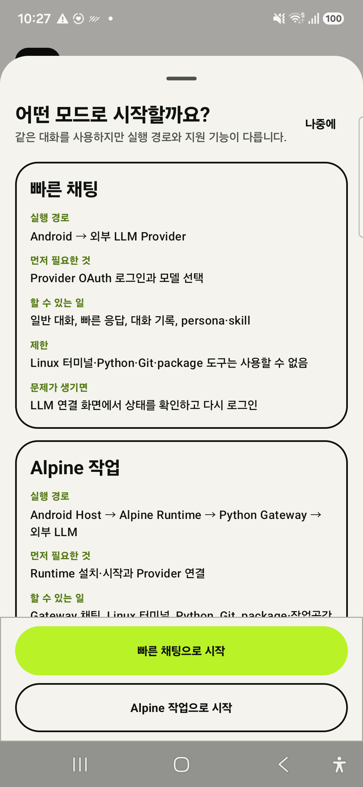
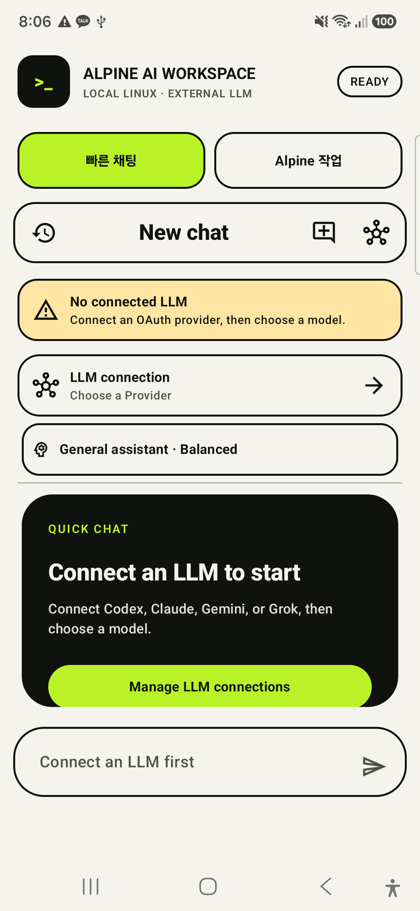
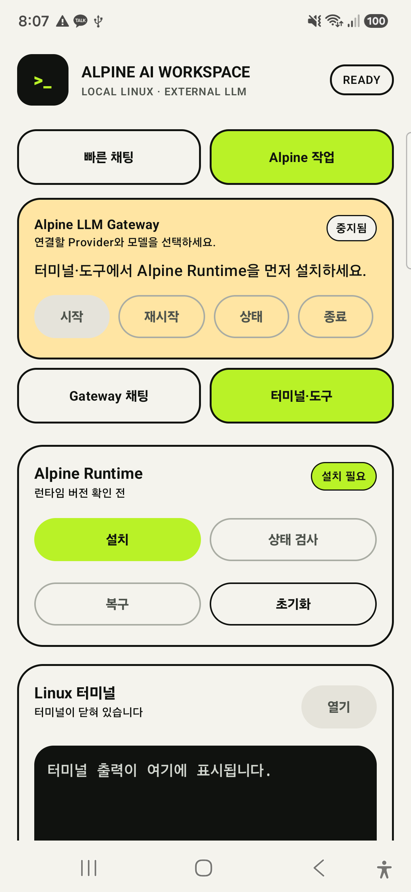
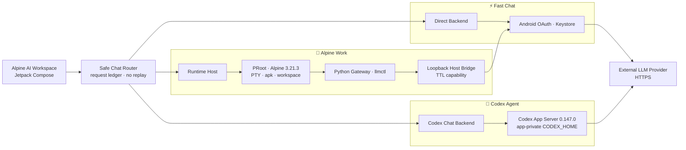

<div align="center">
  <a href="https://github.com/coreline-ai/alpine-llm-gateway">
    
  </a>

  <h1>Alpine AI Workspace</h1>

  <p><strong>Android LLM 채팅과 로컬 Alpine Linux 작업 환경을 하나의 안전한 모듈형 워크스페이스로.</strong></p>
  <p>빠른 Provider 채팅, 공식 Codex App Server 로그인, PRoot Runtime, Python Gateway와 재사용 Android SDK를 한 저장소에서 개발합니다.</p>

  <p>
    <a href="https://github.com/coreline-ai/alpine-llm-gateway/actions/workflows/ci.yml"></a>
    
    
    
  </p>

  <p>
    
    
    
    
    
    
    
    
    
  </p>

  <p>
    <a href="#overview"><strong>개요</strong></a> ·
    <a href="#status"><strong>현재 상태</strong></a> ·
    <a href="#screens"><strong>화면</strong></a> ·
    <a href="#architecture"><strong>아키텍처</strong></a> ·
    <a href="#modules"><strong>모듈</strong></a> ·
    <a href="#quick-start"><strong>빠른 시작</strong></a> ·
    <a href="#verification"><strong>검증</strong></a> ·
    <a href="#roadmap"><strong>로드맵</strong></a> ·
    <a href="#docs"><strong>문서</strong></a>
  </p>
</div>

> [!IMPORTANT]
> **현재 제품은 공개 배포 예정이 없는 내부 개발·검증 단계입니다.** 핵심 로그인·채팅·Runtime 기술 검증은 진행됐지만 GUI/UX가 배포 기준에 도달하지 않았습니다. 별도 지시 전까지 Google Play 등록, 신규 공개 릴리스, 추가 배포를 진행하지 않습니다.

> [!WARNING]
> 저장소 루트 `LICENSE`가 아직 없습니다. 이 README와 저장소 접근 권한은 프로젝트 코드의 공개 사용·수정·재배포 허가를 부여하지 않습니다.

<a id="overview"></a>
## 🧭 프로젝트 개요

`alpine-llm-gateway`는 Android 앱, 재사용 SDK, Alpine Runtime과 Python Gateway를 하나의 검증 가능한 경계로 묶습니다. 사용자 요청은 **Android 직접 Provider**, **Alpine 작업 환경**, **공식 Codex App Server** 중 명시적으로 선택된 경로로만 실행되며, dispatch 이후 자동 재전송이나 조용한 backend 전환을 허용하지 않습니다.

| 제품 경계 | 역할 | 현재 구현 |
|---|---|---|
| 📱 **Alpine AI Workspace** | 빠른 채팅과 Alpine 작업 모드를 제공하는 Compose 앱 | `:integrated-app`, API 26–36 |
| 🧩 **재사용 Android SDK** | Chat·OAuth·Runtime·Bridge·Workspace를 선택 조립 | Gradle 28개 모듈, publication artifact 19개 |
| 🐧 **Alpine Runtime** | PRoot, PTY, package allowlist, workspace와 lifecycle | Alpine `3.21.3`, ARM64 중심 |
| 🐍 **Python Gateway** | Provider 차이를 숨기는 dependency-free gateway와 CLI | Python `3.11+`, `llm-gatewayd`, `llmctl` |
| 🤖 **Codex Agent** | 앱 소유 OAuth client ID 없이 공식 ChatGPT browser login | Codex App Server `0.147.0`, feature 기본 OFF |

### 왜 이 구조인가

- ⚡ **빠른 응답** — 일반 대화는 Android에서 Provider HTTPS로 직접 전송합니다.
- 🐧 **로컬 작업성** — Linux 도구가 필요한 요청만 Alpine Runtime과 Python Gateway를 사용합니다.
- 🔐 **Credential 격리** — Android credential은 Host에 남고 Alpine Guest에는 전달되지 않습니다.
- 🧯 **Fail-closed 라우팅** — 모델, backend, approval 또는 stream 경계가 불명확하면 자동 보정하지 않습니다.
- 🧱 **선택형 SDK** — Runtime payload 없이 Chat만, 또는 Runtime·Bridge·UI까지 필요한 만큼 조립합니다.
- 🧪 **증거 중심 개발** — unit/lint/artifact scan과 Samsung 실기기 결과를 `PASS`·`NOT_RUN`·`BLOCKED`로 구분합니다.

<a id="status"></a>
## 🚦 현재 개발 상태

| 영역 | 상태 | 현재 판정 |
|---|---|---|
| 공식 Codex App Server 로그인 | ✅ `PASS` | Samsung에서 browser callback, account/model, credential refresh와 cold start 유지 확인 |
| Codex 채팅 lifecycle | ✅ `PASS` | multi-turn, stream, Stop, no-replay, controlled restart, Activity recreation 확인 |
| 기존 Provider·Alpine 회귀 | ✅ `PASS` | 확장 ON/OFF 각각 `1821/1821`, 최신 로컬 unittest `150/150`, pytest `157/157` |
| Runtime·PTY·Bridge | ✅ `PASS` | ARM64 Samsung에서 PRoot, initial PTY size, Gateway lifecycle, repair/restart 확인 |
| SDK publication matrix | ✅ `PASS` | publication `19/19`, 외부 consumer 조합 `8/8` |
| GUI/UX | 🚧 `REDESIGN REQUIRED` | token·접근성 자동 계약은 통과했지만 정보 구조·시각 위계·핵심 흐름 재설계 필요 |
| ARM64 16 KiB 실제 실행 | ⛔ `BLOCKED` | 현재 검증 Samsung은 4 KiB page; static ELF/zipalign만 PASS |
| 배포 | ⏸️ `NO_DEPLOYMENT_PLANNED` | private `v0.3.0` 산출물은 내부 검증 이력으로만 보존 |

- **최신 원격 성공 기준선:** `main@f26931a`, GitHub Actions run `31875767445`
- **검증 release source:** `v0.3.0@a4ccd4f`, run `31866945292`
- **고정 실기기 기준:** Samsung `SM-S931N`, Android 16/API 36, `arm64-v8a`
- **다음 제품 우선순위:** GUI/UX 감사 → 정보 구조와 디자인 방향 확정 → 핵심 화면 개편 → Samsung 사용성·접근성 회귀

Production-signed `v0.3.0` APK/AAB와 [private GitHub Release](https://github.com/coreline-ai/alpine-llm-gateway/releases/tag/v0.3.0)는 이미 생성된 **내부 검증 증거**입니다. 산출물 존재는 현재 배포 의사를 의미하지 않습니다. 상세 정본은 [HANDOFF.md](HANDOFF.md)를 따릅니다.

<a id="screens"></a>
## 📱 앱 화면

현재 내부 개발 빌드를 대표하는 **핵심 화면 3개**만 선별했습니다. 기능 위치를 설명하는 개발 증거이며 최종 GUI 시안이 아닙니다. OAuth 계정·client ID·token·기기 serial·실사용 terminal 출력은 포함하지 않았습니다.

<table>
  <tr>
    <td width="33%" align="center" valign="top"><a href="docs/assets/screenshots/10-mode-guide.png"></a><br><strong>모드 안내</strong><br><sub>빠른 채팅과 Alpine 작업의 실행 경로·준비 조건</sub></td>
    <td width="33%" align="center" valign="top"><a href="docs/assets/screenshots/01-fast-chat.png"></a><br><strong>빠른 채팅</strong><br><sub>Provider 연결·모델 선택과 독립 실행 경로</sub></td>
    <td width="33%" align="center" valign="top"><a href="docs/assets/screenshots/08-alpine-runtime-tools.png"></a><br><strong>Runtime · Linux terminal</strong><br><sub>Alpine 설치·복구·PTY terminal 작업</sub></td>
  </tr>
</table>

> **캡처 정책 —** README에는 위 대표 화면 3개만 노출합니다. 검증용 원본 캡처 15개는 `docs/assets/screenshots/`에 유지하며 CI가 해상도·PNG CRC·허용 chunk와 대표 이미지 exact allowlist를 검사합니다. 실제 OAuth 브라우저·callback, 계정, public client ID 입력값, token/credential, 사용자 workspace 경로·terminal 출력은 저장소 이미지로 남기지 않습니다.

## 🧭 두 가지 실행 모드

| 모드 | 실행 경로 | 적합한 작업 | 추가 실행 조건 |
|---|---|---|---|
| ⚡ **빠른 채팅** | Android → OAuth session → Provider HTTPS | 일반 대화, 빠른 응답, Runtime 장애와 독립된 채팅 | 없음 |
| 🐧 **Alpine 작업** | Android → PRoot/Alpine → Python Gateway → Host Bridge → Provider HTTPS | 터미널, Python, Git, 허용 패키지와 Linux 기반 작업 | Alpine Runtime |
| 🤖 **Codex Agent** | Android → app-private Codex App Server → official ChatGPT login/API | 공식 Codex agent multi-turn과 Stop | pinned ARM64 artifact |

빠른 채팅과 Alpine 작업 모드는 같은 대화·모델·Skill·Persona 상태를 사용합니다. Alpine 준비 실패 시 fallback은 **Provider dispatch 전** 사용자가 승인한 요청 한 번에만 적용합니다. 첫 Provider dispatch나 stream delta 이후에는 중복 전송과 중복 비용을 막기 위해 다른 backend로 자동 전환하지 않습니다.

Codex Agent는 direct Provider profile과 분리된 synthetic connection입니다. Android 앱은 외부 `client_id`/`client_secret`을 소유하거나 token exchange를 직접 구현하지 않고, 공식 App Server가 browser callback·credential refresh·logout을 소유합니다.

<a id="architecture"></a>
## 🏗️ 아키텍처



### 🔐 보안과 credential 경계

| 경계 | 강제 규칙 |
|---|---|
| Android Provider OAuth | access/refresh token은 Keystore-backed store에만 보관하고 Guest로 전달하지 않음 |
| OAuth lifecycle | process death 뒤 이전 authorization transaction을 자동 재개하지 않고 명시적 재로그인 요구 |
| Codex Agent | App Server가 credential을 소유하며 Android는 `auth.json`, token, callback query를 읽거나 로그하지 않음 |
| Alpine Guest | Host credential 대신 loopback endpoint와 짧은 TTL capability만 사용 |
| Host Bridge | loopback-only, bounded concurrency/timeout/request size, redacted error |
| Python Gateway | `127.0.0.1` 기본 bind, model allowlist, body/SSE 크기 제한, bounded retry |
| Package mutation | exact allowlist + 사용자 승인 + 동일 argv `apk --simulate` 성공 뒤에만 실행 |
| Streaming | delta 시작 뒤 retry·replay·backend fallback 금지 |

<a id="modules"></a>
## 🧩 모듈 맵

> Gradle 프로젝트는 **28개 모듈**로 구성되며, 재사용 publication 기준은 **19개 AAR/JAR**입니다. 제품 앱, probe와 sample은 publication SDK 수에 포함하지 않습니다.

| 그룹 | 아이콘 | 주요 모듈 | 책임 |
|---|:---:|---|---|
| Product UI | 📱 | `integrated-app`, `alpine-chat-feature` | Compose shell, 대화, History, Skill, Persona, 상태 UI |
| Routing | 🧭 | `alpine-chat-routing` | backend-neutral request ledger, fallback 승인, no-replay |
| Provider | 🔑 | `alpine-chat-provider-android`, `android` | OAuth profile CRUD, Keystore, Provider adapter |
| Backends | 🔀 | `alpine-chat-backend-direct`, `-alpine`, `-codex` | Direct·Gateway·Codex Agent 연결 |
| Codex | 🤖 | `alpine-codex-appserver-android`, `-pack-android` | pinned executable, stdio JSONL/RPC, auth와 lifecycle |
| Runtime | 🐧 | `alpine-runtime-api`, `-android`, `-host`, `-ui-compose` | install, health, recovery, PTY, terminal, package UI |
| Artifacts | 📦 | `alpine-runtime-pack-bundled`, `-pack-x86_64`, `-artifact-play` | rootfs·PRoot·loader, checksum, inventory, delivery boundary |
| Bridge | 🌉 | `alpine-llm-bridge`, `alpine-llm-gateway-pack-bundled` | TTL capability, Host Bridge, bundled Python Gateway |
| Workspace | 🗂️ | `alpine-workspace-api`, `alpine-workspace-android` | app-private quota, bounded atomic import/export/share |
| Background/Test | 🧪 | `alpine-runtime-background-android`, `alpine-runtime-testkit` | FGS/WorkManager policy와 deterministic fake runtime |

전체 artifact 역할과 소비자 조합은 [Runtime SDK 모듈 가이드](docs/alpine-runtime-sdk-modules.md)를 확인하세요.

<a id="quick-start"></a>
## 🚀 빠른 시작

### 요구사항

| 도구 | 기준 | 비고 |
|---|---:|---|
| JDK | `17` | Android/Gradle build |
| Android SDK | `36` | min SDK `26`, target/compile SDK `36` |
| Gradle | wrapper `8.11.1` | 시스템 Gradle 대신 `./gradlew` 사용 |
| Python | `3.11+` | Gateway, verifier와 packaging script |
| Android device | API 26+ | 주 검증 기준은 Samsung Android 16 ARM64 |

### 📱 Android 통합 앱

```bash
git clone https://github.com/coreline-ai/alpine-llm-gateway.git
cd alpine-llm-gateway

./gradlew :integrated-app:assembleDebug
adb install -r integrated-app/build/outputs/apk/debug/integrated-app-debug.apk
```

앱 실행 흐름:

1. 첫 실행 안내에서 `빠른 채팅`과 `Alpine 작업`의 차이를 확인합니다.
2. `LLM 연결`에서 앱 소유·승인된 Provider registration으로 profile을 만듭니다.
3. 로그인 뒤 Provider와 모델을 명시적으로 선택합니다.
4. Linux 기능은 `Alpine 작업 → 터미널·도구 → Runtime 설치` 순서로 준비합니다.
5. Gateway health가 정상일 때 채팅, terminal과 allowlist package 작업을 사용합니다.

> **보안 주의 —** 다른 앱이나 공식 CLI의 OAuth client identity·fingerprint를 복사해 Android direct Provider에 포함하지 마세요. Anthropic/Codex/xAI direct OAuth 유형은 compatibility/reference 경로이며 공식 제품 승인을 의미하지 않습니다.

### 🤖 Codex Agent 내부 검증 build

공식 Codex App Server 경로는 기본 build에서 OFF입니다. 저장소 밖에서 확보한 **고정 버전 ARM64 artifact**를 import한 뒤 내부 검증 package에서만 켭니다.

```bash
python3.11 scripts/import-codex-appserver-artifact.py   /path/to/openai-codex-0.147.0-linux-arm64.tgz

./gradlew :integrated-app:assembleDebug   -PcodexAppServerEnabled=true
```

동일 package/data/signature 경계의 feature-OFF rollback build:

```bash
./gradlew :integrated-app:assembleDebug   -PcodexAppServerRollbackBuild=true
```

과거 production/signing 경로는 재현성을 위해 남아 있지만 현재 `NO_DEPLOYMENT_PLANNED` 상태에서는 실행하지 않습니다. 상세 계약은 [Codex App Server 통합 문서](docs/codex-appserver-integration.md)를 따릅니다.

### 🐍 Python Gateway

런타임 의존성 없이 Python 표준 라이브러리만 사용합니다.

```bash
python3.11 -m venv .venv
source .venv/bin/activate
pip install -e .

cp config.example.json config.json
export LLM_API_KEY="..."
llm-gatewayd serve --config config.json
```

다른 terminal에서:

```bash
llmctl models
llmctl run --model auto --prompt "Alpine에서 동작하는지 설명해줘"
llmctl run --model auto --prompt "스트리밍 테스트" --stream --format jsonl
```

공통 입력은 OpenAI-compatible message 형식입니다. `allowed_models`가 비어 있거나 요청 모델이 허용되지 않으면 `allow_passthrough: true`를 명시하지 않는 한 fail-closed 처리합니다.

### 자주 쓰는 명령

| 목적 | 명령 |
|---|---|
| Python unit | `python3.11 -m unittest discover -s tests -v` |
| Python pytest | `python3.11 -m pytest -q` |
| 통합 앱 build | `./gradlew :integrated-app:assembleDebug` |
| 통합 앱 lint | `./gradlew :integrated-app:lintDebug` |
| UI/README 계약 | `python3.11 scripts/verify-ui-design-contract.py` |
| release readiness 감사 | `python3.11 scripts/verify-release-readiness.py distribution/release-readiness.json --check-evidence` |
| 내부 SDK 검증 | `./scripts/release-local.sh` |

## 🛡️ Gateway 안전 기본값

| 설정 | 기본값 | 의미 |
|---|---:|---|
| `max_response_bytes` | 8 MiB | non-stream 응답과 Provider 오류 body 상한 |
| `max_stream_event_bytes` | 1 MiB | SSE 단일 line/event 상한 |
| `max_stream_bytes` | 32 MiB | SSE 전체 응답 상한 |
| `provider_retry_max_attempts` | 3 | 최초 요청 포함 retryable 요청 최대 시도 |
| `provider_retry_max_backoff_seconds` | 8초 | backoff와 `Retry-After` 상한 |
| `provider_circuit_failure_threshold` | 5 | circuit open 연속 실패 기준 |
| `provider_circuit_recovery_seconds` | 30초 | half-open probe 대기시간 |
| `allow_passthrough` | `false` | model allowlist 우회 기본 차단 |

Streaming은 Provider HTTP 연결·status 단계까지만 재시도합니다. stream이 열린 뒤에는 delta 중복을 막기 위해 retry하지 않고 redacted SSE error event와 `[DONE]`으로 종료합니다.

<a id="verification"></a>
## 🧪 검증

### 핵심 검증 요약

| 검증 축 | 결과 | 최신 근거 |
|---|---|---|
| GitHub Actions | ✅ `SUCCESS` | `main@f26931a`, run `31875767445` |
| Python | ✅ `PASS` | 최신 로컬 unittest `150/150`, pytest `157/157`; publication baseline `148/148`, `155/155` |
| Android Codex ON/OFF | ✅ `PASS` | 각각 `1821/1821` task |
| Default feature-OFF release | ✅ `PASS` | `595/595`, Codex binary 부재 |
| SDK publication/consumer | ✅ `PASS` | `19/19`, `8/8` |
| Samsung Codex account/chat | ✅ `PASS` | callback, refresh, multi-turn, Stop, restart, lifecycle |
| Samsung AAB delivery | ✅ `PASS` | ARM64 4 split, signer와 login/data 유지 |
| UI 자동 계약 | ✅ `PASS` | token, 대표 3개/원본 15개 screenshot 계약, metadata/CRC, semantics·IME·200% font |
| GUI 제품 품질 | 🚧 `REDESIGN REQUIRED` | 소유자 시각·사용성 검토 미승인 |

### 로컬 회귀

```bash
python3.11 -m unittest discover -s tests -v
python3.11 -m pytest -q
python3.11 scripts/verify-ui-design-contract.py

./gradlew   :alpine-chat-feature:testDebugUnitTest   :alpine-runtime-ui-compose:testDebugUnitTest   :integrated-app:assembleDebug   :integrated-app:assembleDebugAndroidTest   :integrated-app:lintDebug
```

Samsung 실기기는 serial을 명시해 다른 연결 기기를 실수로 사용하지 않습니다.

```bash
ANDROID_SERIAL=<approved-device-serial>   ./gradlew :integrated-app:connectedDebugAndroidTest
```

<details>
<summary><strong>📋 상세 검증 매트릭스 펼치기</strong></summary>

| 항목 | 상태 | 범위 |
|---|---|---|
| 결정론 Provider fault matrix | ✅ PASS | status·timeout·malformed/oversized SSE·strict UTF-8·no-retry |
| 모델 카탈로그·no-silent-switch | ✅ PASS | migration, stale cache, unavailable Send/Retry, encrypted restore |
| Samsung OAuth lifecycle | ✅ PASS | Activity recreation, encrypted pending transaction 폐기, cold start |
| Integrated OAuth/app boundary scan | ✅ PASS | copied client identity/API key/private key와 sample package 차단 |
| ARM64 Runtime·PTY·Bridge | ✅ PASS | PRoot, initial PTY, lifecycle, repair/restart, bounded terminal |
| Package/workspace | ✅ PASS | allowlist, simulate-before-mutation, quota, atomic SAF/share 경계 |
| Background lease | ✅ PASS | 마지막 owner 종료 뒤 FGS/service/notification 정리 |
| Codex security scan | ✅ PASS | Android `client_id`/`client_secret` 0건, auth/token 파일 비노출 |
| Codex process ownership | ✅ PASS | controlled restart 뒤 singleton, orphan 없음 |
| 16 KiB actual device | ⛔ BLOCKED | static alignment PASS, `PAGE_SIZE=16384` ARM64 환경 필요 |
| Logout + feature-OFF device rollback | ⏳ APPROVAL REQUIRED | 로그인 제거와 앱 상태 변경이 있어 명시 승인 필요 |
| Doze/reboot/network loss/low storage | ⏳ NOT_RUN | 별도 파괴 테스트 승인 필요 |
| x86_64 Runtime E2E | ⛔ BLOCKED | 지원 artifact는 실험 상태, emulator evidence 없음 |
| Legal/provenance | ⛔ BLOCKED | root license, exact source mirror와 reviewer 결정 필요 |

</details>

현재 README 수정은 최신 성공 commit 이후의 작업입니다. commit/push 뒤 해당 HEAD의 workflow가 성공하기 전까지 새 문서 상태를 원격 CI 검증 완료로 간주하지 않습니다.

<a id="roadmap"></a>
## 🗺️ 로드맵과 현재 제한

### P0 — GUI/UX 전면 개선

1. 핵심 사용자 목표와 모든 화면·상태·navigation을 전수 감사합니다.
2. 첫 실행 → Codex 로그인 → 대화, Runtime 준비 → 작업 흐름의 정보 구조를 다시 설계합니다.
3. typography, spacing, colour, elevation, component와 action hierarchy를 재정의합니다.
4. shell·채팅·로그인·History를 우선 개편한 뒤 Runtime·terminal·package·workspace로 확장합니다.
5. Samsung 실기기에서 한국어 IME, 200% font, TalkBack, Switch Access와 오류 복구 흐름을 검증합니다.

### 기술 제한과 추후 조건

| 우선순위 | 항목 | 현재 경계 |
|---:|---|---|
| P0 | GUI/UX | 자동 contract PASS와 제품 품질 승인은 별개; 현재 재설계 필요 |
| P1 | Terminal resize | initial size만 지원; full-screen `vi`/`nano`/`top`과 dynamic SIGWINCH 미지원 |
| P1 | 실제 Provider | 앱 소유 registration, model catalog와 계정별 E2E 필요 |
| P1 | ARM64 16 KiB | static alignment만 PASS, 실제 16 KiB page device 필요 |
| P1 | Lifecycle destructive matrix | logout, OFF rollback, Doze, reboot, network loss, low storage는 승인 필요 |
| P2 | x86_64 | emulator E2E 전까지 실험 상태 |
| 보류 | Play/공개 배포 | 현재 계획 없음; 새 소유자 지시와 readiness 재감사 필요 |
| 보류 | License/source | 루트 LICENSE, Alpine package exact source mirror와 법무 검토 필요 |

<a id="docs"></a>
## 📚 문서 지도

| 범주 | 문서 | 설명 |
|---|---|---|
| 정본 | [HANDOFF.md](HANDOFF.md) | 최신 제품 상태, Git, 검증, 배포 보류와 재개 조건 |
| 앱 | [통합 앱 가이드](integrated-app/README.md) | 빠른 채팅·Alpine 작업·Codex Agent 사용과 build |
| Android | [Host/Provider 통합](android/README.md) | OAuth, Host Bridge, Provider adapter와 manifest |
| SDK | [Runtime SDK 모듈](docs/alpine-runtime-sdk-modules.md) | publication artifact 19개 역할과 조합 |
| Runtime | [Runtime Host 통합](docs/alpine-runtime-host-integration.md) | Application owner, FGS, PTY, package와 recovery |
| Codex | [Codex App Server 통합](docs/codex-appserver-integration.md) | pinned artifact, auth, stdio RPC, Samsung E2E와 rollback |
| Codex | [구현 완료 감사](docs/codex-appserver-completion-audit-20260815.md) | PASS·NOT_RUN·BLOCKED 정밀 판정 |
| UI | [UI 디자인 상태](docs/ui-design-coverage-and-proposal.md) | 현재 품질 판정과 GUI/UX 개선 우선순위 |
| Provider | [OAuth adapter 경계](docs/provider-oauth-adapters.md) | 제품 registration과 compatibility direct OAuth 구분 |
| E2E | [Provider 계정 runbook](docs/provider-account-e2e-runbook.md) | opt-in 실제 계정 검증 절차 |
| E2E | [Samsung lifecycle runbook](docs/samsung-background-lifecycle-e2e.md) | reboot·Doze·process-kill 승인형 검증 |
| Distribution | [SDK·배포 가이드](docs/sdk-publication-and-distribution.md) | Maven bundle, source, Play와 readiness gate |
| Compliance | [프로젝트 라이선스 상태](distribution/PROJECT_LICENSE_STATUS.md) | 루트 라이선스와 재배포 허가 상태 |
| Compliance | [OSS 경계](distribution/PROJECT_CODE_OSS_BOUNDARY.md) | 프로젝트 코드와 PRoot/Alpine OSS 분리 |
| CI | [GitHub CI 상태](distribution/GITHUB_CI_STATUS.md) | 원격 성공 기준선과 로컬 차이 |
| Plans | [개발 계획](dev-plan/) | Phase별 구현·검증 이력 |

## 🤝 도움과 변경 원칙

- 버그·개선 제안은 저장소 접근 권한이 있는 사용자가 [GitHub Issues](https://github.com/coreline-ai/alpine-llm-gateway/issues)에 기록합니다.
- credential, OAuth URL/query, token, account, prompt/response, 실제 terminal output은 issue·log·screenshot에 첨부하지 않습니다.
- 기능 변경은 기존 Provider·Runtime·Codex 경계를 유지하고, 자동 fallback·replay를 추가하지 않습니다.
- 파괴 테스트, release/tag, signing 변경과 외부 upload는 명시적 승인 없이 실행하지 않습니다.

## 📄 라이선스와 배포

> **라이선스 주의 —** 이 저장소에는 프로젝트 전체 코드에 적용되는 루트 `LICENSE`가 없습니다. 코드를 공개 사용·수정·재배포할 수 있다는 허가를 이 README가 부여하지 않습니다.

PRoot/talloc source bundle 생성과 제3자 고지는 구현되어 있지만 Alpine rootfs package-level exact source mirror와 최종 OSS 검토가 남아 있습니다. `dist/alpine-sdk-0.3.0/`은 `INTERNAL_ONLY`, `external_distribution_ready=false`입니다.

- [프로젝트 라이선스 상태](distribution/PROJECT_LICENSE_STATUS.md)
- [Corresponding source 상태](distribution/SOURCE_OFFER_STATUS.md)
- [제3자 고지](distribution/THIRD_PARTY_NOTICES.md)
- [현재 배포 보류 상태](distribution/README.md)

---

<div align="center">
  <sub>Built for evidence-driven Android + Alpine integration · Current focus: GUI/UX redesign</sub>
</div>
