<div align="center">
  <a href="https://github.com/coreline-ai/alpine-llm-gateway">
    
  </a>

  <h1>Alpine AI Workspace</h1>

  <p><strong>Android 외부 LLM 채팅과 로컬 Alpine Linux 작업 환경을 하나의 모듈형 워크스페이스로 결합합니다.</strong></p>
  <p>빠른 채팅은 Android에서 Provider에 직접 연결하고, Alpine 작업 모드는 PRoot·Python Gateway·터미널·패키지 도구를 사용합니다.</p>

  <p>
    <a href="https://github.com/coreline-ai/alpine-llm-gateway/actions/workflows/ci.yml"></a>
    
    
    
    <a href="apps/mobile_agent/README.md"></a>
    
    
    
    
  </p>

  <p>
    <a href="#screens">앱 화면</a> ·
    <a href="#quick-start">빠른 시작</a> ·
    <a href="#architecture">아키텍처</a> ·
    <a href="#modules">모듈</a> ·
    <a href="#verification">검증</a> ·
    <a href="#docs">문서</a>
  </p>
</div>

> [!IMPORTANT]
> 현재 `0.3.0`은 **내부 개발·검증용**입니다. 프로젝트 전체 라이선스, Alpine package-level corresponding source, 실제 Provider 계정 승인, Play test track과 배포 책임자가 확정되기 전에는 공개 Maven·스토어 배포가 허용된 상태가 아닙니다.

## ✨ 프로젝트 개요

`alpine-llm-gateway`는 다음 네 가지 제품·SDK 경계를 한 저장소에서 관리합니다.

| 영역 | 역할 | 현재 위치 |
|---|---|---|
| **Alpine AI Workspace** | 빠른 채팅과 Alpine 작업 모드를 한 Android 앱에서 제공 | `:integrated-app` |
| **재사용 Android SDK** | 채팅, OAuth Provider, Runtime, Bridge, 터미널, Workspace를 선택 조립 | 19개 AAR/JAR 모듈 |
| **Python Gateway** | Alpine 안에서 Provider 차이를 숨기는 dependency-free gateway와 `llmctl` | `alpine_llm/` |
| **MobileAgent 제품 경로** | 별도 Flutter Android/iOS 앱과 OIDC/BFF 기반 Provider 호출 | `apps/mobile_agent/`, `backend/mobile_agent_bff/` |

`integrated-app`, `demo-chatbot`, `apps/mobile_agent`는 **서로 다른 앱**입니다. 이 README의 화면은 Android 통합 제품인 `dev.alpine.integrated`를 기준으로 합니다.

### 핵심 특징

- ⚡ **빠른 채팅 모드** — Android OAuth/Keystore에서 Provider를 직접 호출
- 🐧 **Alpine 작업 모드** — Alpine 3.21.3, PRoot, Python Gateway, 터미널과 패키지 도구
- 🖥️ **안전한 ANSI terminal** — bounded scrollback, ANSI colour·cursor·clear·alternate screen, raw output 없는 종료 code 요약
- 🔐 **Credential 격리** — OAuth token은 Android Host에만 보관하고 Guest에는 전달하지 않음
- 🔁 **안전한 라우팅** — dispatch 전 사용자 승인 fallback, dispatch 후 자동 재전송 금지
- 💬 **공통 채팅 Feature** — 다중 대화, 암호화 저장, 모델, Skill, Persona, Stop과 Retry
- 📦 **선택형 SDK** — Runtime payload 없이 채팅만, 또는 Runtime·Bridge·UI까지 조립 가능
- 🧯 **방어적 Gateway** — fail-closed 모델 정책, 응답 크기 제한, retry/circuit breaker, redacted 오류
- 🧪 **실기기 검증** — Samsung Android 16 arm64에서 통합 채팅과 Runtime/Bridge probe 검증

<a id="screens"></a>
## 📱 앱 화면

실제 Android 실기기에서 캡처한 **공개 가능한 핵심 화면 17개**입니다. `Alpine AI Workspace` 15개와 별도 Flutter 제품인 `MobileAgent` 2개를 포함합니다. 2026-08-09에 첫 실행 안내, Provider 빈 상태, Alpine Gateway 준비 상태, Runtime 설치 대시보드, terminal 명령 패널과 MobileAgent OAuth 랜딩을 추가했습니다. OAuth 계정·client ID·token·기기 serial·실사용 terminal 출력은 포함하지 않았습니다.

캡처는 각 기기의 원본 비율을 보존합니다. Samsung 기준 `1080 × 2340` 10개와 PD20 기준 `1080 × 2160` 7개이며, 이미지를 누르면 원본을 볼 수 있습니다.

<details open>
<summary><strong>공개 가능한 핵심 화면 갤러리 펼치기</strong></summary>
<br>
<table>
  <tr>
    <td width="50%" align="center" valign="top"><a href="docs/assets/screenshots/10-mode-guide.png"></a><br><strong>첫 실행 모드 안내</strong><br><sub>빠른 채팅과 Alpine 작업의 경로·제한 비교</sub></td>
    <td width="50%" align="center" valign="top"><a href="docs/assets/screenshots/14-provider-empty-state.png">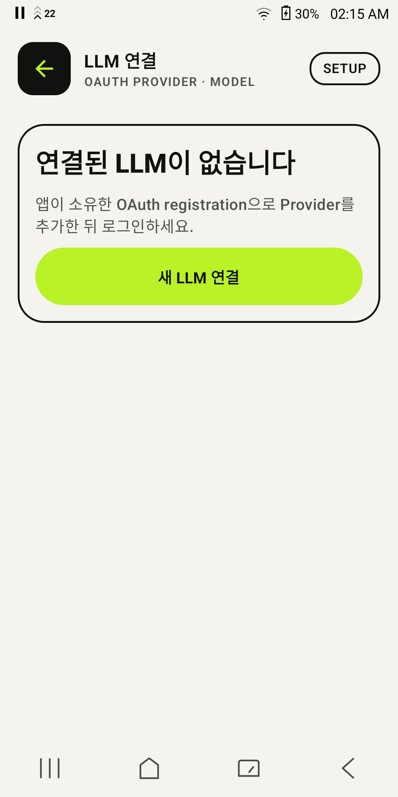</a><br><strong>LLM 연결</strong><br><sub>OAuth Provider가 없을 때의 안전한 시작점</sub></td>
  </tr>
  <tr>
    <td width="50%" align="center" valign="top"><a href="docs/assets/screenshots/01-fast-chat.png"></a><br><strong>빠른 채팅</strong><br><sub>Provider 연결 전 안내와 실행 모드 전환</sub></td>
    <td width="50%" align="center" valign="top"><a href="docs/assets/screenshots/02-conversation-history.png">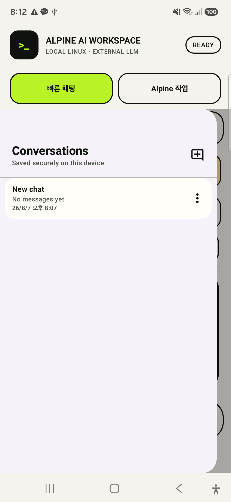</a><br><strong>암호화 대화 기록</strong><br><sub>기존 대화 검색·선택·관리</sub></td>
  </tr>
  <tr>
    <td width="50%" align="center" valign="top"><a href="docs/assets/screenshots/03-assistant-mode.png">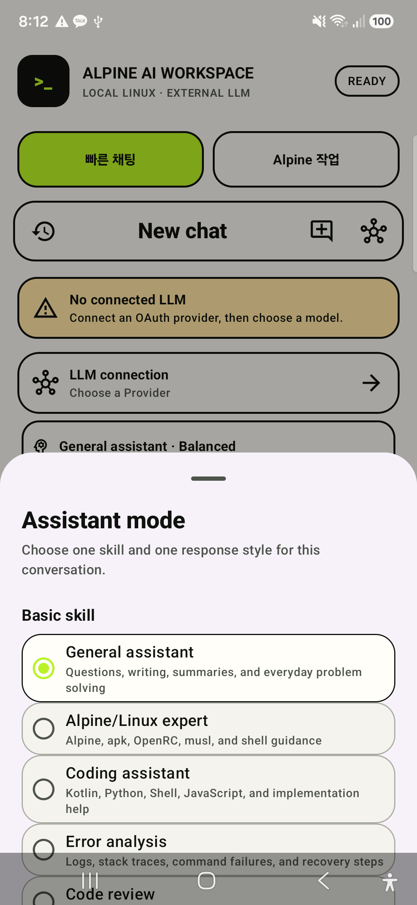</a><br><strong>Assistant Skill</strong><br><sub>현재 대화의 응답 방식 선택</sub></td>
    <td width="50%" align="center" valign="top"><a href="docs/assets/screenshots/04-assistant-personas.png">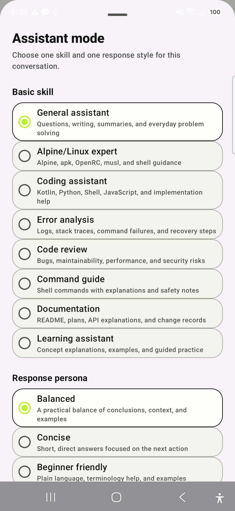</a><br><strong>Skill · Persona 카탈로그</strong><br><sub>기본 Skill과 Persona 탐색</sub></td>
  </tr>
  <tr>
    <td width="50%" align="center" valign="top"><a href="docs/assets/screenshots/05-assistant-defaults.png">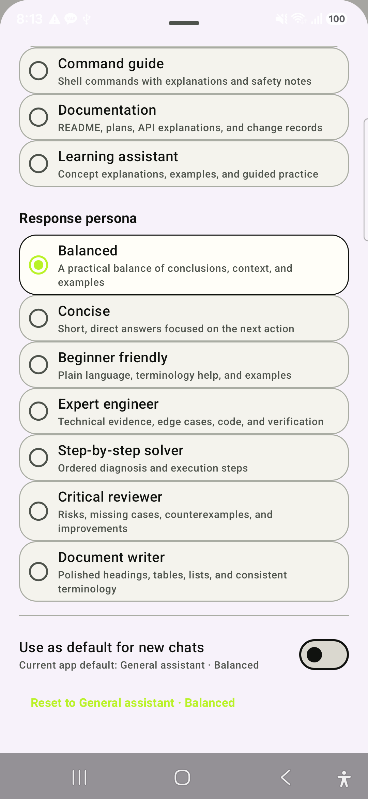</a><br><strong>Persona · 기본값</strong><br><sub>대화별 선택과 기본값 저장</sub></td>
    <td width="50%" align="center" valign="top"><a href="docs/assets/screenshots/06-provider-connections.png">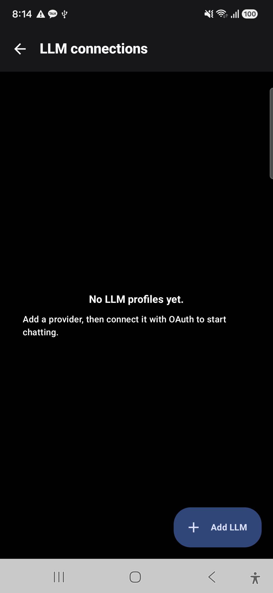</a><br><strong>LLM 연결 관리</strong><br><sub>OAuth Provider profile 상태</sub></td>
  </tr>
  <tr>
    <td width="50%" align="center" valign="top"><a href="docs/assets/screenshots/06a-provider-types.png">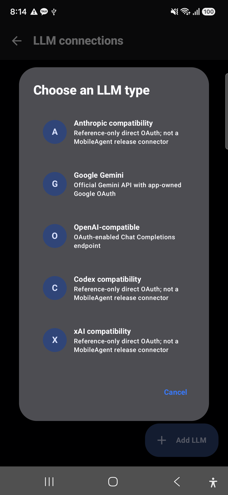</a><br><strong>Provider 유형</strong><br><sub>Codex·Claude·Gemini·Grok 연결 경로</sub></td>
    <td width="50%" align="center" valign="top"><a href="docs/assets/screenshots/07-alpine-gateway-chat.png">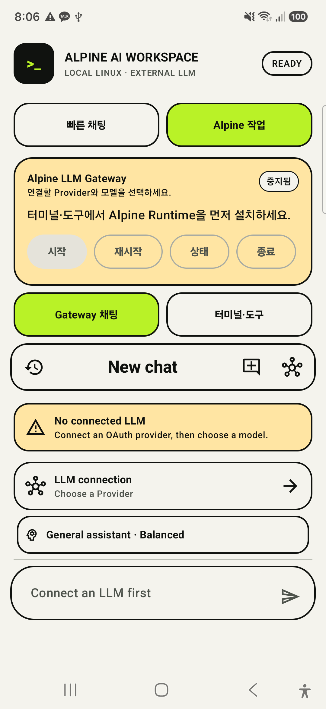</a><br><strong>Gateway 채팅</strong><br><sub>Alpine Gateway 기반 대화</sub></td>
  </tr>
  <tr>
    <td width="50%" align="center" valign="top"><a href="docs/assets/screenshots/11-alpine-workspace-gateway.png">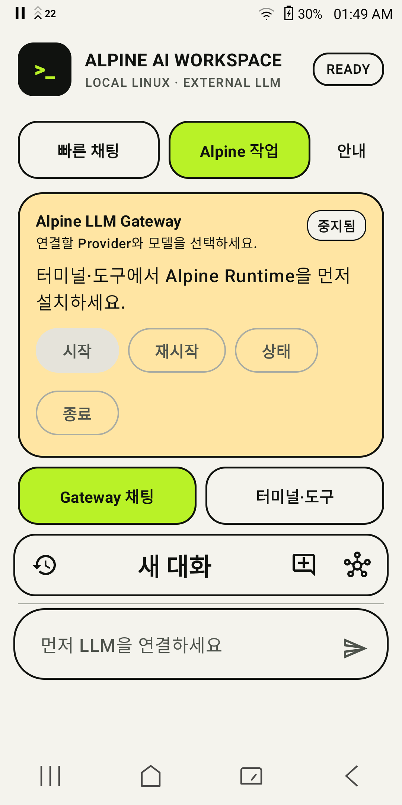</a><br><strong>Alpine 작업 준비</strong><br><sub>Runtime 설치 전 Gateway·Provider 의존성 안내</sub></td>
    <td width="50%" align="center" valign="top"><a href="docs/assets/screenshots/12-runtime-install-dashboard.png">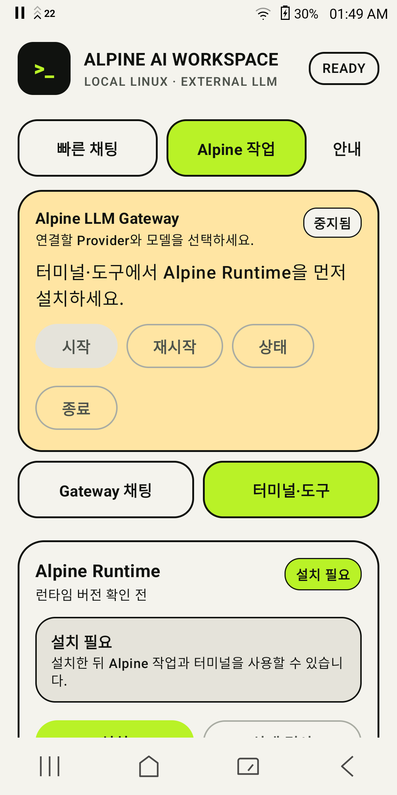</a><br><strong>Runtime 설치 대시보드</strong><br><sub>설치 필요 상태와 다음 action</sub></td>
  </tr>
  <tr>
    <td width="50%" align="center" valign="top"><a href="docs/assets/screenshots/13-runtime-terminal-command.png">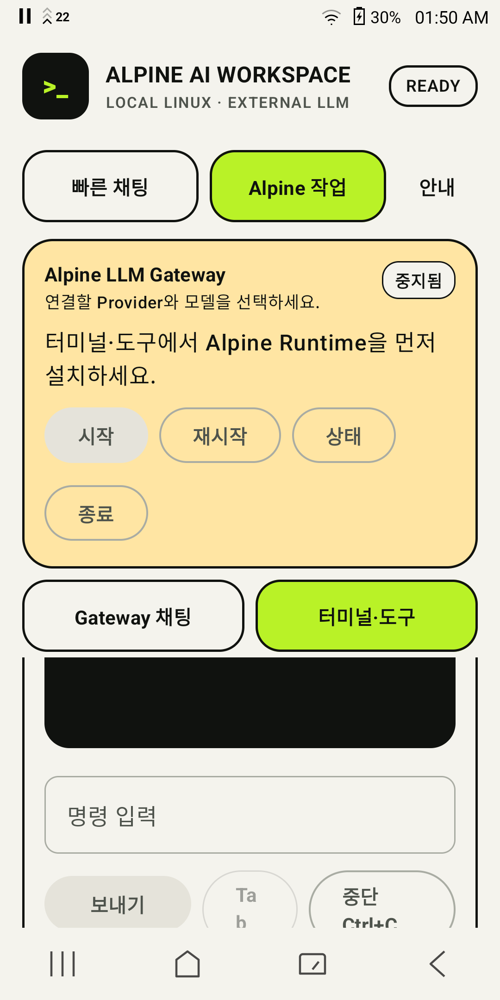</a><br><strong>Linux terminal 명령 패널</strong><br><sub>출력 viewport·명령 입력·중단 control</sub></td>
    <td width="50%" align="center" valign="top"><a href="docs/assets/screenshots/08-alpine-runtime-tools.png"></a><br><strong>Runtime · Linux terminal</strong><br><sub>설치·복구·PTY terminal 제어</sub></td>
  </tr>
  <tr>
    <td colspan="2" align="center" valign="top"><a href="docs/assets/screenshots/09-runtime-package-manager.png">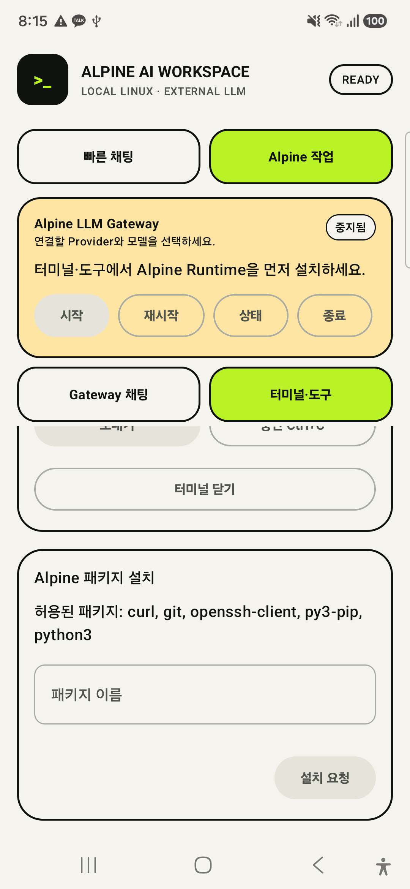</a><br><strong>패키지 allowlist UI</strong><br><sub>승인된 Alpine 패키지 설치</sub></td>
  </tr>
</table>

### MobileAgent Flutter · Android/iOS 공통 OAuth 제품

<table>
  <tr>
    <td width="50%" align="center" valign="top"><a href="docs/assets/screenshots/15-mobileagent-oauth-landing.png">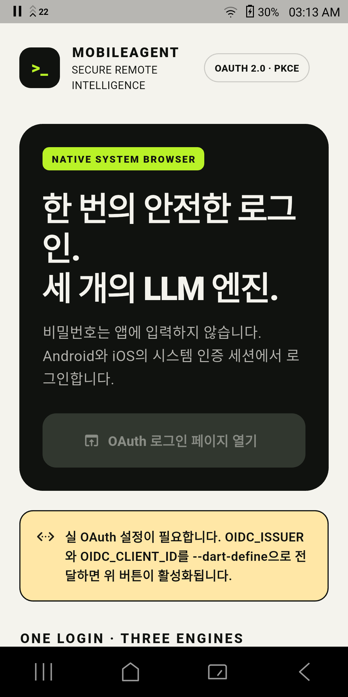</a><br><strong>MobileAgent OAuth 랜딩</strong><br><sub>시스템 브라우저·PKCE와 설정 필요 상태</sub></td>
    <td width="50%" align="center" valign="top"><a href="docs/assets/screenshots/16-mobileagent-provider-grid.png">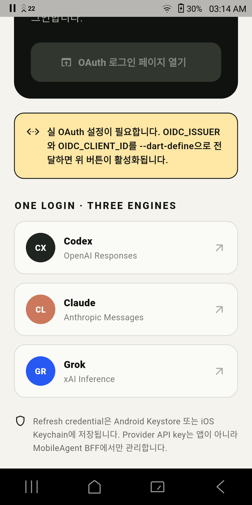</a><br><strong>Codex · Claude · Grok</strong><br><sub>MobileAgent BFF를 통한 세 Provider 경로</sub></td>
  </tr>
</table>

> **의도적으로 제외한 상태** — 실제 OAuth 브라우저·callback, 계정 정보, public client ID 입력값, token/credential, 사용자 workspace 경로·terminal 출력, 파괴적 package/Runtime 확인 dialog는 저장소 이미지로 남기지 않습니다. MobileAgent의 인증 후 대화·Run Card는 앱 소유 HTTPS issuer/BFF와 승인된 계정이 있어야 하므로 아직 문서용 실캡처를 만들지 않았습니다. 이 갤러리는 모든 사용자별·민감 상태가 아니라, 현재 검토 가능한 제품 핵심 플로우를 보여 줍니다.
</details>

## 🧭 두 가지 실행 모드

| 모드 | 실행 경로 | 적합한 작업 | Runtime 필요 |
|---|---|---|---|
| **빠른 채팅** | Android → OAuth session → Provider HTTPS | 일반 대화, 빠른 응답, Runtime 장애 시 독립 사용 | 아니요 |
| **Alpine 작업** | Android → PRoot/Alpine → Python Gateway → loopback Host Bridge → Provider HTTPS | 터미널, Python, Git, 패키지, Linux 기반 Skill과 자동화 | 예 |

두 모드는 동일한 대화·모델·Skill·Persona 상태를 사용합니다. Alpine 준비 실패 시 fallback은 Provider dispatch 전에 사용자가 승인한 **해당 요청 한 번**만 빠른 채팅으로 전송하며, 첫 Provider dispatch 또는 delta 이후에는 중복 비용을 막기 위해 다른 backend로 자동 전환하지 않습니다.

첫 실행에서는 두 모드의 실행 경로, 준비 조건, 기능, 제한과 복구 방법을 비교하는 안내가 자동으로 열립니다. `빠른 채팅으로 시작` 또는 `Alpine 작업으로 시작`을 명시적으로 선택해야 완료되며, `나중에`로 닫으면 다음 새 실행에서 다시 표시됩니다. 완료 후에도 상단 모드 선택 옆 `안내` 버튼으로 언제든 다시 열 수 있습니다. 안내에서 Alpine 작업을 선택해도 Runtime 설치나 시작은 자동 실행하지 않습니다.

<a id="architecture"></a>
## 🏗 아키텍처

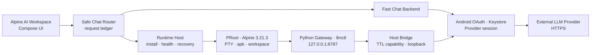

### Credential 경계

1. OAuth access/refresh token은 Android Keystore-backed store에만 저장합니다.
2. OAuth lifecycle marker에는 profile/attempt ID와 상태·시각만 저장하며 token·code·PKCE state/verifier는 포함하지 않습니다.
3. Activity 재생성·process death 뒤에는 이전 OAuth transaction을 자동 재개하지 않고 폐기한 뒤 명시적 재로그인을 요구합니다.
4. Alpine Guest에는 token 대신 loopback endpoint와 짧은 TTL capability 파일만 제공합니다.
5. Host Bridge는 bounded concurrency, timeout, request ID, redacted error와 health metric을 적용합니다.
6. Python Gateway는 기본 `127.0.0.1` bind, 모델 allowlist, 입력·출력·SSE 크기 제한을 적용합니다.
7. 패키지 install은 exact allowlist와 사용자 승인 모두를 통과한 이름만 고정 `apk add` 명령으로 실행합니다. delete는 별도 removable allowlist, update는 지정 allowlist package만 고정 argv로 실행하며 whole-system update는 제공하지 않습니다.

<a id="modules"></a>
## 🧩 모듈 구성

| 그룹 | 주요 모듈 | 책임 |
|---|---|---|
| Chat | `alpine-chat-feature`, `alpine-chat-routing` | 대화 상태, 암호화 저장, UI, backend 중립 계약 |
| Provider | `alpine-chat-provider-android`, `android` | OAuth profile CRUD, Keystore, Provider adapter |
| Backend | `alpine-chat-backend-direct`, `alpine-chat-backend-alpine` | 빠른 채팅과 Gateway 경로 연결 |
| Runtime | `alpine-runtime-api`, `-android`, `-host`, `-ui-compose` | 설치, 실행, 복구, PTY, 터미널, 패키지 상태 |
| Artifact | `alpine-runtime-pack-bundled`, `-pack-x86_64`, `-artifact-play` | rootfs·PRoot·loader 공급과 checksum/SBOM |
| LLM Bridge | `alpine-llm-bridge`, `alpine-llm-gateway-pack-bundled` | capability, Host Bridge와 Python Gateway lifecycle |
| Workspace | `alpine-workspace-api`, `alpine-workspace-android` | app-private 경로, quota, bounded atomic file 작업 |
| Background/Test | `alpine-runtime-background-android`, `alpine-runtime-testkit` | FGS/WorkManager 정책과 결정적 fake runtime |

전체 artifact 역할과 권장 조합은 [Alpine Runtime SDK 모듈 가이드](docs/alpine-runtime-sdk-modules.md)를 참고하세요.

<a id="quick-start"></a>
## 🚀 빠른 시작

### Android 통합 앱

요구사항: JDK 17, Android SDK 36, Android 8.0(API 26) 이상

```bash
git clone https://github.com/coreline-ai/alpine-llm-gateway.git
cd alpine-llm-gateway

./gradlew :integrated-app:assembleDebug
adb install -r integrated-app/build/outputs/apk/debug/integrated-app-debug.apk
```

앱 실행 후:

1. 첫 실행 안내에서 두 모드를 비교하고 시작 모드를 선택합니다.
2. `빠른 채팅`에서 `LLM connection`을 엽니다.
3. 앱 소유·승인된 OAuth public client registration으로 profile을 만듭니다.
4. 로그인 후 Provider와 모델을 선택합니다.
5. Alpine 기능은 `Alpine 작업 → 터미널·도구 → 설치` 순서로 준비합니다.
6. Gateway health가 정상이면 Gateway 채팅, 터미널과 허용 패키지 설치를 사용할 수 있습니다.

> [!CAUTION]
> 다른 앱이나 공식 CLI의 public client ID·fingerprint를 복사해 제품에 포함하지 마세요. 현재 Android direct OAuth 화면의 Anthropic/Codex/xAI 항목은 compatibility/reference 경로이며 공식 제품 승인을 의미하지 않습니다.

### Python Gateway

요구사항: Python 3.11 이상. 런타임 의존성은 Python 표준 라이브러리만 사용합니다.

```bash
python3.11 -m venv .venv
source .venv/bin/activate
pip install -e .

cp config.example.json config.json
export LLM_API_KEY="..."

llm-gatewayd serve --config config.json
```

다른 터미널에서:

```bash
llmctl models
llmctl run --model auto --prompt "Alpine에서 동작하는지 설명해줘"
llmctl run --model auto --prompt "스트리밍 테스트" --stream --format jsonl
```

공통 입력은 OpenAI-compatible message 형식이며 Provider native request 변환은 Gateway가 담당합니다. `stream`은 JSON Boolean만 허용하고, `allowed_models`가 비어 있거나 요청 모델이 허용되지 않으면 `allow_passthrough: true`를 명시하지 않는 한 fail-closed 처리합니다.

## 🛡 Gateway 안전 기본값

| 설정 | 기본값 | 의미 |
|---|---:|---|
| `max_response_bytes` | 8 MiB | non-stream 응답과 Provider 오류 body 상한 |
| `max_stream_event_bytes` | 1 MiB | SSE 단일 line/event 상한 |
| `max_stream_bytes` | 32 MiB | SSE 전체 응답 상한 |
| `provider_retry_max_attempts` | 3 | 최초 요청 포함 retryable 요청 최대 시도 |
| `provider_retry_max_backoff_seconds` | 8초 | backoff와 `Retry-After` 상한 |
| `provider_circuit_failure_threshold` | 5 | circuit open 연속 실패 기준 |
| `provider_circuit_recovery_seconds` | 30초 | half-open probe 대기시간 |
| `allow_passthrough` | `false` | 모델 allowlist 우회 기본 차단 |

Streaming은 Provider HTTP 연결·status 단계까지만 재시도합니다. stream이 열린 뒤에는 delta 중복을 막기 위해 재시도하지 않고 redacted SSE error event와 `[DONE]`으로 종료합니다.

<a id="verification"></a>
## 🧪 검증

### 자주 사용하는 로컬 검증

```bash
python3 -m unittest discover -s tests -v

./gradlew \
  :alpine-chat-feature:testDebugUnitTest \
  :alpine-runtime-ui-compose:testDebugUnitTest \
  :integrated-app:assembleDebug \
  :integrated-app:assembleDebugAndroidTest \
  :integrated-app:lintDebug
```

Samsung 실기기 통합 E2E:

```bash
ANDROID_SERIAL=<device-serial> ./gradlew :integrated-app:connectedDebugAndroidTest
```

내부 SDK release bundle 전체 검증:

```bash
./scripts/release-local.sh
```

### 현재 검증 상태

| 항목 | 상태 | 기준 |
|---|---|---|
| Python unit/compile/smoke | ✅ CI PASS | GitHub Actions `Python 3.11` |
| 결정론 Provider fault matrix | ✅ Local PASS | Python 106/106 + MobileAgent BFF 39/39; status·timeout·malformed/oversized SSE·strict UTF-8·no-retry |
| Android modules·publication matrix | ✅ CI PASS | remote run `30807869557`, commit `3389fcb` |
| 통합 앱 compile·unit·lint·APK | ✅ Local PASS | 2026-08-09 Alpine fallback viewport·접근성·한글 IME 반영 |
| Samsung Android regression | ✅ PASS | OAuth core 3/3, Provider 12/12, Runtime Compose 8/8, integrated-app 10/10 |
| Samsung Demo 전체 회귀 | ✅ 35/35 PASS | Provider·Chat·lifecycle·Markdown·theme |
| Samsung OAuth lifecycle | ✅ Local PASS | OAuth core 3건 + Provider 12건 + 복구 3건 + credential-free `am force-stop` cold start |
| Samsung Provider 변경 회귀 | ✅ 25/25 PASS | OAuth 저장소 3건 + Provider 12건 + Integrated 10건 |
| Integrated APK OAuth/app boundary scan | ✅ Local PASS | production source·APK에서 consumer/CLI fingerprint·known copied registration/API key/private key·demo/probe/sample package를 fail-closed 검사 |
| arm64 Runtime·PTY·Bridge·Gateway probe | ✅ PASS | Samsung actual PRoot: initial `stty size=28 96`, fail-closed `INITIAL_SIZE_ONLY`/`TERMINAL_RESIZE_UNSUPPORTED`, terminal exit event, Host lifecycle `STARTED:3`/`STOPPED:3`, restart/repair healthy |
| ANSI terminal screen renderer·exit summary | ✅ Local PASS | colour·cursor·clear·alternate screen·CJK·raw output 없는 마지막 종료 code unit regression + integrated compile |
| Developer tool fixed smoke workflow | ✅ Local PASS | reusable direct argv Python·Git·SSH·Node profile + API/Host regression; actual repository install은 `NOT_RUN` |
| Runtime Compose package/tool action | ✅ Samsung PASS | 8/8 — terminal accessibility/한글 IME·Enter/Tab/Esc/Ctrl+C external key regression·exit summary·confirmed SIGTERM/SIGKILL, fixed Git smoke, package snapshot/workspace action forwarding |
| Android 12 tablet Runtime Compose | ✅ PASS | 8/8 — scroll container 안에서 package 검토와 workspace import/export/share action이 실제 터치 target으로 노출되고 terminal key regression이 통과 |
| Foreground-service process lease | ✅ Local PASS | background 4/4 — first start/last stop, nested terminal·command, duplicate close, FGS start-rejection host-policy callback; actual notification cleanup은 `NOT_RUN` |
| Package metadata snapshot UI | ✅ Local PASS | exact allowlist의 license·download/installed payload·network/estimate boundary; live dependency preflight는 `NOT_RUN` |
| README UI 갤러리·design contract | ✅ Local PASS | 17개 실제 Android PNG, 원본 기기 해상도 허용 목록·경로·미리보기 너비 검사 |
| Workspace SAF·share boundary | ✅ Samsung PASS | 5/5 — test `content://` import/export, 이름 정규화, size cap, provider 오류 축소, app-private atomic share file; DocumentsUI full manual flow는 `NOT_RUN` |
| bounded Gateway 복구·package mutation·workspace diff | ✅ Local PASS | supervisor/package/workspace unit test + 통합 APK build |
| Gateway process crash·package network/disk-full | ⏳ `NOT_RUN` | 실제 runtime/repository 조건과 destructive matrix 필요 |
| Android 12 tablet integrated regression | ✅ PASS | fake Provider 기반 integrated-app 10/10 — approval/decline fallback, Korean IME·TalkBack semantics, compact 200% guide, history·mode flow; manual gesture/contrast QA는 `NOT_RUN` |
| 실제 Provider 계정 OAuth/API E2E | ⏳ `NOT_RUN` | 앱 소유 registration·계정 승인 필요 |
| x86_64 emulator E2E | ⛔ BLOCKED | 연결된 검증 emulator 없음 |
| 공개 배포 | ⛔ `NO-GO` | release readiness 10개 gate 중 6개 release blocker BLOCKED |

Remote CI의 최신 성공은 원격 `main`의 기준선입니다. 현재 로컬 commit 또는 working tree가 Push되지 않았다면 그 변경은 원격 CI로 검증된 것으로 간주하지 않습니다.

## ⚠️ 현재 제한

- arm64-v8a는 제품 검증 대상이며 x86_64 pack은 emulator E2E 전까지 실험 상태입니다.
- Probe-only relay21은 initial/active same-PTY guest tracee가 physical foreground group임을 확인했고,
  PRoot 없는 host PTY control은 `TIOCSWINSZ → SIGWINCH → 이후 input`을 통과했습니다. 그러나 PRoot session은
  resize 뒤 guest signal과 fixed marker·helper input이 재개되지 않았습니다. 이 evidence는 제품 기능이 아니며,
  제품 터미널은 실행 중 동적 resize를 계속 `INITIAL_SIZE_ONLY`로 명시합니다.

- Probe-only relay24는 host-master resize와 post-launch signal 없이 private memfd winsize 경로를 검증했지만,
  Samsung에서 PRoot guest read/apply와 이후 input 재개에 실패했습니다. 같은 private request를 validate/ack만
  하는 no-write control도 input을 재개하지 못했습니다. 따라서 Android 직접 Provider/Alpine 생산 앱은 계속
  `INITIAL_SIZE_ONLY` terminal contract를 유지합니다.
- 이어진 base-PRoot control은 `TIOCGWINSZ`를 전부 피할 때만 여러 input batch가 유지되고, `stty size` 뒤
  별도 input batch가 재개되지 않는 현상을 보였습니다. 정확한 source-level 원인이 해결될 때까지 full-screen
  TUI·dynamic resize·input replay/retry는 지원하지 않습니다.
- 실제 Provider direct OAuth는 앱 소유 registration과 inference 사용 승인이 필요합니다.
- Gemini 외 direct Provider는 승인된 model catalog를 번들하지 않으며, 앱 소유자가 입력한 model만 후보로 노출합니다.
- MobileAgent OIDC/BFF의 실제 staging Provider E2E는 external account/secret이 없어 아직 실행하지 않았습니다.
- BFF request/cancel/revocation registry는 단일 process memory 구현이며 다중 replica 전 Redis 경계가 필요합니다.
- Play Asset Delivery 전체 E2E는 signed AAB와 Play test track이 필요합니다.
- Provider OAuth의 credential-free Activity 재생성·`am force-stop` 복구는 통과했지만, 실제 계정 browser callback 도중 process kill과 Runtime 재부팅·Doze 검증은 승인 창이 필요합니다.
- Workspace는 app-private bounded text file과 one-shot SAF transfer를 지원합니다. 실제 DocumentsUI에서 선택한 파일을 import → 편집 → 실행 중 terminal과 연결 → export/share하는 수동 사용성 흐름은 Runtime 설치 후 별도 검증이 필요합니다.
- Chat·History·Assistant의 한국어 semantics와 48dp·한글 IME 자동 검증은 통과했지만 실제 TalkBack 음성·focus gesture와 Switch Access는 수동 QA가 필요합니다.
- 루트 프로젝트 `LICENSE`와 Alpine package-level exact source mirror가 없어 외부 배포는 차단됩니다.

전체 gate는 [SDK publication과 배포 가이드](docs/sdk-publication-and-distribution.md)와 [release readiness](distribution/release-readiness.json)에서 확인할 수 있습니다.

<a id="docs"></a>
## 📚 문서 지도

| 문서 | 내용 |
|---|---|
| [통합 앱 가이드](integrated-app/README.md) | 빠른 채팅·Alpine 작업 사용법과 실기기 검증 |
| [Android 통합](android/README.md) | OAuth, Host Bridge, Provider adapter와 manifest |
| [Runtime SDK 모듈](docs/alpine-runtime-sdk-modules.md) | 19개 artifact 역할과 권장 조합 |
| [Runtime Host 통합](docs/alpine-runtime-host-integration.md) | Application owner, FGS, terminal, package, recovery |
| [Alpine package catalog snapshot](docs/alpine-package-catalog-20260808.md) | allowlist package license·payload estimate와 live preflight 경계 |
| [Provider OAuth adapter](docs/provider-oauth-adapters.md) | 제품 OIDC/BFF와 compatibility direct OAuth 경계 |
| [UI 디자인 적용 범위](docs/ui-design-coverage-and-proposal.md) | 미적용 화면 코드 분석과 권장 이식 순서 |
| [Provider 계정 E2E](docs/provider-account-e2e-runbook.md) | opt-in 실제 계정 검증 절차 |
| [Samsung lifecycle E2E](docs/samsung-background-lifecycle-e2e.md) | reboot·Doze·process-kill 검증 절차 |
| [배포 가이드](docs/sdk-publication-and-distribution.md) | Maven bundle, source, Play와 공개 gate |
| [OSS 경계](distribution/PROJECT_CODE_OSS_BOUNDARY.md) | 프로젝트 코드와 PRoot/Alpine OSS 분리 |
| [라이선스 상태](distribution/PROJECT_LICENSE_STATUS.md) | 프로젝트 전체 라이선스 미확정 상태 |
| [GitHub CI 상태](distribution/GITHUB_CI_STATUS.md) | 원격 성공 기준선과 로컬 차이 |
| [개발 계획](dev-plan/) | Phase별 구현·검증 이력 |

## 📄 라이선스와 배포

이 저장소에는 현재 프로젝트 전체 코드에 적용되는 루트 `LICENSE`가 없습니다. 따라서 코드를 공개 사용·재배포할 수 있다는 허가를 이 README가 부여하지 않습니다.

PRoot/talloc source bundle 생성과 라이선스 고지는 구현되어 있지만 Alpine rootfs package-level exact source mirror와 최종 OSS 검토가 남아 있습니다. 생성되는 `dist/alpine-sdk-0.3.0/`은 `INTERNAL_ONLY`이며 `external_distribution_ready=false`입니다.

자세한 내용은 [프로젝트 라이선스 상태](distribution/PROJECT_LICENSE_STATUS.md), [corresponding source 상태](distribution/SOURCE_OFFER_STATUS.md), [제3자 고지](distribution/THIRD_PARTY_NOTICES.md)를 확인하세요.
