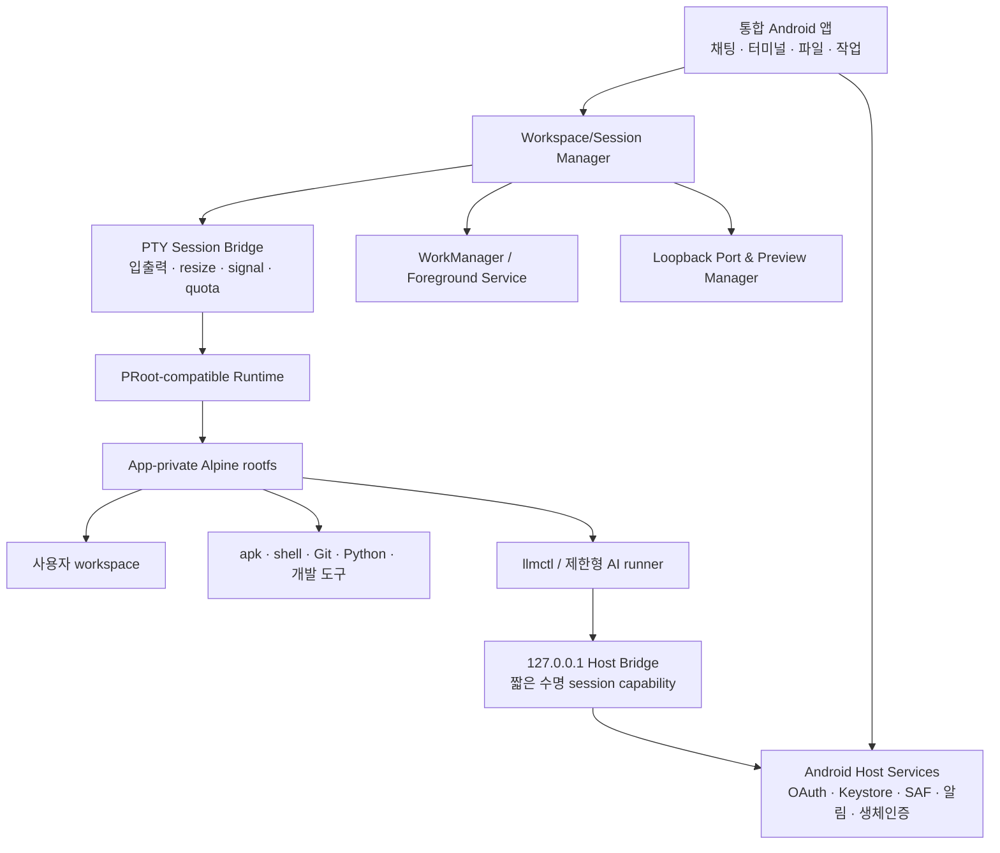

# implement_20260731_233922.md

작성 일시: `2026-07-31 23:39:22 KST`

문서 상태: **장기 개발 과제 / 구현 미착수 / 권장 순서 기준 백로그**

> **2026-08-01 후속 아키텍처 결정:** 이 문서의 기능 카탈로그와 장기 Phase 순서는 유지한다. 다만 `:android`와 `:demo-chatbot` 안에 runtime·terminal·workspace를 직접 추가하는 예상 경로는 더 이상 사용하지 않는다. 재사용 가능한 별도 SDK 모듈, 두 실행 모드와 통합 앱 조립 경계는 [implement_20260801_151654.md](implement_20260801_151654.md)를 선행 기준으로 적용한다.

이 문서는 Alpine 기반 Android 통합 앱이 장기적으로 제공할 수 있는 전체 기능군을 정리하고, 구현이 목적 밖으로 확장되지 않도록 권장 개발 순서와 단계별 완료 기준을 고정하기 위한 작업 문서다. 계획 생성만으로 구현을 시작한 것으로 간주하지 않으며, 각 Phase를 실제 착수할 때 체크박스와 이슈를 갱신한다.

## 개발 목적

현재의 LLM 채팅 데모와 `AlpineRuntime.exec()` 기반을 **한 개의 Android 앱에서 동작하는 AI 연결형 Alpine 모바일 워크스페이스**로 발전시킨다.

- Android 앱 내부의 app-private Alpine user space에서 실제 shell, 개발 도구와 사용자 작업을 실행한다.
- OAuth credential과 Android 권한은 Host에만 보관하고 Alpine에는 최소 권한의 임시 capability만 전달한다.
- 대화, 터미널, 파일, Git, 개발 도구, 로컬 서비스 미리보기, 자동화와 AI 작업을 하나의 앱 UX로 통합한다.
- 사용자 터미널과 AI 자동 실행기를 분리해 편의성과 안전성을 함께 확보한다.
- 실제 기기에서 설치·업데이트·복구·성능·배터리·접근성까지 검증 가능한 제품 수준으로 완성한다.

## 개발 범위

- ABI별 Alpine rootfs와 PRoot-compatible runtime 자산의 재현 가능한 빌드·검증·패키징·업데이트
- PTY 기반 대화형 터미널, ANSI 렌더링, 키 입력, 세션·탭·프로세스 제어
- app-private workspace와 Android Storage Access Framework를 연결한 파일 관리·편집·가져오기·내보내기
- Alpine `apk`와 언어별 package manager를 통한 개발 도구 설치·업데이트·프로필 관리
- Git, SSH client, API·네트워크 도구, 로컬 데이터베이스와 loopback 개발 서버
- Python·JavaScript/TypeScript·C/C++·Go·Rust 등 호환성 검증된 개발 환경
- 기존 OAuth LLM Provider와 `llmctl`을 연결한 AI 터미널·코드 작업·안전한 도구 실행
- WorkManager 기반 예약·반복·백그라운드 작업과 사용자 알림
- 데이터·문서·이미지·오디오·영상 처리용 선택형 도구 프로필
- 프로젝트 템플릿, task/skill, 확장 manifest와 Android 공유·클립보드·알림 연동
- 보안 정책, 리소스 quota, 감사 event, backup/export, runtime update/rollback, SBOM·라이선스
- JVM·instrumentation·실제 Alpine·실기기 E2E·성능·배터리·접근성 검증

## 제외 범위

- Android kernel을 교체하거나 완전한 Linux VM을 제공하는 기능
- Docker/Podman daemon, KVM, 커널 모듈, 실제 root 권한, 임의 mount, `iptables`, eBPF
- `systemd` 전체 boot, 커널 수준 container isolation과 Linux desktop GUI 전체 환경
- Android 보안 모델을 우회하는 외부 저장소 전체 bind, 다른 앱 데이터 접근, 숨은 백그라운드 상주
- 사용자의 명시적 승인 없는 AI의 삭제·결제·배포·원격 push·패키지 설치·credential 사용
- Provider OAuth token, refresh token, client secret, Android Keystore key를 Alpine guest에 복사하는 설계
- 인터넷에 노출되는 기본 SSH server, 웹 server 또는 원격 shell
- 모든 Alpine package의 동작 보장: 기능 카탈로그는 지원할 기능군이며 개별 package는 ABI·musl·Android kernel 호환성 검증 후 지원 등급을 부여한다.
- Play 정책, 공급자 약관이나 오픈소스 라이선스를 우회하는 runtime/Provider 배포

## 참조 문서

- [프로젝트 README](../README.md)
- [Android 통합 가이드](../android/README.md)
- [데모 챗봇 가이드](../demo-chatbot/README.md)
- [데모 UI 설계](../demo-chatbot/DESIGN.md)
- [Provider OAuth adapter 요구사항](../docs/provider-oauth-adapters.md)
- [선행 멀티 대화 장기 보존 계획](implement_20260731_233326.md)
- 현재 runtime 진입점: `../android/src/main/java/dev/alpine/llm/AlpineRuntime.kt`
- 현재 runtime 자산 검증: `../android/src/main/java/dev/alpine/llm/AlpineRuntimeAssets.kt`
- 현재 Alpine CLI 설치 스크립트: `../alpine/install.sh`

## 공통 진행 규칙

- 각 Phase는 앞선 Phase의 자체 테스트 완료 후에만 시작한다.
- 구현 중 발생한 이슈는 해당 Phase에서 수정하고 기록한다.
- 체크박스 상태를 실제 진행 상태와 맞게 업데이트한다.
- 문서에 없는 범위 확장은 하지 않는다.
- 요구사항이 불명확하면 가능한 케이스를 나누고 확인 후 진행한다.
- 한 기능은 유지보수 가능한 최소 책임 단위로 나누고 역할과 경계를 코드·테스트에 반영한다.
- 기존 프로젝트 API, Android 표준 API, 검증된 terminal/PTY 구성요소와 Alpine 공식 package를 우선한다.
- 새 native library와 runtime binary는 출처, 고정 버전, SHA-256, 라이선스, ABI, 빌드 재현 절차 없이 포함하지 않는다.
- `arm64-v8a` 실제 기기를 1차 지원하고 `x86_64` emulator는 자동 검증용으로 추가한다. 32-bit ABI는 별도 근거가 생기기 전 지원하지 않는다.
- rootfs, workspace, cache, log, session은 app-private storage를 기본으로 하며 사용자 선택 파일만 SAF로 반출입한다.
- OAuth credential과 Android 권한은 Host가 소유하고 Alpine에는 회수 가능한 짧은 수명의 capability만 전달한다.
- 모든 guest process와 출력은 시간·동시성·메모리·디스크·출력량 제한을 갖는다.
- 사용자 대화형 터미널과 AI 자동 실행기는 process, workspace 권한, network 정책과 audit log를 분리한다.
- 파괴적 명령, package 설치, 원격 전송/push, 외부 공개 server 시작과 민감 파일 접근은 명시적 확인을 거친다.
- 장기 작업은 Foreground Service와 사용자 알림을 사용하고 WorkManager 제약을 우회하지 않는다.
- 로컬 미리보기 server는 기본 `127.0.0.1`에만 bind하고 외부 공개는 별도 위험 안내와 동의 없이는 허용하지 않는다.
- secret, 전체 환경변수, 명령에 포함된 token, 사용자 파일 내용과 Provider 원문 오류를 log·metric·crash report에 남기지 않는다.
- 각 Phase 완료 시 문서, 테스트 수, 실기기 결과, 잔여 리스크와 runtime/package 크기 변화를 기록한다.

## 확인 필요 사항 / 결정 기록

- [x] 이 계획은 즉시 완료할 단기 패치가 아니라 여러 릴리스에 걸친 **장기 개발 과제**로 관리한다.
- [x] 최종 사용자에게 설치되는 제품은 앱 하나이며, `:android` 같은 Gradle library 모듈 분리는 내부 코드 구조일 뿐 별도 앱 설치를 의미하지 않는다.
- [x] 현재 `:demo-chatbot`은 선행 기능 검증 앱으로 유지하고, 데이터·package ID 보존 방안을 검토한 뒤 통합 앱으로 승격한다.
- [x] Alpine은 Android kernel 위 PRoot user space이며 VM 또는 실제 root Linux로 표현하지 않는다.
- [x] 완전한 터미널은 현재 one-shot `exec()` 확장이 아니라 PTY·stdin·resize·signal·세션 lifecycle 계약으로 구현한다.
- [x] Linux `cron` 상주 대신 Android WorkManager/Foreground Service가 예약과 장기 작업 lifecycle을 소유한다.
- [x] 한 앱 패키징은 우선 app bundle/install-time asset 또는 검증된 runtime pack을 포함해 달성하고, 단일 APK 강제 여부는 크기·스토어 제한 측정 후 결정한다.
- [x] 기능 수보다 공급망, credential 격리, 실제 shell 안정성과 데이터 복구를 먼저 완성한다.
- [x] 사용자 터미널은 일반 workspace를 사용할 수 있지만 AI runner는 기본 workspace allowlist와 명령 승인 정책을 적용한다.

## 현재 기준선

| 구분 | 현재 상태 | 장기 계획의 의미 |
|---|---|---|
| Alpine 실행 wrapper | `installIfNeeded()`, one-shot `exec()`, gateway process lifecycle 기반 있음 | 실제 자산과 PTY session이 필요 |
| runtime 무결성 | ABI 선택, SHA-256, 크기 제한, 안전한 tar 추출, rollback 기반 있음 | 공식 공급망·업데이트 manifest 필요 |
| 실제 rootfs/PRoot | 저장소와 APK에 미포함, 삼성폰 실제 실행 미검증 | Phase 1의 첫 차단 조건 |
| 터미널 | stdout 수집형 명령 실행만 가능 | PTY·stdin·ANSI·resize·job control 미구현 |
| LLM | Android OAuth/Keystore/Host Bridge, 여러 Provider, stream 기반 있음 | Alpine `llmctl` 실제 E2E와 AI runner 필요 |
| 채팅 | 데모 UI, 모델 전환, 생성 중 UI 조작 기반 있음 | 선행 멀티 대화 계획 완료 후 통합 |
| 파일·Git·개발 도구 | 전용 UX 없음 | Phase 3 이후 신규 구현 |
| 자동화·미리보기 | 전용 lifecycle 없음 | WorkManager/loopback port manager 필요 |

## 목표 구조

## 전체 기능 카탈로그

아래는 현재 제품 방향에서 현실적으로 제공 가능한 기능군 전체다. `핵심`은 기본 제품, `선택`은 사용자가 추가 설치하는 도구 프로필, `실험`은 기기·ABI·성능 검증 후에만 노출하는 기능이다.

| 기능군 | 제공 기능 | 등급 | 권장 Phase |
|---|---|---:|---:|
| Linux 기본 환경 | BusyBox/Alpine shell, 환경변수, locale/timezone, 사용자 홈, dotfile, alias, command history | 핵심 | 1~2 |
| 대화형 터미널 | PTY, stdin/stdout/stderr, ANSI/256 color/TrueColor, resize, signal, exit code, hyperlink, selection/copy/paste | 핵심 | 2 |
| 모바일 입력 | software keyboard toolbar, Ctrl/Alt/Tab/Esc/방향키, 외부 키보드 shortcut, 한글·Unicode·IME composition | 핵심 | 2 |
| 세션·프로세스 | 여러 탭, 이름 변경, 재연결, foreground/background 상태, process 목록·종료, bounded scrollback | 핵심 | 2 |
| 고급 terminal UX | split pane, 검색, command palette, snippet, theme/font, bell·진동, URL 열기, `tmux` 연계 | 선택 | 2, 10 |
| package 관리 | `apk update/add/del/upgrade`, repository/profile, package 검색, 설치 용량 미리보기, cache 정리, version pin | 핵심 | 4 |
| 파일 관리 | 생성·이름 변경·복사·이동·삭제·검색·정렬·권한 표시·압축·해제·checksum·휴지통 | 핵심 | 3 |
| Android 파일 연동 | SAF 가져오기/내보내기, 공유 시트, 최근 파일, 사용자 승인 폴더 연결, MIME별 외부 앱 열기 | 핵심 | 3, 11 |
| 편집기 | text/code 편집, line number, 검색/바꾸기, syntax highlight, large-file guard, autosave, diff viewer | 핵심 | 3 |
| IDE 보조 | project tree, build/test task, diagnostics, formatter, LSP client, symbol 이동, terminal/editor 연동 | 선택 | 4, 10 |
| Shell 도구 | `grep`, `sed`, `awk`, `find`, `tar`, `gzip`, `zip`, `jq`, `yq`, `curl`, `wget`, `openssl` | 핵심 | 4 |
| Python | Python, `pip`, `venv`, script 실행, test/lint/format, notebook-compatible local web UI | 핵심 | 4, 6 |
| JavaScript/TypeScript | Node.js, npm 호환 package manager, TypeScript, test/build/dev server | 핵심 | 4, 6 |
| C/C++ | clang/gcc, musl headers, make/cmake/ninja, local compile/test | 선택 | 4 |
| Go·Rust·JVM·기타 언어 | Go, Rust/cargo, OpenJDK/Kotlin CLI, Ruby, PHP, Lua 등 검증된 toolchain profile | 선택/실험 | 4 |
| Git | clone/init/status/diff/log/add/commit/branch/merge/rebase/stash/tag, conflict/diff UI | 핵심 | 5 |
| 원격 저장소 | HTTPS credential broker, SSH key/agent bridge, known_hosts, fetch/pull/push, Git LFS 호환성 검토 | 핵심/선택 | 5 |
| SSH client | SSH/SCP/SFTP/rsync, port forwarding, host profile, fingerprint 확인, session terminal | 핵심 | 5 |
| 네트워크·API | DNS 조회, HTTP/API 요청, TLS 인증서 검사, WebSocket client, port 확인, 제한형 diagnostic | 선택 | 5 |
| 로컬 서비스 | Python/Node/PHP 등 loopback server, port registry, 시작/중지, log, health, 충돌 탐지 | 핵심 | 6 |
| 웹 미리보기 | 앱 내 WebView/Custom Tab preview, reload, viewport, console/log 연결, QR 없이 localhost 접근 | 핵심 | 6 |
| 데이터베이스 | SQLite CLI/UI, schema/query/export/import, PostgreSQL/MySQL client, local lightweight DB 호환성 | 핵심/선택 | 6, 9 |
| 데이터 처리 | CSV/JSON/YAML/XML 변환, `jq`/SQL, diff, 정규식, checksum, archive, chart용 local preview | 선택 | 9 |
| 문서 처리 | Markdown preview, static site, Pandoc 기반 변환, PDF text/metadata 도구 | 선택 | 9 |
| 이미지·오디오·영상 | ImageMagick/libvips, FFmpeg/ffprobe, metadata, resize/convert/trim, batch task | 선택/실험 | 9 |
| LLM CLI | `llmctl` prompt/stream/model 선택, stdin/file pipe, JSONL, tool call 결과, conversation context | 핵심 | 7 |
| AI terminal | 명령 설명·생성·수정, 오류 분석, 안전한 재실행, 현재 출력 요약, natural-language command palette | 핵심 | 7 |
| AI coding | 파일 탐색, 코드 생성·수정, diff 제안, test 실행, 결과 검토, commit message, 문서화 | 핵심 | 7 |
| 제한형 AI agent | workspace allowlist, read/write/exec/network tool policy, 예산·시간 제한, step 승인, audit trail | 핵심 | 7 |
| 다중 Provider | Codex/OpenAI-compatible, Claude, Gemini, xAI와 향후 adapter의 모델 선택·fallback·상태 표시 | 핵심 | 7 |
| 로컬 모델 | 기기 성능·배포 크기가 허용될 때 작은 quantized model/embedding 실행 검토 | 실험 | 10 |
| 작업 실행기 | 저장 명령, build/test/lint pipeline, 작업 queue, cancel/retry, structured log, artifact 수집 | 핵심 | 8 |
| 예약·자동화 | WorkManager 기반 일회성/반복/충전·Wi-Fi 조건, 알림, 실패 backoff, missed-run 정책 | 핵심 | 8 |
| project template | Python/Node/static web/CLI/data 프로젝트 생성, 검증된 기본 설정, sample 실행 | 핵심 | 10 |
| skill·확장 | declarative task/skill manifest, version/permission, 가져오기·내보내기, 호환성·서명 검증 | 선택 | 10 |
| MCP·외부 도구 연결 | Host가 credential을 보관하는 제한형 tool connector, local stdio/loopback protocol 검토 | 실험 | 10 |
| Android 통합 | share target, clipboard, notification, deep link, app shortcut, widget/quick action, biometric gate | 핵심/선택 | 11 |
| 기기 입력·출력 | 사용자 승인 camera/mic/file picker 결과를 Host가 중개하고 guest에는 복사본/capability만 제공 | 선택 | 11 |
| 저장·복구 | encrypted settings, workspace export/import, project archive, rootfs snapshot/rollback, crash recovery | 핵심 | 3, 12 |
| 업데이트 | signed runtime manifest, ABI asset update, rootfs migration, rollback, package profile migration | 핵심 | 1, 12 |
| 관측성 | runtime health, CPU/memory/storage/process/port 상태, redacted event, support bundle | 핵심 | 2, 12 |
| 접근성·국제화 | TalkBack, 큰 글꼴, 키보드 탐색, 색 대비, 다크 모드, 한글/Unicode, RTL 기반 | 핵심 | 전 Phase |
| 사용자 도움말 | 첫 실행, shell/package/Git/SSH/AI 안전 가이드, 예제 workspace, 문제 해결·복구 | 핵심 | 전 Phase |

## 제공 한계와 비호환 기능

| 항목 | 처리 원칙 |
|---|---|
| Docker/KVM/커널 모듈 | 제공하지 않으며 필요 시 원격 host 연결 기능으로 대체한다. |
| 실제 root·mount·iptables | PRoot의 가상 root 표현만 사용하고 Android kernel 권한은 획득하지 않는다. |
| systemd 전체 boot | foreground process 또는 명시적 service manager로 대체한다. |
| raw socket 기반 ping/traceroute | Android 권한·kernel 제한에서 실패할 수 있어 지원 보장 목록에서 제외하고 TCP/HTTP diagnostic을 제공한다. |
| FUSE·파일 감시·inotify edge case | 실제 기기 호환성 matrix를 만들고 실패 시 polling/SAF copy 방식으로 fallback한다. |
| 장시간 무제한 daemon | Foreground Service 알림, 배터리 정책, 사용자 종료 제어가 있는 경우만 허용한다. |
| 외부 LAN 공개 server | 기본 금지하며 별도 보안 설계 전에는 loopback만 지원한다. |
| 대형 toolchain·미디어 도구 | 기본 rootfs에서 제외하고 선택 설치·용량 경고·저장공간 quota를 적용한다. |
| local LLM | 발열·메모리·배포 크기 측정 전에는 실험 기능이며 cloud Provider의 기본 대체재로 약속하지 않는다. |

## 예상 변경 파일 / 영향 범위

- `android/src/main/java/dev/alpine/llm/AlpineRuntime.kt`: 설치·업데이트·process/session 기반 분리
- `android/src/main/java/dev/alpine/llm/runtime/**`: runtime manifest, installer, quota, update/rollback, health
- `android/src/main/java/dev/alpine/llm/terminal/**`: PTY bridge, session, process, bounded buffer 계약
- `android/src/main/cpp/**`: 검증 후 선택하는 최소 native PTY/JNI 계층
- `demo-chatbot/src/main/java/dev/alpine/llm/demo/ui/screens/terminal/**`: terminal 화면·입력·탭·상태
- `demo-chatbot/src/main/java/dev/alpine/llm/demo/ui/screens/workspace/**`: 파일·편집기·Git·task UI
- `demo-chatbot/src/main/java/dev/alpine/llm/demo/data/**`: workspace metadata, task, runtime 설정 저장
- `demo-chatbot/src/main/java/dev/alpine/llm/demo/service/**`: Foreground Service, WorkManager, notification
- `runtime/**` 또는 `scripts/runtime/**`: rootfs/PRoot reproducible build, package manifest, SBOM, checksum
- `demo-chatbot/src/main/assets/runtime/**` 또는 asset delivery 구성: ABI별 검증 자산
- `alpine/**`, `bin/llmctl`: guest bootstrap, shell integration, AI command wrapper
- `android/src/test/**`, `android/src/androidTest/**`, `demo-chatbot/src/test/**`, `demo-chatbot/src/androidTest/**`: 계약·UI·실기기 회귀
- `.github/workflows/**`, `scripts/release-local.sh`: runtime 공급망·native·APK/AAB 검증
- `README.md`, `android/README.md`, `demo-chatbot/README.md`, `docs/**`: 설치·사용·보안·호환성 문서

## 권장 릴리스 이정표

| 이정표 | 포함 Phase | 사용자에게 보이는 결과 |
|---|---:|---|
| L0 Runtime Proof | 1 | 삼성폰에서 검증된 Alpine shell과 `llmctl` 실제 실행 |
| L1 Terminal Alpha | 2 | PTY 터미널, 입력·출력·resize·취소와 기본 세션 |
| L2 Workspace Beta | 3~5 | 파일/편집기, package, Python/Node, Git/SSH 개발 흐름 |
| L3 Local Dev Workspace | 6 | localhost server와 앱 내 웹 미리보기, DB client |
| L4 AI Workspace | 7~8 | AI terminal/coding, 제한형 agent, task·자동화 |
| L5 Extended Toolbox | 9~11 | 데이터·미디어·템플릿·확장·Android 연동 |
| L6 Production | 12 | 한 앱 패키징, update/rollback, 보안·성능·접근성 마감 |

## Phase 상태 요약

- [ ] Phase 1. runtime 공급망·실제 Alpine 실행 완료
- [ ] Phase 2. PTY 터미널·세션·프로세스 lifecycle 완료
- [ ] Phase 3. workspace·파일·편집·복구 완료
- [ ] Phase 4. package·개발 toolchain 프로필 완료
- [ ] Phase 5. Git·SSH·네트워크 개발 흐름 완료
- [ ] Phase 6. 로컬 서비스·웹 미리보기·DB 완료
- [ ] Phase 7. LLM CLI·AI terminal·제한형 agent 완료
- [ ] Phase 8. task runner·WorkManager 자동화 완료
- [ ] Phase 9. 데이터·문서·미디어 도구 완료
- [ ] Phase 10. 프로젝트 템플릿·skill·확장 완료
- [ ] Phase 11. Android Host 기능 통합 완료
- [ ] Phase 12. 완전 통합 패키징·보안·품질·출시 완료

## QA 관점

- [ ] 변조·과대·불완전 rootfs/PRoot 자산이 활성화되지 않고 이전 버전으로 복구되는지 검증한다.
- [ ] PTY의 빠른 출력, binary/invalid UTF-8, ANSI escape, 매우 긴 line, resize storm, process exit race에서 UI가 멈추지 않는지 확인한다.
- [ ] 터미널 종료·앱 background·process death·기기 재부팅 후 session 상태가 거짓으로 `실행 중`에 고착되지 않는지 확인한다.
- [ ] symlink, `..`, archive traversal, workspace escape와 SAF URI 권한 만료로 Host 파일 경계를 벗어나지 않는지 확인한다.
- [ ] package 설치 중 네트워크 단절·저장공간 부족·앱 종료에서 rootfs가 복구 가능한지 확인한다.
- [ ] Git/SSH/HTTP 명령, process environment, shell history와 support bundle에 credential이 평문으로 남지 않는지 확인한다.
- [ ] local server가 기본 loopback에만 bind되고 임의 포트 충돌·stale process·WebView 외부 navigation을 안전하게 처리하는지 확인한다.
- [ ] 사용자 터미널의 명령과 AI runner의 명령·workspace·Stop·오류·audit event가 섞이지 않는지 확인한다.
- [ ] AI가 `rm`, package 설치, remote push, 외부 upload, secret 접근을 시도할 때 승인 전 실행되지 않는지 검증한다.
- [ ] background task의 Android 제약, 중복 실행, 재부팅, missed schedule, retry storm, 배터리 부족을 검증한다.
- [ ] 2 GB 이상 workspace, 수천 파일, 큰 log와 대형 source tree에서 목록·검색·편집기가 UI thread를 막지 않는지 측정한다.
- [ ] rootfs/toolchain별 설치 크기, cold start, idle/active memory, CPU, 발열과 배터리 사용량에 release gate를 적용한다.
- [ ] arm64 삼성폰과 x86_64 emulator에서 동일 핵심 명령·locale·line ending·signal 계약을 확인한다.
- [ ] TalkBack, 200% 글꼴, 고대비, dark theme, external keyboard, 한글 IME, rotation/multi-window를 검증한다.
- [ ] 기존 OAuth profile/token, Provider stream/retry, 채팅 기록과 모델 전환이 runtime 통합 후에도 회귀하지 않는지 확인한다.
- [ ] 앱 upgrade/downgrade, runtime rollback, Keystore invalidation, backup import 실패에서 사용자 데이터 손실 범위를 명확히 표시한다.

## Phase 1. runtime 공급망·실제 Alpine 실행

### 목표

- 신뢰할 수 있는 Alpine rootfs와 PRoot-compatible binary를 앱에 포함하고 삼성 실기기에서 실제 shell과 `llmctl`을 재현 가능하게 실행한다.

### 구현 태스크

- [ ] 선행 계획 `implement_20260731_233326.md`와 현재 Provider/OAuth 변경의 merge 기준선을 확정한다.
- [ ] Alpine release, repository snapshot, rootfs package 목록과 지원 기간을 고정한다.
- [ ] PRoot-compatible runtime의 upstream source, commit/tag, patch, license와 ABI별 빌드 절차를 기록한다.
- [ ] `arm64-v8a` rootfs/PRoot reproducible build script와 immutable artifact manifest를 추가한다.
- [ ] `x86_64` emulator용 동일 manifest와 build를 추가한다.
- [ ] artifact별 SHA-256, 크기, source URL, license, SBOM과 생성 시각을 자동 산출한다.
- [ ] 최소 rootfs에 shell, CA certificate, `apk`, Python runtime과 `llmctl` 실행 의존성을 고정한다.
- [ ] rootfs/PRoot 자산을 앱 build variant 또는 asset delivery에 연결하고 debug/release 누락을 build에서 차단한다.
- [ ] 설치 전 여유 공간, ABI, checksum, rootfs version과 예상 추출 크기를 검사한다.
- [ ] 설치 progress, 취소, staging, atomic activation, 이전 runtime rollback과 손상 복구 UX를 구현한다.
- [ ] runtime update manifest, schema version, downgrade 금지/허용 정책과 data migration hook을 정의한다.
- [ ] PRoot bind 목록을 `/dev`, `/proc`, app-private workspace와 필요한 최소 항목으로 고정한다.
- [ ] guest 기본 환경의 `HOME`, `PATH`, `TMPDIR`, locale, timezone, `TERM`, umask를 명시적으로 설정한다.
- [ ] `AlpineRuntime`의 설치·실행·상태 책임을 installer/process/config 단위로 분리한다.
- [ ] 실제 guest에서 Host Bridge session capability를 사용한 `llmctl models/run/stream` smoke 경로를 연결한다.
- [ ] runtime 자산 재배포가 Alpine/PRoot/package 라이선스와 store 정책을 만족하는지 검토 기록을 남긴다.

### 자체 테스트

- [ ] manifest·checksum·SBOM 생성이 동일 입력에서 재현되고 CI가 변조를 검출한다.
- [ ] 잘못된 ABI, checksum, archive, symlink, 크기, 저장공간 부족이 활성 rootfs를 손상시키지 않는다.
- [ ] 설치 중 process kill 후 재시작 시 staging을 정리하고 이전 또는 새 runtime 중 하나로 일관되게 복구한다.
- [ ] x86_64 emulator에서 `/bin/sh`, `cat /etc/alpine-release`, `apk --version`, `python3 --version`이 통과한다.
- [ ] 삼성 `SM-S931N arm64-v8a`에서 같은 명령과 파일 read/write/execute가 통과한다.
- [ ] 삼성폰 Alpine에서 `llmctl` non-stream/stream/취소가 Host Bridge를 통해 동작하고 OAuth token이 guest에 존재하지 않는다.
- [ ] release APK/AAB 또는 asset delivery 산출물에 예상 ABI 자산만 포함되고 checksum이 manifest와 일치한다.

### 이슈 및 수정

- [ ] 발견 이슈 없음

### 완료 조건

- [ ] 구현 완료
- [ ] 자체 테스트 완료
- [ ] 공급망·라이선스 검토 완료
- [ ] Phase 2 진행 가능

## Phase 2. PTY 터미널·세션·프로세스 lifecycle

### 목표

- one-shot command가 아닌 실제 대화형 shell을 안정적으로 사용하고 여러 session을 제어할 수 있게 한다.

### 구현 태스크

- [ ] 검증된 Android terminal emulator와 PTY/native bridge 후보를 라이선스·유지보수·성능 기준으로 비교하고 하나를 선정한다.
- [ ] `TerminalSession`에 start, write, resize, signal, close, exit status, state flow 계약을 정의한다.
- [ ] PRoot + login shell을 PTY에 연결하고 stdin/stdout/stderr와 terminal size를 양방향 전달한다.
- [ ] native/JNI 계층은 PTY open/resize/signal/process group에 필요한 최소 표면만 노출한다.
- [ ] bounded byte buffer, UTF-8 decoder, invalid sequence 정책과 scrollback quota를 구현한다.
- [ ] ANSI/VT sequence, 256 color/TrueColor, cursor, alternate screen과 hyperlink 표시를 지원한다.
- [ ] 한글 IME composition, emoji/Unicode, software keyboard와 Ctrl/Alt/Esc/Tab/방향키 toolbar를 구현한다.
- [ ] external keyboard shortcut, copy/paste, selection, search, font size, theme와 accessibility semantics를 추가한다.
- [ ] session tab 생성·전환·이름 변경·종료와 현재 directory/title 표시를 구현한다.
- [ ] process group cancel, Ctrl-C/Ctrl-D, graceful stop, timeout 후 force stop 순서를 구현한다.
- [ ] 앱 background 중 실행 정책, Foreground Service 전환, 알림의 Stop action을 구현한다.
- [ ] process death 후 실제 process는 종료된 것으로 정상화하고 복원 가능한 session metadata만 저장한다.
- [ ] runtime health에 active session/process, bounded memory/output와 최근 종료 원인을 추가한다.
- [ ] `tmux`는 기본 의존성으로 강제하지 않고 호환성 검증 후 선택 package로 제공한다.

### 자체 테스트

- [ ] interactive `sh`, prompt, stdin echo, exit code, Ctrl-C/Ctrl-D와 resize 테스트가 통과한다.
- [ ] `vim`/`nano` 또는 alternate-screen fixture에서 화면 전환·cursor·입력이 정상이다.
- [ ] 빠른 대용량 출력과 무한 출력에서 memory quota가 유지되고 UI가 응답한다.
- [ ] invalid UTF-8, 매우 긴 line, ANSI fuzz 입력이 crash나 escape injection을 일으키지 않는다.
- [ ] 여러 session의 출력·입력·Stop·exit 상태가 서로 섞이지 않는다.
- [ ] background/foreground, 회전, multi-window, process kill에서 session UI가 일관된다.
- [ ] 삼성폰의 software/hardware keyboard와 한글 입력으로 명령·편집이 정상 동작한다.

### 이슈 및 수정

- [ ] 발견 이슈 없음

### 완료 조건

- [ ] 구현 완료
- [ ] 자체 테스트 완료
- [ ] Phase 3 진행 가능

## Phase 3. workspace·파일·편집·복구

### 목표

- 사용자가 Alpine workspace의 파일을 안전하게 만들고 편집하며 Android와 주고받을 수 있게 한다.

### 구현 태스크

- [ ] rootfs, user workspace, cache, temp, artifact와 trash의 경계·quota·삭제 정책을 정의한다.
- [ ] 파일 목록, breadcrumb, 생성, 이름 변경, 복사, 이동, 휴지통, 복원, 영구 삭제를 구현한다.
- [ ] 파일명·경로 길이, hidden file, symlink, executable bit와 MIME 표시를 처리한다.
- [ ] filename/content 검색을 background에서 수행하고 결과 수·시간·메모리를 제한한다.
- [ ] text/code editor에 line number, search/replace, undo/redo, autosave와 dirty-state 복구를 구현한다.
- [ ] syntax highlight와 large/binary file read-only guard를 구현한다.
- [ ] terminal current directory와 file browser/editor를 상호 이동할 수 있게 한다.
- [ ] diff viewer와 파일 변경 전후 비교를 추가한다.
- [ ] ZIP/TAR/GZIP 압축·해제와 checksum 계산을 안전한 task로 제공한다.
- [ ] SAF document/folder picker를 통한 명시적 import/export와 persistable permission을 구현한다.
- [ ] Android share/open-with 연계의 파일 크기·MIME·임시 URI 만료 정책을 정의한다.
- [ ] project archive export/import와 충돌 이름·부분 실패·취소 복구를 구현한다.
- [ ] rootfs update와 독립적인 workspace schema/version을 두고 upgrade/rollback 시 사용자 파일을 보존한다.

### 자체 테스트

- [ ] traversal, symlink escape, malformed archive가 workspace 밖을 읽거나 쓰지 못한다.
- [ ] 0-byte, Unicode, 매우 긴 이름, hidden, read-only, 대형 파일 경계가 정상 처리된다.
- [ ] autosave 중 process kill과 storage full에서 마지막 확정본 또는 복구본을 제공한다.
- [ ] 수천 파일 목록·검색·정렬이 UI thread를 차단하지 않는다.
- [ ] SAF 권한 거부·만료, import 중 취소, export 충돌에서 앱이 안전하게 복구한다.
- [ ] project archive에 OAuth/token/Host private metadata가 포함되지 않는다.

### 이슈 및 수정

- [ ] 발견 이슈 없음

### 완료 조건

- [ ] 구현 완료
- [ ] 자체 테스트 완료
- [ ] Phase 4 진행 가능

## Phase 4. package·개발 toolchain 프로필

### 목표

- 검증된 Alpine package와 언어 toolchain을 저장공간·호환성 정보를 보며 설치하고 사용할 수 있게 한다.

### 구현 태스크

- [ ] repository URL, mirror, signing key, branch와 update 주기를 runtime manifest에 고정한다.
- [ ] `apk` 검색·설치·삭제·upgrade·version pin·cache clear를 제한형 package service로 구현한다.
- [ ] 설치 전 download/installed size, network, battery, 저장공간과 위험 명령을 표시한다.
- [ ] package transaction log를 redaction하고 중단·부분 설치 후 `apk fix`/rollback 안내를 구현한다.
- [ ] `base`, `shell`, `python`, `node`, `web`, `native`, `data`, `media` 선택 profile manifest를 정의한다.
- [ ] Python/pip/venv와 test/lint/format 기본 흐름을 검증한다.
- [ ] Node.js/npm/TypeScript와 build/test/dev-server 기본 흐름을 검증한다.
- [ ] C/C++ compiler, make/cmake/ninja와 musl 기반 compile/test를 선택 profile로 검증한다.
- [ ] Go, Rust/cargo, OpenJDK/Kotlin CLI, Ruby, PHP, Lua는 ABI·용량·실행 결과에 따라 지원/실험 등급을 기록한다.
- [ ] 언어 package manager cache와 virtual environment별 quota·cleanup을 구현한다.
- [ ] project별 environment 변수와 secret reference를 분리하고 평문 secret 저장을 금지한다.
- [ ] formatter/linter/test 명령을 구조화된 task로 실행할 수 있는 최소 contract를 추가한다.

### 자체 테스트

- [ ] repository signature 오류, MITM 인증서 오류, network 중단, disk full에서 package 상태가 설명 가능하다.
- [ ] 지원 profile별 hello/build/test와 package add/remove smoke가 arm64/x86_64에서 통과한다.
- [ ] package install 중 앱 background/process kill 후 상태 진단과 복구가 가능하다.
- [ ] cache quota와 cleanup이 project source·venv의 사용자 파일을 삭제하지 않는다.
- [ ] 지원하지 않는 package/toolchain은 crash 대신 호환성 안내를 표시한다.

### 이슈 및 수정

- [ ] 발견 이슈 없음

### 완료 조건

- [ ] 구현 완료
- [ ] 자체 테스트 완료
- [ ] Phase 5 진행 가능

## Phase 5. Git·SSH·네트워크 개발 흐름

### 목표

- 모바일에서 안전하게 source repository를 관리하고 원격 host/API에 연결할 수 있게 한다.

### 구현 태스크

- [ ] Git clone/init/status/diff/log/add/commit/branch/merge/rebase/stash/tag의 terminal·UI 흐름을 구현한다.
- [ ] conflict 파일 표시, diff hunk 검토와 commit 전 변경 요약을 구현한다.
- [ ] HTTPS credential은 Android Host vault/Keystore가 소유하고 일회성 credential helper로 guest에 중개한다.
- [ ] SSH key 생성·가져오기·삭제·biometric unlock과 Host 기반 agent bridge를 설계한다.
- [ ] `known_hosts` fingerprint 확인, 변경 감지와 host profile을 구현한다.
- [ ] SSH terminal, SCP/SFTP/rsync와 opt-in port forwarding을 제한·감사 가능한 session으로 제공한다.
- [ ] fetch/pull/push 전 remote, branch, 변경 범위를 표시하고 push는 명시적으로 승인받는다.
- [ ] Git LFS, submodule, shallow clone은 저장공간·호환성 검증 후 선택 지원한다.
- [ ] curl/wget/OpenSSL/DNS/HTTP/WebSocket client와 API 요청 저장 기능을 제공한다.
- [ ] raw socket이 필요한 diagnostic은 호환성에 따라 비활성화하고 TCP/HTTP 대안을 안내한다.
- [ ] command history와 log에서 URL userinfo, Authorization, token query와 private key를 redaction한다.

### 자체 테스트

- [ ] local Git 전체 흐름과 merge conflict 해결이 실제 repository fixture에서 통과한다.
- [ ] HTTPS/SSH mock remote의 성공·인증 실패·host key 변경·network timeout을 구분한다.
- [ ] credential이 process list, environment dump, history, workspace, log와 support bundle에 남지 않는다.
- [ ] push 승인 취소 시 원격 상태가 바뀌지 않는다.
- [ ] 대형 repository와 느린 network에서 cancel이 process와 notification을 정리한다.

### 이슈 및 수정

- [ ] 발견 이슈 없음

### 완료 조건

- [ ] 구현 완료
- [ ] 자체 테스트 완료
- [ ] Phase 6 진행 가능

## Phase 6. 로컬 서비스·웹 미리보기·DB

### 목표

- Alpine에서 개발 server와 데이터 도구를 실행하고 앱 안에서 안전하게 확인한다.

### 구현 태스크

- [ ] loopback port registry에 owner session, command, port, health, startedAt과 stop contract를 정의한다.
- [ ] server command가 기본 `127.0.0.1`에 bind하도록 template과 환경을 제공한다.
- [ ] port 충돌 탐지, 준비 timeout, health probe, log tail, graceful/force stop을 구현한다.
- [ ] WebView/Custom Tab preview에 URL allowlist, external navigation 확인, reload와 viewport를 구현한다.
- [ ] preview와 server lifecycle을 session/Foreground Service에 연결한다.
- [ ] static HTML, Python HTTP, Node dev server와 PHP server sample을 제공한다.
- [ ] SQLite CLI와 schema/query/import/export UI를 구현한다.
- [ ] PostgreSQL/MySQL 등 원격 DB client profile을 제공하되 credential은 Host vault를 경유한다.
- [ ] local lightweight DB daemon은 PRoot/Android 호환성·종료 복구를 검증한 항목만 지원한다.
- [ ] 개발 server log와 database 결과의 행·byte·시간 제한을 적용한다.

### 자체 테스트

- [ ] 여러 server의 포트 충돌, startup 실패, stale PID, 앱 background/종료를 안전하게 처리한다.
- [ ] server가 wildcard/LAN bind를 요청할 때 기본 정책이 차단하거나 명시적 경고를 표시한다.
- [ ] preview에서 file/content URI, 외부 scheme, mixed content와 download가 정책대로 제한된다.
- [ ] Python/Node/static sample이 삼성폰에서 시작·reload·stop된다.
- [ ] 과대 query/result, malformed DB와 network DB timeout이 UI/메모리를 고갈시키지 않는다.

### 이슈 및 수정

- [ ] 발견 이슈 없음

### 완료 조건

- [ ] 구현 완료
- [ ] 자체 테스트 완료
- [ ] Phase 7 진행 가능

## Phase 7. LLM CLI·AI terminal·제한형 agent

### 목표

- 기존 Provider 인증을 Alpine 작업 흐름에 연결하되 AI가 사용자 권한을 무제한 행사하지 못하게 한다.

### 구현 태스크

- [ ] 실제 Alpine의 `llmctl models/run/stream`과 provider/model selector를 terminal·chat UI에 연결한다.
- [ ] stdin pipe, 선택 파일, 현재 diff, command output을 bounded context로 LLM에 전달한다.
- [ ] 명령 설명, 명령 생성, 오류 분석, 수정안, test 재실행과 출력 요약 UX를 구현한다.
- [ ] AI 제안은 실행 전 command, working directory, file/network 영향과 Provider/model을 표시한다.
- [ ] user terminal과 별도 process/session을 사용하는 `AiRunner`를 구현한다.
- [ ] AI runner의 readable/writable path allowlist, command allowlist/denylist와 network 기본 정책을 구현한다.
- [ ] read, write, patch, exec, test, Git diff 같은 최소 tool contract를 구조화한다.
- [ ] delete, package install, remote push, external upload, secret use, server exposure에 단계별 확인을 적용한다.
- [ ] step 수, wall time, token, command output, file count/size와 동시 job 예산을 제한한다.
- [ ] 각 tool call의 닫힌 audit event와 사용자 중단/rollback 지점을 저장한다.
- [ ] AI 수정은 가능한 경우 patch/diff로 적용하고 적용 전후 snapshot과 test 결과를 연결한다.
- [ ] Provider 전환, 401/429/5xx, stream 오류, context 초과와 부분 tool failure를 conversation/job별로 격리한다.
- [ ] OAuth token 대신 현재 Host Bridge session capability만 guest와 AI runner에 전달한다.
- [ ] 작은 local model/embedding은 별도 실험 flag에서만 성능·배터리·license를 검증한다.

### 자체 테스트

- [ ] AI가 허용 workspace 밖 read/write, credential 파일 접근과 임의 network 호출을 수행하지 못한다.
- [ ] 파괴적 command와 push/upload/package install이 승인 전 실행되지 않는다.
- [ ] prompt injection이 file 내용에 포함돼도 Host policy와 사용자 승인을 우회하지 못한다.
- [ ] 사용자 terminal과 AI runner의 cwd, env, output, Stop, process와 audit event가 격리된다.
- [ ] Provider 오류·재로그인·model 전환 중 부분 변경을 식별하고 복구 또는 diff 폐기가 가능하다.
- [ ] 긴 output/context가 byte/token 제한에서 잘리고 UI와 Provider 요청이 예측 가능하게 실패한다.
- [ ] 실제 삼성폰에서 질문→명령 제안→승인→실행→결과 설명→파일 diff→test 흐름이 통과한다.

### 이슈 및 수정

- [ ] 발견 이슈 없음

### 완료 조건

- [ ] 구현 완료
- [ ] 자체 테스트 완료
- [ ] 보안 adversarial 검토 완료
- [ ] Phase 8 진행 가능

## Phase 8. task runner·WorkManager 자동화

### 목표

- 반복 가능한 command pipeline을 저장하고 Android lifecycle 안에서 안전하게 실행·추적한다.

### 구현 태스크

- [ ] task schema에 id, project, command/steps, cwd, environment reference, timeout, quota, trigger를 정의한다.
- [ ] build/test/lint/export 등 foreground task queue와 cancel/retry를 구현한다.
- [ ] stdout/stderr/exit/artifact를 bounded structured result로 저장한다.
- [ ] WorkManager 일회성·반복 작업과 charging, unmetered network, battery/storage 제약을 연결한다.
- [ ] 장기 실행은 Foreground Service notification, progress와 Stop action을 사용한다.
- [ ] 중복 실행 정책, unique work, missed-run, backoff, retry limit와 기기 재부팅 후 상태를 정의한다.
- [ ] 자동화가 요구하는 Provider, network, secret와 destructive action 권한을 task 저장 시 명시한다.
- [ ] schedule 목록, 최근/다음 실행, 실패 원인, log와 artifact UX를 구현한다.
- [ ] shell snippet/template에서 task를 만들고 project와 함께 export/import할 수 있게 한다.
- [ ] Linux `crond`는 UI-visible lifecycle을 우회할 수 있으므로 기본 비활성화한다.

### 자체 테스트

- [ ] 앱 종료·재부팅·Doze·network 전환·충전 조건에서 WorkManager 결과가 정책과 일치한다.
- [ ] 같은 task가 중복 실행되지 않고 cancel/retry가 orphan process를 남기지 않는다.
- [ ] 반복 실패가 무한 retry/알림 storm을 만들지 않는다.
- [ ] 예약 task가 승인되지 않은 secret/network/destructive 권한을 획득하지 못한다.
- [ ] task log/artifact quota와 cleanup이 source 파일을 삭제하지 않는다.

### 이슈 및 수정

- [ ] 발견 이슈 없음

### 완료 조건

- [ ] 구현 완료
- [ ] 자체 테스트 완료
- [ ] Phase 9 진행 가능

## Phase 9. 데이터·문서·미디어 도구

### 목표

- 기본 앱 크기를 과도하게 늘리지 않으면서 선택형 Alpine 도구로 실용 작업 범위를 확장한다.

### 구현 태스크

- [ ] CSV/JSON/YAML/XML 조회·필터·변환과 `jq`/`yq`/SQL task template을 제공한다.
- [ ] SQLite schema/query/result/export와 bounded table viewer를 보강한다.
- [ ] Markdown preview, static site build와 Pandoc 기반 문서 변환 profile을 검증한다.
- [ ] PDF text/metadata 추출은 암호화·대형·손상 파일 경계를 검증한 도구만 노출한다.
- [ ] ImageMagick/libvips 기반 resize/convert/metadata/batch profile을 검증한다.
- [ ] FFmpeg/ffprobe 기반 inspect/trim/transcode/audio extract를 선택 profile로 검증한다.
- [ ] 각 작업에 입력/출력 예상 크기, 임시 공간, battery/thermal 경고와 cancel을 제공한다.
- [ ] 결과 artifact를 workspace에 저장하고 SAF/share로 내보내는 흐름을 연결한다.
- [ ] 상업 배포 시 codec/font/library별 license와 patent 위험을 SBOM에 반영한다.
- [ ] 기기 성능이 부족하거나 ABI package가 없는 기능은 실험/비지원으로 명확히 표시한다.

### 자체 테스트

- [ ] malformed/과대 입력과 decompression bomb가 quota를 우회하지 못한다.
- [ ] 데이터 변환의 encoding, delimiter, Unicode, 빈 값과 큰 행 경계를 검증한다.
- [ ] 미디어 작업 cancel 후 child process와 대형 temp 파일이 정리된다.
- [ ] 장시간 작업이 UI를 멈추지 않고 thermal/battery 정책과 notification을 따른다.
- [ ] output 공유에 app-private path나 secret metadata가 노출되지 않는다.

### 이슈 및 수정

- [ ] 발견 이슈 없음

### 완료 조건

- [ ] 구현 완료
- [ ] 자체 테스트 완료
- [ ] Phase 10 진행 가능

## Phase 10. 프로젝트 템플릿·skill·확장

### 목표

- 반복 작업을 재사용 가능한 project/task/skill로 만들되 임의 코드 확장의 권한을 명시적으로 통제한다.

### 구현 태스크

- [ ] Python CLI, Node web, static site, data project의 검증된 template과 smoke task를 추가한다.
- [ ] project create/import/export에 template version, migration과 conflict 정책을 정의한다.
- [ ] declarative task/skill manifest에 version, entrypoint, required package, path, network, secret 권한을 정의한다.
- [ ] skill 설치 전 source, checksum/signature, license, 예상 용량과 권한을 표시한다.
- [ ] skill update/disable/remove와 project별 활성화 범위를 구현한다.
- [ ] command palette, snippet, AI prompt template과 terminal/editor action 연결을 제공한다.
- [ ] formatter, linter, test, build, preview와 artifact task를 template에서 선언할 수 있게 한다.
- [ ] LSP/diagnostic adapter는 language별 선택 component로 추가하고 memory/process quota를 적용한다.
- [ ] MCP/local stdio/loopback tool connector는 Host credential broker와 permission manifest를 통과한 실험 기능으로 제한한다.
- [ ] community extension registry는 서명·검수·신고·rollback 정책이 마련되기 전 기본 제공하지 않는다.

### 자체 테스트

- [ ] 악성 manifest, path escape, command injection과 dependency confusion이 설치/실행되지 않는다.
- [ ] template 생성 후 build/test/preview가 offline fixture에서 재현된다.
- [ ] skill disable/remove가 project source와 다른 skill 상태를 손상시키지 않는다.
- [ ] update 후 manifest 권한이 늘어나면 자동 승인되지 않고 다시 확인한다.
- [ ] LSP/connector runaway process가 session quota와 Stop을 우회하지 못한다.

### 이슈 및 수정

- [ ] 발견 이슈 없음

### 완료 조건

- [ ] 구현 완료
- [ ] 자체 테스트 완료
- [ ] Phase 11 진행 가능

## Phase 11. Android Host 기능 통합

### 목표

- Android가 잘하는 권한·입출력·알림 기능을 Host broker로 제공하고 guest에는 최소 데이터만 전달한다.

### 구현 태스크

- [ ] Android share target에서 text/file/URL을 선택 workspace로 안전하게 가져온다.
- [ ] workspace 결과를 content URI로 share하고 임시 권한·만료·용량을 관리한다.
- [ ] clipboard read/write는 foreground 사용자 action에서만 수행하고 민감 값 자동 수집을 금지한다.
- [ ] biometric gate로 secret 사용, SSH key unlock과 고위험 AI action 재승인을 지원한다.
- [ ] app shortcut과 quick action에 새 terminal, 최근 project, task 실행을 연결한다.
- [ ] widget/notification에 task·server·AI job 상태와 안전한 Stop action을 선택 제공한다.
- [ ] deep link는 허용된 app route만 열고 command/file 자동 실행을 금지한다.
- [ ] camera/microphone/file picker는 사용자 승인 후 Host가 결과를 workspace copy 또는 짧은 capability로 중개한다.
- [ ] network/battery/storage/thermal 상태를 runtime warning과 task 제약에 연결한다.
- [ ] multi-window, tablet/foldable adaptive layout과 external keyboard workflow를 보강한다.

### 자체 테스트

- [ ] 악성 share/deep link가 command 실행, path escape, 대형 파일 DoS를 일으키지 않는다.
- [ ] URI 권한 만료와 source 앱 삭제 후에도 오류가 안전하게 처리된다.
- [ ] background에서 clipboard/camera/mic를 몰래 접근하지 않고 Android permission UX와 일치한다.
- [ ] biometric 취소·잠금·키 invalidation에서 secret이 guest나 UI에 노출되지 않는다.
- [ ] phone/tablet/foldable, rotation, multi-window와 external keyboard에서 핵심 작업이 유지된다.

### 이슈 및 수정

- [ ] 발견 이슈 없음

### 완료 조건

- [ ] 구현 완료
- [ ] 자체 테스트 완료
- [ ] Phase 12 진행 가능

## Phase 12. 완전 통합 패키징·보안·품질·출시

### 목표

- 모든 핵심 기능을 사용자 관점의 앱 하나로 패키징하고 업데이트·복구·성능·보안·접근성 기준을 충족한다.

### 구현 태스크

- [ ] `:demo-chatbot` 데이터/package ID 보존을 포함한 통합 앱 승격 또는 migration 방안을 확정한다.
- [ ] 채팅·대화 기록, Provider, terminal, workspace, task, preview의 단일 navigation과 상태 복원을 완성한다.
- [ ] base app과 ABI runtime 자산의 APK/AAB/asset delivery 구성을 크기·설치 실패·offline 요구에 따라 확정한다.
- [ ] runtime/package/extension signed update, staged rollout, migration, rollback과 end-of-support 정책을 구현한다.
- [ ] workspace/project/settings의 encrypted export/import와 선택적 backup 정책을 구현한다.
- [ ] rootfs 초기화, package 복구, workspace 보존, factory reset과 support bundle UX를 제공한다.
- [ ] threat model에 credential, Host Bridge, PTY/native, archive, SAF, WebView, AI tool, SSH와 supply chain을 반영한다.
- [ ] native hardening, dependency/SBOM/license/CVE scan과 release signing 검증을 CI에 추가한다.
- [ ] process/memory/storage/output/network/token/task quota의 기본값과 사용자 경고를 확정한다.
- [ ] opt-in redacted telemetry와 crash report 또는 완전 비활성 선택을 제공하고 개인정보 문서를 작성한다.
- [ ] cold start, runtime install/update, terminal latency, file index, server, AI, battery/thermal benchmark gate를 설정한다.
- [ ] TalkBack, 200% font, contrast, keyboard-only, 한글/Unicode, RTL과 adaptive layout release gate를 설정한다.
- [ ] first-run onboarding, terminal/Git/SSH/AI 안전 가이드, recovery와 compatibility 문서를 완성한다.
- [ ] Android Library, Python Gateway, integrated app, runtime build와 실제 Provider/Alpine E2E를 CI·로컬 release 절차에 연결한다.
- [ ] 삼성 대표 기기와 지원 Android/API matrix에서 upgrade·rollback·장시간 soak test를 수행한다.
- [ ] 계획의 각 기능을 `지원`, `실험`, `비지원` compatibility matrix에 최종 반영한다.

### 자체 테스트

- [ ] clean install에서 runtime 설치→terminal→package→Git→Python/Node→preview→LLM→task 전체 흐름이 통과한다.
- [ ] 기존 앱 upgrade에서 OAuth profile/token, 대화, workspace와 설정이 보존된다.
- [ ] runtime update 실패·rollback, Keystore invalidation, disk full과 process kill에서 복구 UX가 동작한다.
- [ ] release build에 debug endpoint, test credential, private key, source token과 미승인 binary가 없다.
- [ ] 외부 network scan에서 사용자 승인 없이 listening interface가 노출되지 않는다.
- [ ] 8시간 terminal/server/task soak에서 orphan process, unbounded memory/storage, wake lock과 notification 누수가 없다.
- [ ] 전체 JVM/unit/instrumentation/native/runtime/E2E/lint/build/license/security 검사가 통과한다.
- [ ] 삼성 `SM-S931N`에서 앱 하나만 설치한 상태로 핵심 사용자 시나리오를 최종 확인한다.

### 이슈 및 수정

- [ ] 발견 이슈 없음

### 완료 조건

- [ ] 구현 완료
- [ ] 자체 테스트 완료
- [ ] 보안·라이선스·접근성·성능 release gate 완료
- [ ] 최종 결과와 잔여 리스크 기록 완료

## 최종 완료 기준

- [ ] 사용자는 앱 하나에서 채팅, Alpine terminal, 파일, Git, 개발 도구, preview와 자동화를 사용할 수 있다.
- [ ] OAuth/SSH/원격 저장소 credential이 Alpine rootfs, workspace, history와 log에 평문으로 존재하지 않는다.
- [ ] runtime과 선택 package의 출처·버전·checksum·license·SBOM과 rollback이 추적 가능하다.
- [ ] 사용자 terminal과 제한형 AI runner의 권한·process·audit 경계가 실제 adversarial test로 검증된다.
- [ ] 핵심 기능이 삼성 arm64 실기기와 x86_64 emulator에서 자동·수동 E2E를 통과한다.
- [ ] Android background, 배터리, 저장공간, 접근성, 복구와 store 정책을 만족한다.
- [ ] 제공 불가능하거나 실험적인 Linux 기능은 UI와 문서에서 명확히 구분된다.

## 잔여 리스크 / 후속 과제

- PRoot 프로젝트 유지 상태와 최신 Android kernel/SELinux 변화에 따라 장기 호환성 비용이 커질 수 있다.
- Alpine/musl package가 Android kernel과 PRoot에서 설치되더라도 모든 runtime 동작이 보장되지는 않는다.
- 통합 runtime과 toolchain은 앱/asset 용량, 설치 시간과 저장공간을 크게 늘릴 수 있다.
- Android background·Doze·thermal 정책 때문에 desktop Linux와 같은 상시 daemon 경험은 제공할 수 없다.
- Provider OAuth와 inference 정책은 앱 출시 시점에 각 Provider의 승인 registration과 약관으로 다시 검증해야 한다.
- local model, community extension registry, LAN server 공개와 원격 shell server는 핵심 계획 완료 후 별도 보안 계획으로 재평가한다.
