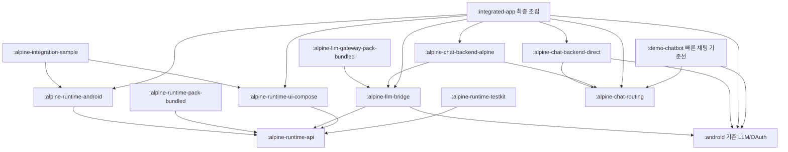

# implement_20260801_151654.md

작성 일시: `2026-08-01 15:16:54 KST`

문서 상태: **Phase 7 내부 배포·전체 통합 검증 완료 / 공개 배포 외부 gate 대기**

이 문서는 Alpine 통합 기능을 특정 데모 앱에 종속시키지 않고, 어떤 Android 앱에서도 선택적으로 사용할 수 있는 재사용 모듈로 분리하기 위한 작업 문서다. 기존 장기 기능 카탈로그는 유지하되, 해당 기능을 구현하기 전에 이 문서의 모듈 경계와 통합 계약을 먼저 확정한다.

## 개발 목적

- Alpine rootfs, PRoot-compatible runtime, Python Gateway, Host Bridge, 터미널과 상태 UI를 특정 앱 코드에서 분리한다.
- Android 앱은 필요한 모듈만 의존해 `runtime만`, `runtime+터미널`, `runtime+LLM`, `전체 통합` 형태로 조합할 수 있게 한다.
- 현재 `:demo-chatbot`의 빠른 채팅 경로와 검증 결과를 보존한다.
- 최종 통합 앱에서는 `빠른 채팅 모드`와 `Alpine 작업 모드`를 명시적으로 선택할 수 있게 한다.
- runtime 공급망, Android 실행 제한, credential 경계와 lifecycle을 SDK 계약에서 강제한다.

## 개발 범위

- 앱 중립적인 runtime API와 Android 구현 모듈
- rootfs/PRoot/Python Gateway artifact 공급자와 ABI/version/checksum 계약
- 설치, 시작, 중지, 상태, health, repair, rollback과 process/session 계약
- Android OAuth/Provider를 선택적으로 연결하는 보안 LLM Host Bridge 모듈
- Compose를 강제하지 않는 core와 선택형 Compose 상태·복구·터미널·패키지 UI 모듈
- 빠른 채팅/Alpine 작업 backend 선택과 명시적 fallback 계약
- 독립 sample host 앱, testkit, Maven publication과 통합 가이드
- 기존 `:android` 안의 runtime 관련 클래스 이동 및 호환성 처리

## 제외 범위

- 이번 계획에서 장기 기능 카탈로그 전체를 한 번에 구현하지 않는다.
- `:demo-chatbot`에 rootfs, PRoot, Python 또는 terminal 의존성을 추가하지 않는다.
- core runtime API에서 Compose, Activity, Provider OAuth 또는 특정 앱의 ViewModel을 참조하지 않는다.
- OAuth token, refresh token, client secret과 Android Keystore key를 Alpine guest에 전달하지 않는다.
- Provider 오류 후 사용자가 모르는 상태에서 다른 모드로 자동 재요청하지 않는다.
- Android 실행 정책을 우회하기 위한 target SDK 하향, 동적 실행 코드 우회 또는 검증되지 않은 native binary 배포를 하지 않는다.
- Google Play Asset Delivery를 유일한 runtime 공급 방식으로 강제하지 않는다.

## 참조 문서

- [장기 Alpine 모바일 워크스페이스 계획](implement_20260731_233922.md)
- [멀티 LLM 데모 계획](implement_20260731_145320.md)
- [프로젝트 README](../README.md)
- [Android 통합 가이드](../android/README.md)
- [데모 챗봇 가이드](../demo-chatbot/README.md)
- [Phase 3 runtime 검증 기록](alpine-runtime-phase3-verification-20260801.md)
- [Phase 6 UI·sample 통합 검증 기록](alpine-runtime-phase6-verification-20260801.md)
- [Phase 7 배포·전체 통합 검증 기록](alpine-runtime-phase7-verification-20260801.md)
- [SDK publication·배포 가이드](../docs/sdk-publication-and-distribution.md)
- [Android 10+ 앱 홈 실행 제한](https://developer.android.com/about/versions/10/behavior-changes-10)
- [Android App Bundle 구조](https://developer.android.com/guide/app-bundle/app-bundle-format)
- [Play Asset Delivery Native 통합](https://developer.android.com/guide/playcore/asset-delivery/integrate-native)

## 기존 계획 검토 결과

### 유지할 내용

- `implement_20260731_233922.md`의 전체 기능 카탈로그, 공급망 검증, PTY, workspace, package, Git, AI runner, WorkManager와 보안 원칙은 유효하다.
- `arm64-v8a` 삼성 실기기 우선, `x86_64` emulator 자동 검증, app-private storage, 짧은 수명의 Host Bridge capability 원칙을 유지한다.
- 채팅·OAuth·Provider 기능은 현재 검증된 Android 직접 경로를 계속 기준선으로 사용한다.

### 변경할 내용

- 기존 계획의 `:android` 내부 runtime 확장과 `:demo-chatbot` 내부 terminal/workspace UI 추가 경로는 사용하지 않는다.
- `:demo-chatbot`을 바로 통합 앱으로 승격하지 않고, 현재 빠른 채팅 reference app으로 유지한다.
- 실제 통합 제품은 신규 `:integrated-app`에서 조립하며 SDK 모듈을 소비하는 예시 중 하나로 취급한다.
- 장기 계획 Phase 1보다 먼저 Android target SDK 36에서 PRoot-compatible 실행이 가능한지 실기기 gate를 둔다.
- 두 모드의 선택, 대화별 mode 저장, fallback 시점과 중복 요청 방지 계약을 새로 추가한다.

### 이전 계획에서 보완할 누락 사항

- Android 10 이상은 writable app home의 파일을 직접 `execve()`하는 것을 제한하므로, 단순히 asset에서 PRoot를 복사하고 실행한다는 가정을 금지한다.
- PRoot launcher를 APK에 포함된 native code 경로, 최소 JNI launcher 또는 정책상 허용되는 다른 방식으로 실행할 수 있는지 먼저 증명한다.
- runtime core와 LLM Provider, UI, asset delivery를 서로 독립적으로 교체할 수 있는 공개 API가 필요하다.
- Host 앱이 runtime lifecycle을 소유하는지 SDK service가 소유하는지 명확한 단일 owner 계약이 필요하다.
- 직접 Provider 요청에서 Alpine Gateway로, 또는 반대로 전환할 때 conversation context와 과금 중복을 방지하는 규칙이 필요하다.

## 공통 진행 규칙

- 각 Phase는 앞선 Phase의 자체 테스트 완료 후에만 시작한다.
- 구현 중 발생한 이슈는 해당 Phase에서 수정하고 기록한다.
- 체크박스 상태를 실제 진행 상태와 맞게 업데이트한다.
- 문서에 없는 범위 확장은 하지 않는다.
- 요구사항이 불명확하면 가능한 케이스를 나누고 확인 후 진행한다.
- 공개 API는 특정 앱 package, Compose, Provider 구현과 자산 공급 방식에 의존하지 않는다.
- 의존성 방향을 CI에서 검사하고 역방향·순환 의존성을 허용하지 않는다.
- native/runtime artifact는 출처, 버전, ABI, SHA-256, license와 SBOM 없이 build에 포함하지 않는다.
- 기존 `:android`, `:demo-chatbot`, Python Gateway 회귀 테스트를 각 Phase의 필수 gate로 유지한다.
- 오류 원문, command 환경 전체와 credential은 SDK event, log와 UI state에 포함하지 않는다.
- Host 앱은 SDK UI를 사용하지 않고 자체 UI만으로도 모든 runtime lifecycle을 제어할 수 있어야 한다.

## 권장 모듈 구조

| Gradle 모듈 | 공개 artifact 예시 | 책임 | 금지 의존성 |
|---|---|---|---|
| `:alpine-runtime-api` | `alpine-runtime-api` | 상태, 설치, session, command, terminal, health, artifact provider 계약 | Android UI, Compose, OAuth, 특정 앱 |
| `:alpine-runtime-android` | `alpine-runtime-android` | Android storage, installer, process, PRoot launcher, lifecycle 구현 | Compose, Provider별 코드 |
| `:alpine-runtime-pack-bundled` | `alpine-runtime-pack-bundled` | offline/sideload용 검증된 rootfs·native artifact 공급 | UI, OAuth |
| `:alpine-llm-bridge` | `alpine-llm-bridge` | HostBridge, Python Gateway controller, Android LLM session 연결 | 특정 앱 화면·ViewModel |
| `:alpine-llm-gateway-pack-bundled` | `alpine-llm-gateway-pack-bundled` | version/protocol/checksum이 고정된 Python Gateway layer 공급 | runtime core, UI |
| `:alpine-runtime-ui-compose` | `alpine-runtime-ui-compose` | 선택형 설치·상태·복구·터미널·패키지 Compose UI | Provider 구현 직접 참조 |
| `:alpine-runtime-testkit` | `alpine-runtime-testkit` | fake artifact/process/bridge와 deterministic fixture | production credential |
| `:alpine-chat-routing` | `alpine-chat-routing` | 공통 chat backend, mode, fallback, audit, request ledger 계약 | Android, Compose, Provider 구현 |
| `:alpine-chat-backend-direct` | `alpine-chat-backend-direct` | Android OAuth/Provider 빠른 채팅 adapter | runtime, rootfs, Python Gateway |
| `:alpine-chat-backend-alpine` | `alpine-chat-backend-alpine` | runtime/Bridge/Python Gateway 작업 모드 adapter | 특정 앱 UI |
| `:alpine-integration-sample` | 설치형 sample app | 최소 SDK 통합과 lifecycle 예제 | demo 내부 코드 복사 |
| `:integrated-app` | 최종 조립 앱 | 빠른 채팅/Alpine 작업 두 모드와 제품 navigation | runtime 내부 구현 직접 접근 |

`Play Asset Delivery`, signed download와 host-provided file은 `RuntimeArtifactProvider`의 선택 adapter로 추가한다. Google Play를 사용하지 않는 앱도 `:alpine-runtime-pack-bundled` 또는 자체 provider로 통합할 수 있어야 한다.

## 의존성 방향

핵심 원칙은 `:demo-chatbot`과 `:android`가 runtime 모듈에 의존하지 않는 것이다. Alpine을 사용하지 않는 앱은 기존 Android LLM artifact만 추가하면 된다.

## 공개 API 최소 계약

- `AlpineRuntimeManager`: install, start, stop, repair, reset, observeState, health
- `RuntimeArtifactProvider`: ABI/version에 맞는 artifact와 manifest 제공
- `RuntimeInstallSession`: progress, cancel, staging, activation, rollback 결과
- `RuntimeSession`: exec, openTerminal, listProcesses, close
- `TerminalSession`: write, resize, signal, output flow, exit status
- `RuntimeHealth`: runtime/gateway/bridge/process/storage 상태와 안전한 오류 코드
- `RuntimeEnvironmentContributor`: Host Bridge처럼 필요한 제한된 환경만 launch 시 주입
- `RuntimeEventSink`: credential·원문 exception을 받을 수 없는 닫힌 운영 event

Android `Context`, Activity와 Compose state는 factory/Android 구현 또는 선택 UI 모듈에서만 사용한다. core 계약은 Host 앱의 View, Compose, Fragment 어느 방식에서도 호출 가능해야 한다.

## 두 실행 모드 계약

| 모드 | backend | runtime 요구 | 주요 용도 |
|---|---|---:|---|
| 빠른 채팅 | 현재 Android OAuth/Provider session | 없음 | 즉시 채팅, 작은 설치 크기, runtime 장애 시 사용 |
| Alpine 작업 | Alpine runtime + Python Gateway + Host Bridge | 필요 | 터미널, Python, Git, skill, workspace, AI 작업 |

- mode 선택은 SDK가 강제하지 않고 Host 앱이 결정한다.
- 최종 통합 앱은 새 대화 또는 workspace에 `executionMode`를 명시적으로 저장한다.
- Alpine 설치 전에는 작업 모드 대신 설치 안내를 표시하며 몰래 빠른 모드로 전환하지 않는다.
- 요청을 Provider에 보내기 전의 runtime 시작 실패에만 사용자 동의를 받은 빠른 모드 fallback을 허용한다.
- 첫 Provider delta 이후에는 자동 fallback하지 않는다. 중복 응답·중복 과금·서로 다른 context를 방지하기 위해 실패로 종료하고 사용자가 재시도 모드를 선택한다.
- fallback 발생 시 선택된 backend, 모델 변경 여부와 대화에 미치는 영향을 UI에 표시한다.
- 빠른 모드와 Alpine 모드 모두 공통 stream/failure 계약을 구현하되 backend 내부 오류 원문은 노출하지 않는다.

## 예상 변경 파일 / 영향 범위

- `settings.gradle.kts`: 신규 library/sample/app 모듈 등록
- `alpine-runtime-api/**`: 앱 중립 공개 계약
- `alpine-runtime-android/**`: installer/process/lifecycle/health 구현
- `alpine-runtime-pack-bundled/**`: 검증된 runtime artifact와 manifest
- `alpine-llm-bridge/**`: Host Bridge와 Python Gateway lifecycle
- `alpine-llm-gateway-pack-bundled/**`: rootfs와 분리된 Python Gateway layer와 lock
- `alpine-llm-bridge-probe/**`: Phase 4 `llmctl` device E2E fixture
- `alpine-runtime-ui-compose/**`: 선택형 상태·복구·terminal/package UI
- `alpine-runtime-testkit/**`: fake runtime과 host integration fixture
- `alpine-chat-routing/**`: 앱 중립 두 모드 routing/fallback/audit/idempotency 계약
- `alpine-chat-backend-direct/**`: 기존 Android Provider backend adapter
- `alpine-chat-backend-alpine/**`: Alpine Python Gateway backend adapter
- `alpine-integration-sample/**`: View/Compose 양쪽 최소 통합 예제
- `integrated-app/**`: 두 모드를 조립하는 최종 제품 앱
- `android/src/main/java/dev/alpine/llm/AlpineRuntime*.kt`: runtime 모듈로 이동
- `android/src/main/java/dev/alpine/llm/HostBridgeServer.kt`: LLM bridge 모듈로 이동
- `android/src/main/java/dev/alpine/llm/AlpineLlmGatewayClient.kt`: LLM bridge 모듈로 이동
- `scripts/runtime/**`: artifact build, manifest, checksum, SBOM
- `.github/workflows/**`: 모듈 의존성·native/runtime·publication 검증
- `README.md`, `android/README.md`, `docs/**`: SDK 선택표와 migration 가이드

## Phase 상태 요약

- [x] Phase 1. 실행 가능성·모듈 경계 gate 완료
- [x] Phase 2. 공개 API·모듈 skeleton 완료
- [x] Phase 3. runtime·artifact 독립 모듈 완료
- [x] Phase 4. 보안 LLM bridge·Python Gateway 완료
- [x] Phase 5. 두 모드 routing·fallback 계약 완료
- [x] Phase 6. 선택 UI·sample host 통합 완료
- [x] Phase 7. 내부 publication·전체 회귀·문서 완료

## QA 관점

- [x] Alpine 모듈을 의존하지 않은 앱의 APK/AAB에 rootfs, PRoot, Python과 관련 transitive dependency가 포함되지 않는지 확인한다.
- [x] core runtime이 Compose, Activity, demo package와 Provider 구현을 참조하지 않는지 확인한다.
- [x] target SDK 36 삼성폰에서 native launcher와 guest shell 실행이 Android 정책을 위반하지 않고 가능한지 확인한다.
- [x] 변조·잘못된 ABI·부분 다운로드·저장공간 부족·process kill에서 이전 runtime이 보존되는지 확인한다.
- [x] Host Bridge token 외 OAuth credential이 guest filesystem, process environment, history와 log에 존재하지 않는지 확인한다.
- [x] 빠른/Alpine 모드 전환과 fallback에서 요청·메시지·과금이 중복되지 않는지 확인한다.
- [x] Compose UI 없이 XML View/서비스/자체 UI 앱에서도 install/start/exec/stop이 가능한지 확인한다.
- [x] SDK UI를 사용하는 앱과 자체 UI를 사용하는 앱의 lifecycle 결과가 동일한지 확인한다.
- [x] 앱 background와 process death 후 runtime 상태가 거짓으로 실행 중에 고착되지 않는지 확인한다. 기기 재부팅 자동 복구 정책은 Phase 7 publication matrix와 장기 background service 단계에서 별도 검증한다.
- [x] 모듈별 consumer ProGuard, manifest merge, minSdk, ABI와 publication metadata가 올바른지 확인한다.
- [x] third-party license와 공개 배포 차단 조건을 release manifest에 기록한다. 프로젝트 전체 license와 corresponding source는 저장소 소유자 확인 전 fail-closed다.

## Phase 1. 실행 가능성·모듈 경계 gate

### 목표

- 큰 자산과 UI 개발 전에 target SDK 36에서 실제 실행 가능한 공급·launcher 방식과 영구 모듈 경계를 확정한다.

### 구현 태스크

- [x] 현재 `AlpineRuntime`, asset selector, Host Bridge와 Gateway client의 의존성 지도를 작성한다.
- [x] PRoot-compatible upstream, Android patch, license와 유지 상태를 고정한다.
- [x] APK에 포함된 native code 경로, packaged guest loader와 허용 가능한 대안을 비교한다.
- [x] writable app home에서 복사한 executable을 직접 실행하는 방식을 금지하는 테스트를 추가한다.
- [x] target SDK 36 arm64 debug fixture에서 launcher→최소 guest shell→exit code를 검증한다.
- [x] `:android`/`:demo-chatbot` 무의존 원칙과 신규 모듈 DAG를 architecture test로 고정한다.
- [x] 외부 앱 통합 시 필요한 최소 public surface와 lifecycle owner를 ADR로 기록한다.

### 자체 테스트

- [x] 삼성 `SM-S931N` Android 16에서 packaged PRoot/loader와 Alpine 3.21.3 guest command를 실행한다.
- [x] Android 15 arm64 emulator에서 같은 launcher fixture를 실행한다.
- [x] 현재 1차 지원 ABI를 `arm64-v8a`로 고정하고 x86_64는 별도 artifact/CI 후속으로 기록한다.
- [x] 신규 probe를 제외한 기존 `:android`와 `:demo-chatbot` build/test가 그대로 통과한다.

### 이슈 및 수정

- [x] writable PRoot 실행, AAPT gzip 변환과 writable embedded loader 실패를 발견해 packaged PRoot+loader 경로로 수정했다.

### 완료 조건

- [x] 실행 가능성 gate 통과
- [x] 모듈 경계 승인
- [x] 자체 테스트 완료
- [x] Phase 2 진행 가능

## Phase 2. 공개 API·모듈 skeleton

### 목표

- 구현과 UI가 독립적으로 교체 가능한 최소 SDK 계약과 빈 모듈을 만든다.

### 구현 태스크

- [x] `:alpine-runtime-api`, `:alpine-runtime-android`, `:alpine-llm-bridge`, `:alpine-runtime-ui-compose`, `:alpine-runtime-testkit`을 추가한다.
- [x] runtime state, install, artifact, session, command, terminal, health와 event 계약을 정의한다.
- [x] Android factory 외 공개 API에서 `Context`와 UI 타입을 제거한다.
- [x] artifact provider와 environment contributor SPI를 정의한다.
- [x] fake runtime/test dispatcher/virtual artifact를 testkit에 추가한다.
- [x] forbidden dependency와 API surface 검사를 CI에 추가한다.

### 자체 테스트

- [x] API 모듈 단독 JVM 테스트가 Android framework 없이 통과한다.
- [x] runtime/UI/bridge를 각각 제외한 조합이 compile된다.
- [x] Java/Kotlin host에서 기본 API를 호출할 수 있다.
- [x] binary/public API dump가 생성되고 의도하지 않은 노출이 없다.

### 이슈 및 수정

- [x] 로컬 JBR이 Java 21이므로 JVM 모듈은 toolchain 탐색 대신 Java 17 bytecode target으로 고정했다.
- [x] fake의 `CompletionStage<Void>` null 완료 컴파일 오류를 전용 deterministic void scheduler로 수정했다.

### 완료 조건

- [x] 구현 완료
- [x] 자체 테스트 완료
- [x] Phase 3 진행 가능

## Phase 3. runtime·artifact 독립 모듈

### 목표

- 기존 runtime 코드를 Provider와 UI에서 분리하고 검증 가능한 artifact 공급·설치·복구를 완성한다.

### 구현 태스크

- [x] `AlpineRuntime`과 `AlpineRuntimeAssets` 책임을 runtime 모듈의 installer/process/health 단위로 이동한다.
- [x] 기존 package 이름 또는 migration facade 정책을 결정하고 0.x 호환성 변경을 문서화한다.
- [x] bundled, host-provided와 signed-download artifact provider를 분리한다.
- [x] ABI/version/checksum/size/license/SBOM manifest를 구현한다.
- [x] staging, atomic activation, cancel, rollback, repair와 reset을 구현한다.
- [x] runtime 상태를 NotInstalled/Installing/Ready/Starting/Running/Stopping/RepairRequired/Failed로 제한한다.
- [x] host process lifecycle과 Foreground Service 연결 지점을 API로 제공하되 앱 정책은 Host가 선택하게 한다.

### 자체 테스트

- [x] runtime 모듈이 `:android`, Compose와 Provider 클래스를 참조하지 않는다.
- [x] 설치 중 kill, disk full, checksum mismatch와 ABI mismatch에서 활성 runtime을 보존한다.
- [x] install/start/exec/stop/restart/repair가 emulator와 삼성폰에서 통과한다.
- [x] runtime 모듈 미사용 APK에는 자산과 native launcher가 포함되지 않는다.

### 이슈 및 수정

- [x] `/bin/sh` 절대 심볼릭 링크를 일반 파일로 오판하던 무결성 검사를 수정했다.
- [x] signed-download 서명을 실제 bundle canonical manifest와 결합했다.
- [x] 설치 transaction의 process-death rollback/finalize와 저장소 실패 보존을 보강했다.
- [x] 환경 검증 오류 보존, process finally 정리와 API dump stale input 문제를 수정했다.
- [x] manager 중지 후 폐쇄 session의 명령 재실행과 process 등록 경쟁을 차단했다.
- [x] 상세 검증 기록을 `alpine-runtime-phase3-verification-20260801.md`에 남겼다.

### 완료 조건

- [x] 구현 완료
- [x] 자체 테스트 완료
- [x] Phase 4 진행 가능

## Phase 4. 보안 LLM bridge·Python Gateway

### 목표

- runtime을 LLM과 독립적으로 유지하면서 필요한 앱만 Android OAuth/Provider와 Python Gateway를 연결한다.

### 구현 태스크

- [x] `HostBridgeServer`와 `AlpineLlmGatewayClient`를 `:alpine-llm-bridge`로 이동한다.
- [x] runtime 직접 `attachHostBridge()` 대신 environment contributor/capability 주입으로 연결한다.
- [x] Python Gateway package/version/protocol compatibility manifest를 runtime artifact와 분리한다.
- [x] bridge와 gateway start/health/stop/restart 순서 및 single owner를 구현한다.
- [x] loopback bind, session token TTL/rotation, request limit, timeout와 redacted event를 적용한다.
- [x] OAuth token이 guest에 전달되지 않는 구조 검사를 추가한다.

### 자체 테스트

- [x] Alpine `llmctl models/run/stream/cancel`이 fake와 실제 Host Bridge를 통과한다.
- [x] bridge 재시작, token 만료, gateway crash와 runtime stop에서 process/port가 정리된다.
- [x] 401/429/5xx/malformed SSE/response limit 오류가 공통 안전 오류로 전달된다.
- [x] runtime-only host 앱은 LLM/OAuth dependency 없이 build된다.

### 이슈 및 수정

- [x] Python OpenAI adapter와 Host Bridge normalized SSE의 형식 불일치를 발견해 전용 `android-host-bridge` adapter와 protocol version 검사를 추가했다.
- [x] Alpine minirootfs에 DNS 설정이 없어 첫 `apk add python3`가 실패하던 문제를 Android active network DNS의 안전한 `resolv.conf` 반영으로 수정했다.
- [x] PRoot command cancel 후 guest Python이 남아 재시작 포트를 점유하던 문제를 `--kill-on-exit`, guest PID 파일과 추적 하위 process 종료로 수정했다.
- [x] 상세 검증 기록을 `alpine-runtime-phase4-verification-20260801.md`에 남겼다.

### 완료 조건

- [x] 구현 완료
- [x] 자체 테스트 완료
- [x] Phase 5 진행 가능

## Phase 5. 두 모드 routing·fallback 계약

### 목표

- 동일 앱에서 빠른 채팅과 Alpine 작업을 안전하게 선택하되 backend 오류가 중복 요청을 만들지 않게 한다.

### 구현 태스크

- [x] 공통 chat request/stream/failure backend 계약을 앱 중립 위치로 추출한다.
- [x] 현재 Android direct Provider backend adapter를 구현한다.
- [x] Alpine Python Gateway backend adapter를 구현한다.
- [x] conversation/workspace별 execution mode 저장과 migration을 정의한다.
- [x] runtime 미설치·복구 필요·시작 실패와 Provider 실패를 구분한다.
- [x] 요청 시작 전 사용자 승인 fallback과 첫 delta 이후 fallback 금지를 구현한다.
- [x] mode/model/backend 변경을 사용자와 audit event에 명시한다.

### 자체 테스트

- [x] 동일 요청이 두 backend에 동시에 전송되지 않는다.
- [x] 첫 delta 이후 장애가 direct backend 자동 재호출을 일으키지 않는다.
- [x] fallback 거부 시 대화가 변경되지 않고 안전하게 재시도할 수 있다.
- [x] 앱 재시작 후 대화별 mode가 복원된다.
- [x] 기존 빠른 채팅의 OAuth, stream, retry, model 선택과 대화 저장 회귀가 없다.

### 이슈 및 수정

- [x] Python Gateway client가 prompt 하나만 받던 경계를 전체 normalized request JSON으로 확장해 대화 history와 system instruction 손실을 막았다.
- [x] conversation schema 2를 3으로, index schema 1을 2로 올리고 구버전은 `FAST_CHAT`으로 명시적으로 migration했다.
- [x] 현재 Provider별 upstream idempotency key가 검증되지 않았으므로 두 backend capability를 `NONE`으로 고정하고 dispatch 이후 router replay를 금지했다.
- [x] 상세 검증 기록을 `alpine-runtime-phase5-verification-20260801.md`에 남겼다.

### 완료 조건

- [x] 구현 완료
- [x] 자체 테스트 완료
- [x] Phase 6 진행 가능

## Phase 6. 선택 UI·sample host 통합

### 목표

- SDK UI를 원하는 앱과 자체 UI를 만드는 앱 모두 동일 기능을 통합할 수 있음을 증명한다.

### 구현 태스크

- [x] 설치 진행, 상태, health, repair/reset Compose components를 제공한다.
- [x] 최소 PTY terminal UI와 session controls를 선택 UI 모듈에 구현한다.
- [x] package install UI는 command 정책과 승인 contract를 통해 호출하고 core에 UI 의존성을 넣지 않는다.
- [x] XML/View 기반 자체 UI sample에서 install/start/exec/stop을 구현한다.
- [x] Compose sample에서 상태·복구·terminal UI를 조립한다.
- [x] `:integrated-app` shell에서 빠른 채팅/Alpine 작업 navigation과 명시적 mode selector를 연결한다.
- [x] Host 앱 lifecycle, service, notification, storage, manifest와 ProGuard 통합 가이드를 작성한다.

### 자체 테스트

- [x] sample 앱이 기존 demo package와 코드 복사 없이 SDK artifact만으로 동작한다.
- [x] SDK Compose UI를 제거해도 자체 UI sample이 정상 동작한다.
- [x] 회전, background/foreground, process death와 복구 화면이 runtime 실제 상태와 일치한다.
- [x] TalkBack semantics, 200% font, 한글 IME와 외부 키보드 기본 흐름이 통과한다.

### 이슈 및 수정

- [x] bundled BusyBox만으로는 실제 controlling terminal이 만들어지지 않아 `/dev/ptmx` 기반 native PTY adapter와 안전한 pipe fallback을 추가했다.
- [x] 신규 `libalpine-runtime-pty.so`의 Android 16 16 KiB page alignment를 `0x4000`으로 맞추고 실기기에서 native PTY mode를 확인했다.
- [x] lifecycle 전환 뒤 이전 health 결과가 남는 문제와 terminal ANSI/OSC control sequence가 UI에 노출되는 문제를 controller에서 수정했다.
- [x] XML sample의 API 27 전용 navigation bar 속성을 `values-v27`로 분리해 minSdk 26 lint 오류를 수정했다.
- [x] 현재 고정 PRoot는 열린 뒤의 `TIOCSWINSZ`를 guest에 전달하지 않으므로 Phase 7에서 `INITIAL_SIZE_ONLY` capability와 안정 오류 코드로 명시하고 거짓 성공을 제거했다.
- [x] Phase 7에서 PRoot/loader/native PTY의 ELF `PT_LOAD` alignment가 모두 16 KiB 이상인지 publication gate로 자동 검증했다.
- [x] 상세 검증 기록을 `alpine-runtime-phase6-verification-20260801.md`에 남겼다.

### 완료 조건

- [x] 구현 완료
- [x] 자체 테스트 완료
- [x] Phase 7 진행 가능

## Phase 7. publication·전체 회귀·문서

### 목표

- 각 모듈을 독립 artifact로 배포하고 외부 앱이 문서만으로 재현 가능하게 통합한다.

### 구현 태스크

- [x] 12개 모듈별 AAR/JAR, sources, POM, Gradle metadata, SHA-256 sidecar와 license bundle을 생성한다.
- [x] transitive dependency, consumer ProGuard/R8와 manifest merge를 검사한다.
- [x] Maven local fixture에서 새 빈 앱이 저장소 source project 의존 없이 필요한 artifact만 받아 build되게 한다.
- [x] runtime 없는 앱, runtime-only 앱, runtime+UI 앱, runtime+LLM 앱, 전체 앱 5종 matrix를 CI에 추가한다.
- [x] 기존 class 이동 migration과 artifact 선택표를 작성한다.
- [x] sideload APK와 Play AAB/asset adapter의 차이, offline 요구와 지원 범위를 문서화한다.
- [x] 장기 계획 `implement_20260731_233922.md`의 예상 경로와 Phase 선행조건을 이 모듈 구조에 맞춰 갱신한다.
- [x] release bundle manifest, 전체 `SHA256SUMS`, runtime lock/SBOM, Alpine package license inventory와 검증 report를 생성한다.
- [x] PRoot/loader/native PTY의 ELF 16 KiB alignment와 optional payload owner 격리를 publication validator에서 강제한다.
- [x] 실계정 Provider E2E를 credential 추출 없이 수행하는 opt-in runbook을 작성하고 CI의 fake 429/5xx/비정상 SSE 검증과 분리한다.
- [x] 공개 배포는 프로젝트 license, complete corresponding source, 서명 key와 실제 계정 승인이 없으면 `remote_distribution_ready=false`로 차단한다.

### 자체 테스트

- [x] Python, Android LLM, demo, 신규 SDK, sample, integrated app 전체 unit/instrumentation/lint/build가 통과한다.
- [x] 삼성폰에서 빠른 채팅과 Alpine 작업 모드를 각각 실행하고 명시적 전환·process 재시작 복구를 검증한다.
- [x] runtime 미사용 앱 APK에 rootfs, PRoot, PTY, Python Gateway와 runtime 권한이 포함되지 않는다.
- [x] 외부 sample project가 저장소 내부 source path 없이 published artifact로 release R8/lint build된다.
- [x] 삼성폰 probe에서 native PTY 최초 `28x96`, 명령·signal·process cleanup과 `INITIAL_SIZE_ONLY` resize 계약을 검증한다.

### 이슈 및 수정

- [x] 외부 fixture의 AndroidX 설정과 빈 consumer rule/module script 누락으로 lint가 실패해 독립 fixture 설정을 보완했다.
- [x] native resize ioctl이 성공을 반환해도 고정 PRoot guest 크기가 바뀌지 않는 거짓 성공을 발견해 공개 capability와 `TERMINAL_RESIZE_UNSUPPORTED`로 수정했다.
- [x] 이전 기록의 PRoot/loader 16 KiB 경고를 실제 ELF program header로 재검사해 모두 `0x4000`임을 확인하고 자동 gate로 고정했다.
- [x] Samsung에서 test-only APK가 target 26으로 생성돼 호환성 안내가 Compose test Activity를 가리는 문제를 발견하고 Android library 3개의 `testOptions.targetSdk=36`으로 수정해 안내 없이 재실행 통과했다.
- [x] 저장소에 프로젝트 전체 `LICENSE`와 complete corresponding source가 없음을 확인해 공개 원격 배포를 자동 차단하고 내부 bundle만 생성한다.

### 완료 조건

- [x] 구현 완료
- [x] 자체 테스트 완료
- [x] 내부 publication·문서 완료
- [x] 공개 배포 외부 gate와 기술 후속 리스크 분리 완료
- [x] 장기 기능 계획 진행 가능

## 최종 완료 기준

- [x] 어떤 Android 앱도 `:alpine-runtime-api`와 필요한 구현 artifact만 선택해 Alpine 기능을 통합할 수 있다.
- [x] Alpine을 사용하지 않는 앱은 rootfs, native launcher, Python, terminal/Compose dependency를 받지 않는다.
- [x] LLM을 사용하지 않는 Alpine 앱도 runtime·terminal 기능을 사용할 수 있다.
- [x] SDK UI를 사용하지 않는 앱도 자체 UI로 모든 lifecycle과 복구 기능을 구현할 수 있다.
- [x] 최종 통합 앱은 빠른 채팅과 Alpine 작업 모드를 명확히 구분하고 Provider dispatch 전의 안전한 fallback 계약을 제공한다.
- [x] 기존 데모 앱과 Android LLM library는 기능·크기·보안 기준선이 회귀하지 않는다.

## 잔여 리스크 / 후속 과제

### 외부 결정·운영 gate

- **공개 배포 차단:** 프로젝트 전체 license, PRoot/talloc complete corresponding source와 재현 build archive, Maven/App Store 서명 key owner가 확정될 때까지 내부 배포만 허용한다.
- **실제 Provider 계정 E2E:** 공식 client registration, 테스트 계정과 비용 승인이 필요한 수동 gate다. token은 Android Keystore 밖으로 추출하지 않으며 실제 429/5xx를 강제로 만들지 않는다.
- **스토어 공급 방식:** 현재 bundled arm64 AAR은 offline/sideload 기준이다. 제품 크기 측정 뒤 Play Asset Delivery 또는 signed-download adapter 채택을 결정한다.

### 기술 후속 리스크

- **동적 terminal resize:** 현재 고정 PRoot는 최초 크기만 보장한다. UI/API가 이를 명시하고 거짓 성공은 제거했지만, 진짜 `DYNAMIC` 지원은 PRoot patch·재빌드·실기기 검증이 필요하다.
- **ABI 범위:** 현재 지원은 `arm64-v8a`다. `x86_64` runtime/loader/PTY artifact와 emulator matrix는 장기 계획 공급망 Phase에서 추가한다.
- **백그라운드·재부팅:** process death 후 거짓 `RUNNING` 복구는 완료했다. 장기 작업용 Foreground Service/WorkManager adapter와 실제 reboot/Doze/배터리 정책 검증은 Host 제품 단계에서 진행한다. SDK는 임의 자동 시작하지 않는다.
- **빌드 도구 전환:** 현재 Gradle 8.11.1/AGP 8.10.1 gate는 통과하지만 Gradle 9 비호환 deprecated feature 경고가 남는다. Gradle 9 전환 전 `--warning-mode all` 기준 plugin/build script migration을 별도 수행한다.
- **장기 기능:** workspace, 파일, Git/SSH, AI runner와 자동화는 재사용 `alpine-workspace-*` 모듈로 기존 장기 계획 순서에 따라 구현한다.

### 닫힌 리스크

- PRoot, guest loader와 native PTY의 Android 16 16 KiB `PT_LOAD` alignment는 모두 `0x4000`이며 build/publication 자동 gate가 검증한다.
- runtime 없는 소비자 APK의 payload·권한 격리, 12개 artifact metadata와 5개 외부 release/R8 조합은 자동 검증한다.
- 기존 0.x class 이동은 migration 문서와 artifact 선택표로 정리했다.

## 2026-08-01 P1·P2 후속 상태

Phase 7 이후 계획 [implement_20260801_213246.md](implement_20260801_213246.md)에서 다음 항목을
추가 구현했다.

- 선택형 Foreground Service/notification/WorkManager adapter와 Samsung API 36 검증
- Play Asset Delivery rootfs adapter와 app-private workspace API/Android 구현
- x86_64 rootfs/PRoot/loader/PTY lock·SBOM·16 KiB 및 실험 pack
- Provider E2E redacted report와 Gradle 9 readiness gate
- 17개 publication과 8개 외부 release/R8/lint 소비자 조합

이 절이 위의 Phase 7 시점 잔여 목록보다 최신이다. 실제 PRoot 동적 resize, x86_64 emulator E2E,
실계정 Provider, Play test track, reboot/Doze와 공개 배포 gate는 계속 남아 있다.
