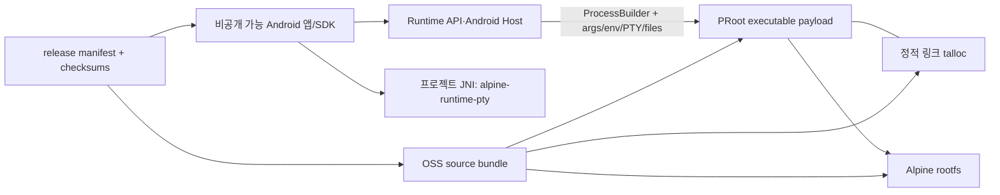

# implement_20260802_183317.md

작성 일시: `2026-08-02 18:33:17 KST`

문서 상태: **로컬 compliance·native source packaging 구현/검증 완료 / owner·rootfs source·외부 승인 차단 유지**

이 문서는 OpenMinis를 동작·구조 참고 자료로만 사용한 clean 구현을 전제로, 비공개 Android 앱/SDK와
PRoot·talloc·Alpine 구성요소의 라이선스 의무를 코드·artifact·배포 절차에서 분리하는 후속 개발 계획이다.
법률 의견을 대신하지 않으며, 실제 외부 배포 전에는 저장소 소유자와 OSS 전문 검토자의 승인이 필요하다.

## 개발 목적

- Android 앱 전체의 소스 공개를 전제로 하지 않고, 프로젝트 고유 코드와 제3자 copyleft 구성요소의 경계를 증명 가능하게 만든다.
- PRoot·talloc combined binary와 Alpine rootfs에 대해 실제 배포본과 일치하는 source, patch, build/relink 자료를 제공한다.
- OpenMinis 코드 복사 여부를 주장만으로 처리하지 않고 파일 단위 provenance와 검증 기록으로 남긴다.
- 내부 개발용 배포와 외부 제3자 배포를 명확히 구분하고, 충족되지 않은 외부 배포 gate는 fail-closed로 유지한다.
- app/SDK artifact와 `oss-sources` artifact를 분리하되 동일 release manifest와 checksum으로 연결한다.

## 이번 상세 검토의 결론

| 검토 항목 | 현재 확인 결과 | 의미 | 후속 조치 |
|---|---|---|---|
| Android 앱과 PRoot 연결 | `ProotProcessLauncher`가 `ProcessBuilder`로 PRoot executable을 별도 process로 실행 | 앱이 PRoot 라이브러리를 직접 링크하는 구조는 아님 | process 경계를 자동 테스트로 고정 |
| JNI/native link | 앱 JNI는 `alpine-runtime-pty`만 로드하고 PRoot/talloc을 링크하지 않음 | proprietary 영역과 PRoot binary의 분리 근거 | CMake/JNI dependency 금지 규칙 추가 |
| PRoot 배치 | `libproot.so` 이름으로 `jniLibs`에 저장되지만 executable path로 실행 | 파일명·APK 동봉만으로 링크 관계가 생긴 것은 아님 | manifest에 `EXECUTABLE_PAYLOAD`로 명시 |
| talloc 결합 | 정적 링크와 실제 build input delta를 native source bundle에 보존 | source 자료는 생성됐지만 combined binary 최종 법률 결론은 미승인 | OSS 검토자 결론·relink 범위 승인 |
| PRoot 라이선스 기록 | source 선언 `GPL-2.0-or-later`, binary 결론 `NOASSERTION`으로 lock/SBOM/notice 정정 | metadata 불일치는 해소했고 법률 결론은 fail-closed 유지 | 최종 `license_concluded` 승인 |
| Alpine rootfs | arm64/x86_64 각각 15 package inventory와 6개 source origin 확인, exact source mirror 미포함 | 외부 URL만으로 장기 source 보존을 보장하기 어려움 | 6개 origin source/APKBUILD/patch mirror |
| runtime pack 경계 | `alpine-runtime-pack-bundled`, `alpine-runtime-pack-x86_64`이 별도 모듈 | copyleft payload를 격리할 수 있는 기존 구조가 있음 | fast-chat/core로의 전이 의존 금지 |
| 통합 앱 | `integrated-app`은 bundled runtime pack을 직접 포함 | Alpine 모드는 같은 앱에 넣을 수 있으나 배포 artifact 검토 필요 | 명시적 `withAlpine` composition으로 관리 |
| OpenMinis 참고 | 부분 provenance manifest에 고위험 파일 9개를 fail-closed 등록했으나 비교 감사 미완료 | clean 구현 주장을 현재 상태에서 확정할 수 없음. protocol 사실과 source 표현을 분리 감사해야 함 | 고위험 파일부터 파일 단위 provenance·유사성 감사 |
| Provider 등록값 | 일부 demo 계약이 OpenMinis에서 확인한 public client ID·endpoint·scope를 사용 | copyright와 별개로 Provider 약관·앱 등록 승인 문제가 존재 | 외부 앱은 자체 승인 registration으로 교체 |
| 공개 배포 | native source bundle은 구현됐으나 rootfs source, project license owner와 법률 승인 미확정 | 현재 외부 배포는 계속 No-Go | internal/external readiness 분리 유지 |

## 중요한 라이선스 판단 원칙

- GPL 프로그램과 통신한다는 사실만으로 상대 프로그램 전체가 자동으로 GPL이 되는 것은 아니다.
- 별도 process, command line, pipe/socket/PTY와 파일 경계는 독립 프로그램이라는 근거가 되지만 법률 결론을 자동 보장하지 않는다.
- 같은 APK에 동봉했다는 사실만으로 앱 전체가 자동으로 GPL이 되는 것도 아니며, 반대로 모듈만 분리했다고 의무가 사라지는 것도 아니다.
- OpenMinis의 아이디어·공개 protocol·사용 흐름을 참고한 것과 GPL 소스 표현을 복사·수정한 것은 구분한다.
- endpoint, port, scope 같은 protocol 사실과 함수 구조·주석·오류 문구·build 절차 같은 source 표현을 같은 방식으로 판정하지 않는다.
- 소스 공개 의무가 확인된 구성요소의 source는 반드시 공개 Git 저장소일 필요는 없지만, 배포 방식과 해당 라이선스가 요구하는 방식으로 수령자에게 제공되어야 한다.
- 앱 EULA나 이용 약관은 PRoot/talloc/Alpine package에 이미 부여된 복제·수정·재배포 권리를 제한해서는 안 된다.
- PRoot+talloc binary의 최종 SPDX 결론은 현재 문서에서 임의로 확정하지 않고, exact source/license compatibility 검토 후 승인자가 확정한다.

## 목표 모듈·artifact 경계

| 분류 | 구성요소 | 기본 정책 |
|---|---|---|
| 프로젝트 고유 코드 | `alpine-runtime-api`, `alpine-runtime-android`, HostBridge, UI, Provider/OAuth, Python Gateway, workspace | 저장소 소유자가 proprietary 또는 별도 프로젝트 라이선스 선택 가능. 단, copied GPL code가 없어야 함 |
| 선택형 host 기능 | terminal UI, background, artifact provider, workspace integration | 프로젝트 고유 코드로 유지하고 copyleft payload에 링크하지 않음 |
| copyleft payload pack | `alpine-runtime-pack-bundled`, `alpine-runtime-pack-x86_64` | PRoot/loader/rootfs binary, notices, SBOM, source-bundle 참조만 포함 |
| 제3자 source pack | PRoot exact source, talloc exact source, patches, build scripts, toolchain manifest | 수령자가 binary provenance를 확인하고 필요한 재빌드·재링크를 수행할 수 있게 제공 |
| Alpine package source | rootfs에 실제 설치된 package별 source/APKBUILD/patch | arm64/x86_64 및 release version별 고정·검증 |
| 앱 조합 | fast-chat 앱 또는 `withAlpine` 통합 앱 | Alpine pack 포함 여부를 build graph와 release manifest에 명시 |

## 개발 범위

- OpenMinis reference-only/copy/modified/generated 구분을 포함하는 코드 provenance 감사.
- PRoot/talloc license metadata와 SBOM/lock/notice 정합성 수정.
- PRoot+talloc complete source/build/relink bundle 생성·검증.
- arm64/x86_64 Alpine package inventory와 copyleft package source 보존.
- Android app/runtime pack의 process 경계와 Gradle dependency 경계 자동 검증.
- internal-only, limited test, external release 배포 mode별 readiness gate.
- app EULA/OSS notice/source access 안내와 배포 archive 연결.

## 제외 범위

- 저장소 소유자 승인 없이 프로젝트 전체 라이선스나 EULA를 확정하는 작업.
- 이 문서만으로 결합 저작물 여부나 최종 법률 결론을 선언하는 작업.
- OpenMinis 코드가 복사되지 않았다고 감사 전 확정하는 작업.
- 승인 전에 저장소를 물리적으로 public/private 여러 저장소로 이동하는 작업.
- source bundle 검증 전 Maven/Play/GitHub Release에 외부 배포하는 작업.
- 라이선스 의무를 피하기 위해 source header, notice 또는 저작권 표시를 제거하는 작업.
- 현재 PRoot/rootfs binary를 근거 없이 교체하거나 기능 구현을 변경하는 작업.

## 참조 파일

- [기존 남은 항목·배포 gate 계획](implement_20260802_091003.md)
- [`settings.gradle.kts`](../settings.gradle.kts)
- [`ProotProcessLauncher.kt`](../alpine-runtime-android/src/main/kotlin/dev/alpine/runtime/android/internal/ProotProcessLauncher.kt)
- [`NativePtyBridge.kt`](../alpine-runtime-android/src/main/kotlin/dev/alpine/runtime/android/internal/NativePtyBridge.kt)
- [`build-proot-android.sh`](../scripts/runtime/build-proot-android.sh)
- [`package-sdk-release.py`](../scripts/package-sdk-release.py)
- [`test_android_module_boundaries.py`](../tests/test_android_module_boundaries.py)
- [`SOURCE_OFFER_STATUS.md`](../distribution/SOURCE_OFFER_STATUS.md)
- [`THIRD_PARTY_NOTICES.md`](../distribution/THIRD_PARTY_NOTICES.md)
- [GNU GPL FAQ](https://www.gnu.org/licenses/gpl-faq.en.html)
- [GNU GPLv3 aggregate 기준](https://www.gnu.org/licenses/gpl-3.0.html#section5)
- [GNU LGPLv3 combined work 기준](https://www.gnu.org/licenses/lgpl-3.0.en.html)
- [고정 PRoot 소스 헤더](https://github.com/OpenMinis/proot/blob/8cf13e997cdc9472997aae19df8050c073c9a86c/src/cli/proot.c)

## 공통 구현 규칙

- 배포 binary에서 source로, source에서 binary로 양방향 추적 가능한 identifier와 checksum을 둔다.
- `license_declared`, `license_concluded`, `review_status`, `review_owner`를 하나의 필드로 섞지 않는다.
- 외부 URL만 기록하고 source 보존이 완료된 것으로 판정하지 않는다.
- arm64만 검증하고 x86_64 source 의무를 완료 처리하지 않는다.
- `System.loadLibrary("proot")`, PRoot/talloc JNI link, core SDK의 runtime-pack 전이 의존은 CI에서 금지한다.
- app과 OSS archive를 분리해도 동일 release ID와 manifest로 묶어 잘못된 source version 제공을 막는다.
- 내부 배포 준비도와 외부 제3자 배포 준비도를 별도 boolean/gate로 유지한다.
- 법률 또는 owner 승인이 없는 결론은 `REVIEW_REQUIRED`로 남기고 자동으로 `PASS` 처리하지 않는다.
- secret, signing material, 사용자 OAuth token, 로컬 절대 경로는 source/release bundle에 포함하지 않는다.
- 각 Phase는 자체 테스트와 문서 갱신이 끝난 뒤 다음 단계로 진행한다.

## Phase 상태 요약

- [x] Phase 0 완료 — 현재 코드·binary·license metadata 경계 상세 조사
- [ ] Phase 1 완료 — 배포 정책·프로젝트 라이선스·책임자 결정
- [ ] Phase 2 완료 — OpenMinis 포함 코드 provenance 감사
- [ ] Phase 3 완료 — PRoot/talloc license metadata 정정
- [ ] Phase 4 완료 — PRoot/talloc OSS source bundle 생성
- [ ] Phase 5 완료 — Alpine rootfs package source 대응
- [ ] Phase 6 완료 — 모듈·링크·artifact 경계 자동 강제
- [ ] Phase 7 완료 — 앱 EULA·고지 UI·release packaging 연결
- [ ] Phase 8 완료 — CI·consumer·외부 배포 readiness 전체 검증

## Phase 0. 현재 경계와 불일치 조사

### 완료 내용

- [x] 23개 Gradle module의 직접 dependency와 runtime pack 포함 위치를 확인했다.
- [x] PRoot가 JNI library가 아니라 별도 process로 실행되는 경로를 확인했다.
- [x] JNI가 `alpine-runtime-pty`만 로드하고 PRoot/talloc을 직접 링크하지 않음을 확인했다.
- [x] talloc이 PRoot binary에 정적 링크되는 build script를 확인했다.
- [x] PRoot 고정 소스 헤더와 lock/SBOM/notice의 SPDX 불일치를 확인했다.
- [x] rootfs package inventory는 있으나 exact source archive가 release bundle에 없음을 확인했다.
- [x] 기존 boundary test가 모듈/pack 경계를 일부 보호하지만 법률 경계 전용 검증은 부족함을 확인했다.
- [x] `AnthropicOAuthContract.kt`, Provider 기본값과 native build script에 OpenMinis 참조·유사성이 명시돼 있어 clean 구현 주장을 추가 감사 없이 확정할 수 없음을 확인했다.

### 자체 테스트

- [x] 조사 결과가 실제 파일과 line/search 결과로 재확인 가능하다.
- [x] 확인되지 않은 clean-room·license 결론을 `PASS`로 기록하지 않았다.
- [x] 현재 공개 배포 gate를 해제하지 않았다.

## Phase 1. 배포 정책·프로젝트 라이선스·책임자 결정

### 목표

- 내부 사용과 제3자 배포를 분리하고 프로젝트 고유 코드의 라이선스 정책과 책임자를 확정한다.

### 구현 태스크

- [ ] `INTERNAL_ONLY`, `LIMITED_TEST`, `EXTERNAL_RELEASE` 배포 mode를 정의한다.
- [ ] 프로젝트 고유 코드의 proprietary/OSS 정책과 승인 owner를 기록한다.
- [ ] 외부 테스터, 위탁 개발자, Play closed test를 포함한 “제3자 전달” 범위를 배포 표에 반영한다.
- [ ] app/SDK binary, OSS source archive, notice, signing, source 보존의 owner와 보존 기간을 지정한다.
- [ ] 외부 배포 전 OSS 전문 검토와 최종 승인 증거 형식을 정한다.
- [x] readiness manifest가 내부/외부 배포 준비도를 분리하도록 설계한다.

### 자체 테스트

- [x] owner가 없는 gate가 자동으로 `BLOCKED/UNASSIGNED`가 된다.
- [x] `INTERNAL_ONLY` 성공이 `EXTERNAL_RELEASE` 성공으로 전파되지 않는다.
- [x] 앱 고유 코드 비공개 정책과 제3자 OSS 권리가 충돌하지 않는지 검토 항목이 존재한다.

## Phase 2. 코드 provenance·clean 구현 감사

### 목표

- 모든 배포 소스·생성물의 출처와 변경 관계를 파일 단위로 설명한다.

### 구현 태스크

- [x] `compliance/code-provenance.json` schema와 필수 필드를 정의한다.
- [ ] 각 파일을 `PROJECT_ORIGINAL`, `THIRD_PARTY_UNMODIFIED`, `THIRD_PARTY_PATCHED`, `GENERATED`, `REFERENCE_ONLY`로 분류한다.
- [ ] OpenMinis와 동일 목적을 가진 OAuth, runtime launcher, build script, HostBridge를 파일 단위로 비교 검토한다.
- [ ] 1차 고위험 목록인 `AnthropicOAuthContract.kt`, Provider profile defaults, OAuth adapter, `build-proot-android.sh`, PRoot patch를 우선 감사한다.
- [ ] protocol상 필수인 상수·parameter와 선택 가능한 source 표현·제어 흐름·주석·오류 문구를 분리해 결과를 기록한다.
- [ ] reference-only 항목에는 참고 URL·참고 범위·독립 구현자·검토자를 기록하고 copied source가 없음을 감사한다.
- [ ] third-party 항목에는 origin repository, exact commit/tag, copyright, license, patch 목록을 연결한다.
- [ ] 생성 파일은 generator와 입력 checksum을 기록한다.
- [ ] 누락 파일·허용되지 않은 출처·출처 미확정 파일에서 실패하는 provenance validator를 추가한다.

### 자체 테스트

- [ ] 배포 archive의 모든 source와 payload가 정확히 하나의 provenance 항목에 연결된다.
- [ ] OpenMinis 파일을 의도적으로 복사한 fixture가 `REFERENCE_ONLY`로 통과하지 못한다.
- [ ] `mirrored`, `copied`, `ported`, `adapted`가 포함된 주석/문서가 provenance 항목 없이 통과하지 못한다.
- [ ] 유사성 검사는 보조 증거로만 사용하며 “유사하지 않음=법적 안전”으로 판정하지 않는다.
- [x] 제3자 header와 저작권 고지가 native source bundle에 보존된다.

## Phase 3. PRoot/talloc license metadata 정정

### 목표

- source 선언, static-link 구성, binary 결론과 검토 상태를 분리해 SBOM·lock·notice를 일치시킨다.

### 구현 태스크

- [ ] 고정 PRoot commit 전체의 license/header와 upstream LICENSE/COPYING을 감사한다.
- [x] 사용 중인 talloc exact version/source/license와 실제 build input 변경 여부를 감사한다.
- [ ] PRoot v2-or-later와 LGPLv3-or-later static link 조합의 binary concluded license를 OSS 검토자가 확정한다.
- [x] arm64/x86_64 lock, probe lock, SBOM, provider metadata, notice, source-offer 문서를 동일 결과로 수정한다.
- [x] `license_declared`와 `license_concluded`가 의미에 맞게 분리됐는지 검증한다.
- [x] 잘못된 PRoot `GPL-2.0-only` 파일명/notice가 남지 않도록 검사를 추가한다.
- [x] metadata source와 실제 exact commit header 불일치 시 source bundle 생성을 차단한다.

### 자체 테스트

- [x] arm64/x86_64의 동일 component가 예외 사유 없이 다른 SPDX 식별자를 갖지 않는다.
- [x] SBOM, lock, notice, source bundle manifest의 version/hash/license가 일치한다.
- [x] 승인되지 않은 `license_concluded`는 `NOASSERTION/REVIEW_REQUIRED` 상태로 외부 release를 차단한다.

## Phase 4. PRoot/talloc OSS source bundle

### 목표

- 배포된 PRoot+talloc binary를 설명하고 재현·재링크할 수 있는 version 고정 source archive를 만든다.

### 구현 태스크

- [x] exact PRoot source snapshot과 upstream commit hash를 bundle에 저장한다.
- [x] exact talloc source archive와 source checksum을 bundle에 저장한다.
- [x] PRoot patch와 실제 talloc build input delta를 고정된 patch 자료로 내보낸다.
- [x] `build-proot-android.sh`, ABI별 toolchain/NDK version, compiler/linker flags와 환경 manifest를 포함한다.
- [x] arm64/x86_64별 source-to-binary manifest와 ELF checksum을 생성한다.
- [ ] clean container에서 source 적용·빌드·artifact 비교를 수행하는 runbook과 verifier를 추가한다.
- [ ] LGPL static-link 요구사항을 충족하는 재링크 가능 자료 범위를 검토하고 포함한다.
- [ ] app object 파일은 PRoot/talloc과 링크되지 않았다는 사실을 dependency/ELF 검사 결과로 증명한다.

### 자체 테스트

- [x] 네트워크 없이 source archive를 풀어 provenance·license·patch completeness를 검증할 수 있다.
- [x] source version이나 patch 하나가 다르면 bundle 생성·검증이 실패한다.
- [x] ARM target만 있는 archive가 x86_64 대응 완료로 판정되지 않는다.
- [x] bundle에 token-like 값과 프로젝트 생성 파일의 로컬 절대 경로가 없는지 검사한다.

## Phase 5. Alpine rootfs package source 대응

### 목표

- rootfs의 실제 설치 package와 해당 source를 ABI·release별로 고정한다.

### 구현 태스크

- [x] arm64와 x86_64 rootfs 각각에서 `/lib/apk/db/installed` 기반 inventory를 생성한다.
- [ ] package name, version, architecture, license, origin, source URL, source checksum을 기록한다.
- [x] GPL/LGPL/AGPL/MPL/CDDL과 unknown/custom package를 source 검토 대상으로 식별한다.
- [ ] exact source, APKBUILD, Alpine patch를 release source archive 또는 유지 가능한 mirror에 보존한다.
- [ ] package binary/version과 source/APKBUILD version 일치 validator를 추가한다.
- [ ] BusyBox, musl, apk-tools 등 핵심 package의 notice/source 접근 경로를 별도 검토한다.
- [ ] 외부 URL 만료·upstream 삭제 상황에서도 source 제공이 가능한 보존 정책을 확정한다.

### 자체 테스트

- [ ] rootfs package 누락·버전 불일치·source hash 불일치에서 외부 release가 실패한다.
- [x] arm64와 x86_64 inventory가 각각 해당 rootfs checksum에 연결된다.
- [x] `license=custom/unknown` package는 source 검토 대상으로 fail-closed 분류된다.

## Phase 6. 모듈·링크·artifact 경계 자동 강제

### 목표

- 현재의 좋은 분리 방향을 회귀 불가능한 build/test 계약으로 만든다.

### 구현 태스크

- [x] `tests/test_license_compliance.py` 전용 test suite를 추가한다.
- [x] PRoot launcher가 승인된 executable/process 경계에서만 사용되는지 검사한다.
- [x] `System.loadLibrary("proot")`와 PRoot/talloc JNI/CMake link를 금지한다.
- [x] `demo-chatbot`과 fast-chat core가 runtime pack을 전이 의존하지 않도록 검사한다.
- [x] 명시적으로 승인된 Alpine host/probe/integrated app만 pack을 포함하도록 dependency graph를 고정한다.
- [x] core API·host·provider 경계에 copyleft payload dependency가 들어오지 않도록 기존 module test와 연결한다.
- [x] app/SDK binary와 native OSS source를 별도 artifact로 생성한다.
- [x] pack 제거/포함을 포함한 8개 published consumer variant를 검증한다.

### 자체 테스트

- [ ] 의도적 PRoot JNI link fixture가 CI에서 실패한다.
- [x] fast-chat 앱의 APK/AAB에 PRoot, loader, rootfs가 포함되지 않는다.
- [ ] `withAlpine` 앱 manifest에는 포함 payload와 해당 source bundle ID가 정확히 기록된다.
- [x] pack을 제거해도 앱 고유 코드·Provider·빠른 채팅 모드가 빌드된다.

## Phase 7. 고지·EULA·release packaging 연결

### 목표

- 사용자가 앱 고유 라이선스와 제3자 OSS 권리를 혼동하지 않고 source에 접근할 수 있게 한다.

### 구현 태스크

- [ ] 프로젝트 LICENSE/EULA 초안을 owner 승인 절차로 확정한다.
- [ ] EULA에 제3자 GPL/LGPL/기타 OSS 권리 우선 예외를 둔다.
- [ ] 앱 `오픈소스 라이선스` 화면에 component, copyright, license text, source access 정보를 제공한다.
- [ ] offline notice를 앱/package 안에 포함하고 동일 내용을 release archive에도 둔다.
- [x] `package-sdk-release.py`가 app/SDK artifact와 `oss-sources` archive를 별도로 생성하게 한다.
- [x] 두 archive를 release ID, component manifest와 checksum으로 연결한다.
- [ ] corresponding source 제공 방식과 제공 기간·문의 owner를 배포 문서에 명시한다.

### 자체 테스트

- [ ] EULA가 OSS 구성요소의 역공학·수정·재배포 권리를 일괄 금지하지 않는다.
- [ ] 설치 앱에서 네트워크 없이 license text와 기본 source 안내를 확인할 수 있다.
- [x] binary release와 다른 version의 source archive를 연결하면 verifier가 실패한다.

## Phase 8. CI·consumer·외부 배포 readiness 검증

### 목표

- tracked source만으로 artifact와 source bundle을 재현하고 배포 mode별 Go/No-Go를 판정한다.

### 구현 태스크

- [ ] provenance, license metadata, source completeness, module boundary verifier를 로컬 release와 GitHub CI에 연결한다.
- [ ] clean checkout에서 app/SDK, fast-chat, `withAlpine`, arm64/x86_64 pack consumer matrix를 실행한다.
- [x] source bundle extraction·checksum·offline completeness test를 로컬 release pipeline에서 실행한다.
- [x] readiness manifest에 `internal_distribution_ready`와 `external_distribution_ready`를 별도로 기록한다.
- [ ] public/private repository 구조를 최종 결정하고 source 공개/제공 위치와 접근성을 검증한다.
- [ ] OSS 검토자, release owner, signing owner, support owner가 최종 release record를 승인한다.
- [ ] source bundle이 없는 binary, source-only 단독 version, 잘못된 EULA 조합을 release script가 거부하게 한다.

### 자체 테스트

- [ ] 미추적 로컬 source/cache 없이 원격 CI에서 동일 manifest와 checksum을 생성한다.
- [x] 내부 gate만 통과한 상태에서는 외부 배포 readiness가 계속 `false`다.
- [x] source mirror 누락, owner 미지정, license review 미승인 중 하나라도 있으면 외부 배포가 차단된다.
- [ ] 최종 app/SDK artifact에서 secret·absolute path·불필요한 GPL source copy가 검출되지 않는다.

## 예상 변경 파일 / 영향 범위

- 신규 compliance metadata: `compliance/code-provenance.json`, `compliance/component-license-policy.json`.
- 신규 verifier/builder: `scripts/compliance/` 아래 provenance, license, source-bundle 검증 도구.
- 기존 runtime metadata: `runtime/*.lock.json`, `runtime/probe/artifacts.lock.json`.
- 기존 SBOM/provider metadata: `alpine-runtime-pack-bundled/`, `alpine-runtime-pack-x86_64/`.
- 배포 문서: `distribution/THIRD_PARTY_NOTICES.md`, `distribution/SOURCE_OFFER_STATUS.md`, 신규 OSS source 안내.
- 배포 생성: `scripts/package-sdk-release.py`, `scripts/release-local.sh`, release readiness verifier.
- 경계 테스트: `tests/test_android_module_boundaries.py`, 신규 `tests/test_license_boundaries.py`.
- 앱 고지 UI: 실제 배포 앱의 설정/정보 화면과 resource/license asset.
- CI: `.github/workflows/ci.yml` 및 source completeness gate.

## QA·위험 관점

- [x] 동일 이름의 PRoot source를 다른 commit으로 바꿔치기해도 revision 검사가 잡는가?
- [x] PRoot license header는 v2-or-later인데 SBOM만 v2-only로 남는 회귀를 잡는가?
- [x] talloc source는 있으나 실제 build input·flags·patch가 빠진 archive를 실패시키는가?
- [ ] rootfs에 새 GPL package가 추가되면 source inventory가 자동으로 차단되는가?
- [x] arm64만 source complete이고 x86_64 target이 누락된 source manifest를 실패시키는가?
- [ ] OpenMinis와 유사한 파일이 provenance 없이 들어오면 release가 실패하는가?
- [ ] Provider public client ID를 그대로 유지한 demo artifact가 외부 production release로 승격되지 않는가?
- [x] fast-chat artifact에 runtime pack이 실수로 전이 포함되면 APK content test가 잡는가?
- [ ] EULA가 제3자 license 권리를 덮어쓰는 문구를 포함하지 않는가?
- [ ] source URL이 사라져도 release 당시 source를 제공할 수 있는가?
- [x] app와 source archive의 version/checksum 관계가 release manifest와 `SHA256SUMS`에 남는가?

## 의사결정 필요 항목

| 결정 | 권장 기본값 | 미결정 시 영향 |
|---|---|---|
| 현재 배포 mode | `INTERNAL_ONLY` | 외부 배포 계속 차단 |
| 프로젝트 고유 코드 라이선스 | proprietary 후보, owner 확정 필요 | LICENSE/EULA와 외부 배포 차단 |
| PRoot+talloc binary SPDX 결론 | OSS 전문 검토 후 확정 | SBOM·notice·source bundle 승인 차단 |
| source 제공 위치 | 별도 `oss-sources` release/archive | 외부 binary 배포 차단 |
| 저장소 분리 | 초기에는 단일 repo+엄격한 module/artifact 경계, 필요 시 후속 분리 | 구현은 가능하나 release owner 정책 필요 |
| OpenMinis provenance | `REFERENCE_ONLY` 주장 후 파일 감사 | clean 구현 증거 미완료 |
| x86_64 | experimental 유지 | x86_64 외부 지원 차단, arm64 영향 없음 |

## 권장 구현 순서

1. 배포 mode와 project license owner를 먼저 확정한다.
2. OpenMinis provenance 감사를 수행해 프로젝트 고유 코드 범위를 고정한다.
3. PRoot/talloc license metadata 불일치를 정정하고 승인 상태를 기록한다.
4. PRoot/talloc source bundle을 먼저 완성한 뒤 Alpine package source 범위를 확장한다.
5. module/link/artifact boundary test를 추가해 이후 회귀를 막는다.
6. 앱 고지/EULA와 release packaging을 연결한다.
7. clean CI와 consumer matrix를 통과한 뒤에만 외부 배포 Go/No-Go를 판단한다.

## 최종 완료 기준

- [ ] 프로젝트 고유 코드와 모든 제3자 코드/payload가 파일 단위 provenance로 분류돼 있다.
- [ ] PRoot/talloc의 actual source header, lock, SBOM, notice, binary conclusion이 승인된 상태로 일치한다.
- [x] arm64/x86_64 PRoot+talloc source/build archive가 배포 binary와 checksum으로 연결된다.
- [ ] 각 rootfs package와 required source가 version/hash로 연결된다.
- [x] fast-chat/core 앱은 copyleft payload 없이 독립 build되고 Alpine 앱은 명시적 pack만 포함한다.
- [x] app/SDK artifact와 OSS source artifact가 동일 release manifest로 묶인다.
- [ ] EULA와 앱 고지 화면이 제3자 OSS 권리를 침해하지 않는다.
- [ ] clean checkout 원격 CI와 external consumer matrix가 통과한다.
- [ ] OSS 검토자와 release owner가 외부 배포를 서면 승인한다.
- [x] 그 전까지 `external_distribution_ready=false`와 공개 배포 `No-Go`를 유지한다.

## 2026-08-02 구현·검증 기록

### 구현 완료

- `compliance/component-license-policy.json`과 부분 provenance manifest를 추가했다.
- PRoot source 선언을 `GPL-2.0-or-later`, combined binary 결론을 `NOASSERTION/REVIEW_REQUIRED`로 분리했다.
- arm64/x86_64 lock, probe lock, SBOM, Kotlin provider metadata, notice와 source-offer를 동기화했다.
- 공식 talloc archive SHA-256을 고정하고 실제 OpenMinis build input의 `talloc.c` whitespace delta와
  standalone `replace.h`를 native source bundle에 보존했다.
- exact PRoot tracked source, talloc source, patch, ABI별 NDK/API, build script와 binary checksum을 포함하는
  결정적 `alpine-oss-native-sources-0.3.0.tar.gz` 생성기·verifier를 구현했다.
- arm64/x86_64 각각 15개 Alpine package와 6개 미러 대상 source origin을 inventory로 생성했다.
- JNI/CMake/process/Gradle payload 경계와 negative case를 검증하는 회귀 테스트를 추가했다.
- 내부 SDK bundle schema를 2로 올리고 app/SDK, native OSS source, ABI별 inventory를 분리·연결했다.

### 검증 결과

- Python 전체: `97 tests`, 모두 통과. 승인된 실행에서 socket test 4건도 포함해 통과했다.
- Android runtime pack: unit/checksum, release AAR와 lint 모두 통과했다.
- 전체 내부 release pipeline: Gradle root build와 8개 published consumer variant, R8/lint/publication 통과.
- native source archive를 같은 입력으로 2회 생성해 SHA-256
  `67af3163d2b07cf134f30b28d630858afd8ba7590445d1f43866e1b4853de278` 일치를 확인했다.
- release manifest: `internal_distribution_ready=true`, `external_distribution_ready=false`를 확인했다.
- 외부 배포 차단 7개와 기능 지원 차단 2개는 fail-closed로 유지했다.

### 남은 핵심 차단

- OpenMinis 참조 고위험 파일의 실제 파일 단위 clean/provenance 검토.
- PRoot+talloc combined binary의 최종 license conclusion과 프로젝트 라이선스/EULA owner 승인.
- Alpine 6개 source origin의 exact source/APKBUILD/patch mirror.
- 앱 내 오픈소스 고지 UI와 source access 화면.
- GitHub clean checkout 원격 CI, Provider/Play/Samsung 승인 E2E와 release owner 지정.
