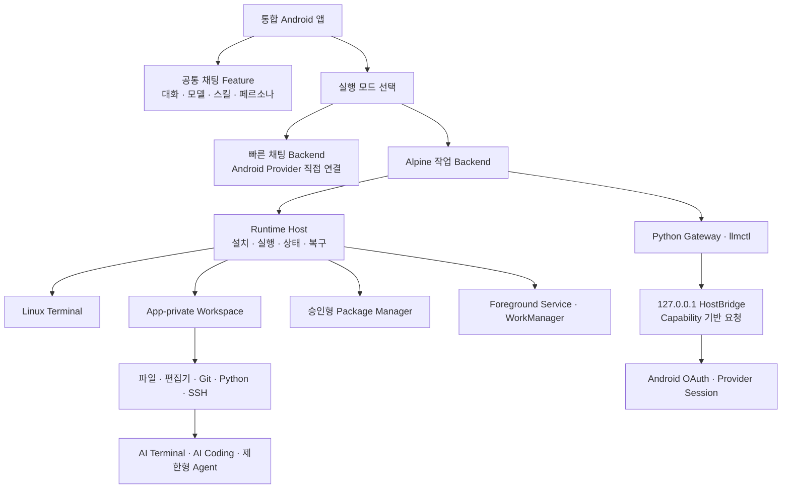

# implement_20260802_191629.md

작성 일시: `2026-08-02 19:16:29 KST`

문서 상태: **Phase 1 공통 Chat Feature 완료 / Phase 2 진행 가능**

이 문서는 현재 분리돼 있는 채팅 데모, Alpine Runtime SDK, 터미널, Python Gateway와 HostBridge를
하나의 재사용 가능한 제품 구조로 완성하기 위한 전체 개발 순서를 고정한다. 현재 내부 기술 MVP와
장기 기능 백로그를 구분하고, 기능 수를 늘리기 전에 실제 통합 앱의 핵심 사용자 흐름을 먼저 완성한다.

## 개발 목적

최종 목적은 다음 두 실행 모드를 한 Android 앱에서 제공하되, 각 기능은 다른 앱에서도 선택적으로
사용할 수 있는 독립 모듈로 유지하는 것이다.

1. **빠른 채팅 모드**
   - Alpine 설치나 실행 없이 Android에서 Provider에 직접 연결한다.
   - OAuth 로그인, Provider·모델 선택, 스트리밍 채팅, 대화 기록, 스킬·페르소나를 제공한다.
   - Alpine Runtime 장애나 미설치 상태에서도 독립적으로 사용할 수 있어야 한다.
2. **Alpine 작업 모드**
   - Alpine rootfs·PRoot Runtime, Linux 터미널, 안전한 Workspace, 패키지 설치와 Python Gateway를 사용한다.
   - Android HostBridge를 통해 Provider credential을 Guest에 전달하지 않고 LLM 기능을 제공한다.
   - 이후 파일·Git·Python·SSH·로컬 서비스·AI 작업 기능을 단계적으로 확장한다.

제품 구조는 다음 원칙을 만족해야 한다.

- `demo-chatbot`과 `integrated-app`에 중복 구현하지 않고 재사용 가능한 Chat Feature를 공유한다.
- Runtime, 터미널, Gateway, Workspace와 UI를 특정 앱에 종속시키지 않는다.
- 빠른 채팅 전용 앱에는 rootfs, PRoot, PTY, Python Gateway가 패키징되지 않는다.
- Alpine 작업 기능은 명시적으로 선택한 Host 앱에만 포함한다.
- Provider 요청이 시작된 뒤에는 다른 Backend로 자동 재전송하지 않는다.
- OAuth·SSH credential은 Alpine rootfs, Workspace, 터미널 기록과 로그에 평문으로 저장하지 않는다.

## 전체 아웃라인

## MVP 완료 기준

### 통합 제품 MVP에 반드시 포함

- 하나의 앱에서 실제 빠른 채팅과 Alpine 작업 모드를 전환할 수 있다.
- 빠른 채팅에서 OAuth 로그인, Provider·모델 선택, 스트리밍·중단·재시도가 동작한다.
- 기존 다중 대화, 암호화 저장, 스킬·페르소나 기능이 유지된다.
- Alpine 작업 모드에서 Runtime 설치·실행·상태·복구·종료가 동작한다.
- 최소 PTY 터미널에서 명령 입력, 출력, Ctrl+C, 종료가 동작한다.
- 승인된 패키지를 안전하게 설치할 수 있다.
- Python Gateway와 HostBridge가 실제 Runtime lifecycle에 연결되고 health 상태를 표시한다.
- 빠른 채팅은 Runtime 미설치·실패 상태에서도 계속 사용할 수 있다.
- Samsung arm64 실기기에서 두 모드의 핵심 E2E가 통과한다.
- tracked source 기준 로컬 clean build와 GitHub 원격 CI가 통과한다.

### 통합 제품 MVP 이후 단계

- 완전한 ANSI/VT terminal, 다중 탭과 동적 resize
- 파일 관리자·편집기·SAF 가져오기/내보내기
- Git·SSH·Python/Node 개발 Toolchain UX
- 로컬 서비스·웹 Preview·Database UI
- AI Terminal·AI Coding·제한형 Agent
- 예약 작업·반복 자동화·확장 Skill/MCP
- x86_64 정식 지원과 Play Asset Delivery
- 외부 공개 배포와 Store 출시

## 개발 범위

- 현재 대규모 변경을 재현 가능한 Git 기준선으로 정리한다.
- 채팅 화면·상태·대화 저장을 재사용 가능한 Android Feature 모듈로 분리한다.
- `integrated-app`의 비활성 빠른 채팅 Shell을 실제 채팅 기능으로 교체한다.
- 직접 Provider Backend와 Alpine Gateway Backend를 동일 채팅 계약에 연결한다.
- Runtime·HostBridge·Python Gateway lifecycle과 health/recovery UX를 통합한다.
- 최소 터미널을 제품 수준 Terminal Alpha로 확장한다.
- Workspace, 파일, 개발 Toolchain, AI 작업 기능을 의존 순서대로 추가한다.
- 실기기·실계정·CI·공급망 Gate를 기능 개발과 분리해 검증한다.

## 제외 범위

- Android 보안 모델을 우회하는 root, mount, KVM, Docker 또는 kernel module 지원
- 사용자 승인 없는 패키지 설치, 파일 삭제, 원격 push, 외부 업로드와 credential 사용
- 기본값으로 LAN에 공개되는 SSH/Web server 또는 원격 Shell
- Provider 요청 dispatch 이후 자동 Backend fallback이나 중복 재전송
- Guest rootfs에 OAuth access/refresh token 또는 SSH private key 저장
- 초기 통합 MVP에 IDE 전체, 무제한 Agent, 로컬 대형 LLM을 한 번에 포함하는 작업
- 외부 공개 배포를 명시적으로 결정하기 전의 Play Production 출시

## 참조 문서

- [프로젝트 README](../README.md)
- [장기 Alpine 기능 계획](implement_20260731_233922.md)
- [멀티 대화 구현 계획](implement_20260731_233326.md)
- [재사용 모듈·두 모드 통합 계획](implement_20260801_151654.md)
- [Phase 7 이후 P1·P2 계획](implement_20260801_213246.md)
- [잔여 구현·외부 Gate 계획](implement_20260802_091003.md)
- [라이선스·소스 경계 계획](implement_20260802_183317.md)
- [SDK 모듈 구조](../docs/alpine-runtime-sdk-modules.md)
- [Host 통합 가이드](../docs/alpine-runtime-host-integration.md)
- [Release readiness](../distribution/release-readiness.json)

## 공통 진행 규칙

- 각 Phase는 앞선 Phase의 자체 테스트 완료 후에만 시작한다.
- 구현 중 발생한 이슈는 해당 Phase에서 수정하고 기록한다.
- 체크박스 상태를 실제 진행 상태와 맞게 업데이트한다.
- 문서에 없는 범위 확장은 하지 않는다.
- 요구사항이 불명확하면 가능한 케이스를 나누고 확인 후 진행한다.
- 한 기능은 유지보수 가능한 최소 책임 단위로 나누고 각 단위의 역할과 경계를 유지한다.
- 공통화는 현재 범위의 중복을 줄일 때만 수행하고 미래 기능을 위한 과도한 추상화를 만들지 않는다.
- 기존 프로젝트 API, Android 공식 API와 표준 라이브러리를 우선 사용한다.
- 새 의존성은 terminal renderer 등 직접 구현 위험이 더 큰 경우에만 보안·유지 상태를 검토해 포함한다.
- 기능 구현과 제품 조립을 구분한다. 모듈 단위 테스트만으로 최종 앱 통합 완료를 주장하지 않는다.
- Fake/Mock 테스트와 실제 Provider·실기기 E2E 결과를 별도로 기록한다.
- 외부 조건이 없는 항목을 성공으로 기록하지 않고 `BLOCKED` 또는 `NOT_RUN`을 유지한다.
- secret, Provider 원문 오류, 사용자 대화·파일 내용과 전체 environment를 로그에 남기지 않는다.
- 각 Phase 종료 시 build, test, 실기기 결과, artifact 크기와 잔여 리스크를 기록한다.

## 권장 개발 순서

| 순서 | 이정표 | 핵심 결과 | 다음 단계 선행 이유 |
|---:|---|---|---|
| 0 | 재현 가능한 기준선 | 현재 변경 Commit·clean build·CI 기준선 | 통합 중 회귀와 유실 방지 |
| 1 | 공통 Chat Feature | 데모와 제품 앱이 같은 채팅 기능 사용 | 중복 조립 제거 |
| 2 | 빠른 채팅 통합 | `integrated-app`에서 실제 Provider 채팅 | 가장 빠른 사용자 가치 완성 |
| 3 | Alpine LLM 통합 | Runtime·Gateway·HostBridge 실제 연결 | 두 모드 제품 MVP 완성 |
| 4 | Terminal Alpha | ANSI·입력·resize·세션 안정화 | 이후 개발 Toolchain의 기반 |
| 5 | Workspace Beta | 파일 관리·편집·SAF·Package UX | Git·AI 작업의 안전한 파일 경계 |
| 6 | 개발 Toolchain | Python·Git·SSH·Node·Preview | 실제 모바일 개발 흐름 완성 |
| 7 | Lifecycle·복구 | 장기 실행·Doze·재부팅·quota | 장시간 작업 신뢰성 확보 |
| 8 | AI Workspace | AI terminal·coding·제한형 Agent | 안정된 Terminal/Workspace 위에서 구현 |
| 9 | 전체 E2E·호환성 | Provider·Samsung·x86_64·Play 검증 | Release 후보 판정 |
| 10 | 배포·컴플라이언스 | CI·서명·라이선스·source·배포 | 선택한 배포 범위의 최종 Gate |

## Phase 상태 요약

- [x] Phase 0. 현재 변경 기준선·재현성 확정
- [x] Phase 1. 공통 Chat Feature 모듈화
- [ ] Phase 2. 통합 앱 빠른 채팅 완성
- [ ] Phase 3. Alpine Runtime·Gateway·HostBridge 통합
- [ ] Phase 4. Terminal Alpha 완성
- [ ] Phase 5. Workspace·파일·Package Beta
- [ ] Phase 6. Python·Git·SSH·로컬 개발 흐름
- [ ] Phase 7. Background lifecycle·복구·자원 정책
- [ ] Phase 8. AI Terminal·AI Coding·제한형 Agent
- [ ] Phase 9. 실계정·실기기·ABI·Play 전체 E2E
- [ ] Phase 10. 배포·컴플라이언스·Release Candidate

## 예상 변경 파일 / 영향 범위

- `demo-chatbot/**`: 공통 Chat Feature의 thin sample host로 축소
- 신규 `alpine-chat-feature/**`: 대화 상태, 저장, 공통 채팅 UI와 Host 연결 계약
- `alpine-chat-routing/**`: 두 모드 선택, dispatch ledger와 fallback 정책
- `alpine-chat-backend-direct/**`: Android 직접 Provider Backend
- `alpine-chat-backend-alpine/**`: Python Gateway Backend
- `integrated-app/**`: 실제 제품 조립, 모드·상태·복구 UX
- `alpine-llm-bridge/**`: HostBridge와 Python Gateway lifecycle
- `alpine-runtime-*`: Runtime, Terminal, Background와 선택 UI
- `alpine-workspace-*`: 안전한 파일 저장소와 향후 파일 UI
- `integration-fixtures/**`, `scripts/**`: 실계정·실기기·배포 Gate
- `.github/workflows/ci.yml`: clean checkout 전체 검증
- `docs/**`, `distribution/**`: 통합·운영·배포 문서

## QA 관점

- [x] 빠른 채팅 앱과 모드에 Runtime payload·권한이 전이 포함되지 않는다.
- [ ] Runtime 설치·실행 실패 중에도 빠른 채팅이 정상 동작한다.
- [ ] Provider 요청 dispatch 후 Backend 변경·재시도로 중복 과금·중복 응답이 발생하지 않는다.
- [x] 대화 A/B의 Provider, 모델, 실행 모드, Skill, Persona와 streaming job이 섞이지 않는다.
- [ ] OAuth token·SSH key가 rootfs, Workspace, terminal buffer, command history와 support log에 남지 않는다.
- [ ] HostBridge는 loopback과 유효 capability 없이 접근할 수 없다.
- [ ] 터미널의 빠른 출력, invalid UTF-8, ANSI escape, 긴 line, resize storm과 exit race가 UI를 멈추지 않는다.
- [ ] symlink, `..`, archive traversal, 과대 파일과 SAF 권한 만료가 Workspace 경계를 넘지 않는다.
- [ ] 패키지·Git·AI의 변경 작업은 승인 전에 실행되지 않는다.
- [ ] 앱 background, process kill, Doze와 reboot 후 거짓 실행 상태나 자동 명령 재실행이 없다.
- [x] Provider 429·5xx·malformed SSE·timeout에서 내부 오류와 credential이 노출되지 않는다.
- [ ] arm64 Samsung과 x86_64 Emulator의 지원 범위를 UI와 manifest가 정확히 구분한다.
- [ ] TalkBack, 200% 글꼴, 한글 IME, 외부 키보드, 회전과 dark theme를 단계별로 검증한다.
- [x] clean checkout과 원격 CI가 로컬 전용 파일 없이 동일 Artifact 구조를 생성한다.

## Phase 0. 현재 변경 기준선·재현성 확정

### 목표

- 현재 구현 결과를 유실하거나 과거 코드와 섞지 않고 재현 가능한 개발 기준선을 만든다.

### 구현 태스크

- [x] 현재 tracked·untracked 변경을 기능군별로 분류하고 의도하지 않은 파일·secret을 검사한다.
- [x] 삭제·이동된 Android Runtime/Bridge 코드가 신규 모듈로 정확히 이전됐는지 확인한다.
- [x] 문서의 현재 구현 상태와 실제 코드·report의 불일치를 정리한다.
- [x] 현재 전체 변경을 의미 있는 Commit 단위로 분리한다.
- [x] GitHub 원격 Branch에 Push하고 CI 실행 기준선을 만든다.
- [x] 이후 Phase가 사용할 통합 MVP acceptance checklist를 고정한다.

### 자체 테스트

- [x] Python 전체 테스트가 통과한다.
- [x] Android 전체 unit, lint, debug/release build가 통과한다.
- [x] 17개 publication과 8개 consumer matrix가 다시 통과한다.
- [x] `git diff --check`와 secret/absolute-path sentinel 검사가 통과한다.
- [x] clean checkout에서 내부 release script가 동일한 구조의 bundle을 생성한다.

### 이슈 및 수정

- [x] 생성된 Android `.cxx` 중간 파일이 미추적 목록에 포함되던 문제를 `.gitignore`로 차단했다.
- [x] 검증 문서의 기기 serial과 로컬 OpenMinis 절대 경로를 배포 가능한 placeholder로 치환했다.
- [x] 대규모 변경을 Gateway, Runtime SDK, Release gate와 CI 수정 Commit으로 분리해 main에 반영했다.
- [x] 첫 원격 CI에서 license compliance report 생성 누락을 발견하고 Workflow를 수정했다.

### 완료 조건

- [x] 구현 완료
- [x] 자체 테스트 완료
- [x] 원격 CI 기준선 확인
- [x] Phase 1 진행 가능

## Phase 1. 공통 Chat Feature 모듈화

### 목표

- `demo-chatbot`의 실제 채팅 기능을 복사하지 않고 `integrated-app`과 다른 Host 앱이 재사용하게 한다.

### 구현 태스크

- [x] 대화 모델·암호화 저장·Repository·ViewModel과 Compose 화면의 Host 의존성을 분리한다.
- [x] `ChatCompletionSession` 직접 의존을 공통 Chat Backend 계약으로 연결한다.
- [x] Provider 관리 화면을 공통 Feature와 Host 전용 책임으로 구분한다.
- [x] 다중 대화, draft, 모델, Skill, Persona와 생성 상태를 공통 Feature에 유지한다.
- [x] `demo-chatbot`을 공통 Feature를 사용하는 thin sample app으로 전환한다.
- [x] Runtime이나 Alpine Backend가 없어도 공통 Feature가 빌드되게 한다.

### 자체 테스트

- [x] 기존 demo JVM·Compose instrumentation 테스트가 동일하게 통과한다.
- [x] 다중 대화·백그라운드 생성·암호화 저장 회귀 테스트가 통과한다.
- [x] Fast-chat-only APK에 Runtime payload가 없음을 확인한다.
- [x] 공통 Feature를 최소 Host fixture에서 조립하는 consumer 테스트가 통과한다.

### 이슈 및 수정

- [x] 기존 ViewModel 테스트가 demo 전용 `ProviderConnection`을 직접 사용해 컴파일되지 않던 문제를 공통 `ChatBackendConnection` fixture로 수정했다.
- [x] Provider raw SSE JSON이 공통 ViewModel까지 전달되던 경계를 Host adapter에서 `ChatBackendDelta`로 정규화했다.
- [x] Provider exception 문자열이 Feature로 전달될 수 있는 경계를 닫힌 `ChatBackendFailureCode`로 교체했다.

### 완료 조건

- [x] 구현 완료
- [x] 자체 테스트 완료
- [x] Phase 2 진행 가능

## Phase 2. 통합 앱 빠른 채팅 완성

### 목표

- `integrated-app`의 비활성 안내 화면을 실제 사용할 수 있는 빠른 채팅 제품 화면으로 교체한다.

### 구현 태스크

- [ ] 공통 Chat Feature를 `integrated-app`에 연결한다.
- [ ] Provider 프로필 생성·로그인·로그아웃·모델 선택을 연결한다.
- [ ] 직접 Provider Backend를 기본 빠른 채팅 경로로 연결한다.
- [ ] 현재 대화의 실행 모드를 저장하고 Mode selector와 동기화한다.
- [ ] 스트리밍 중 다른 대화·모드 화면 이동과 Stop 동작을 안전하게 유지한다.
- [ ] Runtime 미설치·실패 상태가 빠른 채팅 UI를 차단하지 않게 한다.

### 자체 테스트

- [ ] 빠른 채팅의 로그인→모델 선택→stream→Stop→retry가 통과한다.
- [ ] 새 대화→이전 대화 복귀→앱 재시작 복원이 통과한다.
- [ ] Runtime을 제거한 consumer에서도 빠른 채팅이 빌드·실행된다.
- [ ] Samsung에서 기존 Codex OAuth profile과 대화 데이터가 유지된다.

### 이슈 및 수정

- [ ] 발견 이슈 없음

### 완료 조건

- [ ] 구현 완료
- [ ] 자체 테스트 완료
- [ ] Phase 3 진행 가능

## Phase 3. Alpine Runtime·Gateway·HostBridge 통합

### 목표

- Alpine 작업 모드에서 Runtime과 LLM Gateway가 실제로 함께 시작되고 공통 채팅 화면에서 사용되게 한다.

### 구현 태스크

- [ ] `IntegratedApplication`에 `AlpineLlmBridgeController`의 단일 owner를 연결한다.
- [ ] Runtime install/start/stop/restart와 Gateway/HostBridge lifecycle 순서를 고정한다.
- [ ] Alpine Backend를 공통 Chat Backend 계약에 연결한다.
- [ ] Runtime, HostBridge, Gateway process, protocol health를 통합 상태로 표시한다.
- [ ] capability 생성·회전·삭제와 token Guest 격리를 확인한다.
- [ ] Alpine 시작 실패 시 사용자 승인 아래 빠른 채팅 전환만 제안하고 요청을 자동 재전송하지 않는다.
- [ ] 복구·재시작·Stop UI와 오류 코드별 안내를 연결한다.

### 자체 테스트

- [ ] Runtime→HostBridge→Gateway→`llmctl` 순서의 start/health/stop E2E가 통과한다.
- [ ] Gateway crash, capability 만료, protocol mismatch와 port 충돌을 복구한다.
- [ ] Alpine 채팅이 history와 system instruction을 손실하지 않는다.
- [ ] 요청 dispatch 이후 Runtime 장애에서 direct Backend 재전송이 발생하지 않는다.
- [ ] Samsung에서 두 모드를 왕복하고 Alpine 응답을 확인한다.

### 이슈 및 수정

- [ ] 발견 이슈 없음

### 완료 조건

- [ ] 구현 완료
- [ ] 자체 테스트 완료
- [ ] **통합 제품 내부 MVP 달성**
- [ ] Phase 4 진행 가능

## Phase 4. Terminal Alpha 완성

### 목표

- 현재 일반 텍스트 명령 패널을 실제 모바일 Terminal Alpha로 발전시킨다.

### 구현 태스크

- [ ] ANSI/VT screen engine의 자체 구현과 검증된 library 도입을 비교하고 하나를 결정한다.
- [ ] cursor, erase, color, style, scroll region과 Unicode width를 렌더링한다.
- [ ] raw key input과 Ctrl/Alt/Tab/Esc/방향키 toolbar를 구현한다.
- [ ] Ctrl+C, Ctrl+D, terminate, kill과 exit code 표시를 완성한다.
- [ ] 화면 크기 측정과 PTY resize를 연결하고 guest `stty`·SIGWINCH를 실제 통과시킨다.
- [ ] bounded scrollback, 검색, 선택·복사·붙여넣기와 URL 열기를 구현한다.
- [ ] 최소 다중 세션·탭과 명시적 close lifecycle을 구현한다.
- [ ] 동적 resize가 불가능한 Runtime에는 `INITIAL_SIZE_ONLY`를 정확히 표시한다.

### 자체 테스트

- [ ] ANSI fixture, wide Unicode, combining character와 invalid sequence 테스트가 통과한다.
- [ ] resize storm과 TUI `SIGWINCH` 재배치가 실제 Guest에서 통과한다.
- [ ] 빠른 출력·긴 line·256KB 초과 출력에서 UI가 멈추지 않는다.
- [ ] 한글 IME, 외부 키보드와 200% 글꼴을 Samsung에서 검증한다.
- [ ] session close·앱 background·process kill 후 child process와 fd가 남지 않는다.

### 이슈 및 수정

- [ ] 현재 PRoot guest 동적 resize가 `GUEST_WINSIZE_NOT_PROPAGATED`로 차단돼 있다.

### 완료 조건

- [ ] 구현 완료
- [ ] 자체 테스트 완료
- [ ] Terminal Alpha 실기기 Gate 완료
- [ ] Phase 5 진행 가능

## Phase 5. Workspace·파일·Package Beta

### 목표

- Terminal, 개발 도구와 AI가 공유할 안전한 사용자 Workspace UX를 제공한다.

### 구현 태스크

- [ ] 기존 Workspace API 위에 목록·생성·이름 변경·이동·삭제 UI를 구현한다.
- [ ] large-file guard가 있는 최소 text/code editor와 검색·저장·diff viewer를 추가한다.
- [ ] SAF 파일 가져오기·내보내기와 Android 공유를 capability 기반으로 연결한다.
- [ ] Workspace와 Guest `/workspace`의 동일 파일 경계를 검증한다.
- [ ] Package UI에 검색 가능한 승인 목록, 설치 상태·용량·실패 복구를 추가한다.
- [ ] `apk add` 외 update/del/upgrade는 별도 위험 확인과 고정 argument 계약으로 구현한다.
- [ ] Workspace quota, temp/cache 정리와 export/import를 구현한다.

### 자체 테스트

- [ ] traversal, symlink, archive bomb, 과대 파일과 TOCTOU 경계 테스트가 통과한다.
- [ ] 편집 중 process death와 저장공간 부족에서 원본을 보존한다.
- [ ] package 설치 취소·네트워크 실패·중단 후 Runtime health가 유지된다.
- [ ] Android와 Guest에서 같은 Workspace 파일을 읽고 수정한다.
- [ ] 수천 파일 목록과 큰 파일에서 UI thread block을 측정한다.

### 이슈 및 수정

- [ ] 발견 이슈 없음

### 완료 조건

- [ ] 구현 완료
- [ ] 자체 테스트 완료
- [ ] Workspace Beta 실기기 Gate 완료
- [ ] Phase 6 진행 가능

## Phase 6. Python·Git·SSH·로컬 개발 흐름

### 목표

- 모바일에서 실제 프로젝트를 clone, 편집, 실행, 검증하고 Preview할 수 있는 최소 개발 흐름을 완성한다.

### 구현 태스크

- [ ] Python/pip/venv/script/test/lint profile을 고정한다.
- [ ] Node/npm/TypeScript profile을 선택 설치 구조로 제공한다.
- [ ] Git clone/status/diff/add/commit/branch/pull/push의 Terminal·UI 흐름을 구현한다.
- [ ] HTTPS credential broker와 SSH key/known_hosts Host 경계를 구현한다.
- [ ] SSH/SCP/SFTP 기본 기능과 fingerprint 확인을 제공한다.
- [ ] loopback local server registry, start/stop/log/health와 port 충돌 처리를 구현한다.
- [ ] 앱 내 Web Preview를 loopback-only navigation 정책으로 연결한다.

### 자체 테스트

- [ ] Python과 Node sample의 install→test→run 흐름이 통과한다.
- [ ] Git local fixture와 mock HTTPS/SSH remote의 성공·실패가 구분된다.
- [ ] token·SSH key가 Guest 파일·environment·log에 남지 않는다.
- [ ] local server가 loopback 외 주소에 기본 bind되지 않는다.
- [ ] Samsung에서 clone→edit→test→preview→commit 흐름이 통과한다.

### 이슈 및 수정

- [ ] 발견 이슈 없음

### 완료 조건

- [ ] 구현 완료
- [ ] 자체 테스트 완료
- [ ] Local Development Beta 완료
- [ ] Phase 7 진행 가능

## Phase 7. Background lifecycle·복구·자원 정책

### 목표

- 장시간 Terminal, package, build, server와 AI 작업이 Android lifecycle과 배터리 정책 안에서 안전하게 동작하게 한다.

### 구현 태스크

- [ ] 작업 종류별 Foreground Service ownership과 notification/Stop action을 고정한다.
- [ ] WorkManager 일회성·반복 작업과 network/charging 조건을 구현한다.
- [ ] process lease, stale state, crash recovery와 missed-run 정책을 완성한다.
- [ ] reboot·Doze·process kill·배터리 제한 정책을 사용자 승인 아래 검증한다.
- [ ] CPU, memory, storage, process, port와 작업 log quota를 적용한다.
- [ ] 이전 명령·Provider 요청을 자동 재실행하지 않는 복구 계약을 유지한다.

### 자체 테스트

- [ ] Stop action이 Runtime과 모든 child process를 종료한다.
- [ ] reboot·Doze·force-stop 후 거짓 실행 상태가 남지 않는다.
- [ ] retry storm, duplicate Work와 notification 누락을 방지한다.
- [ ] quota 정리가 source, Workspace와 credential을 삭제하지 않는다.
- [ ] Samsung 파괴적 lifecycle matrix를 승인된 창에서 완료한다.

### 이슈 및 수정

- [ ] 현재 reboot·Doze·process-kill 정식 E2E가 미실행이다.

### 완료 조건

- [ ] 구현 완료
- [ ] 자체 테스트 완료
- [ ] Samsung lifecycle Gate 완료
- [ ] Phase 8 진행 가능

## Phase 8. AI Terminal·AI Coding·제한형 Agent

### 목표

- 안정된 Terminal과 Workspace 위에서 사용자가 검토·승인할 수 있는 AI 작업 흐름을 제공한다.

### 구현 태스크

- [ ] Terminal 출력·선택 파일·Git diff를 bounded context로 전달한다.
- [ ] 명령 설명·제안·수정·실행 승인·결과 요약 흐름을 구현한다.
- [ ] read/write/patch/exec/test/git-diff의 최소 구조화 Tool contract를 정의한다.
- [ ] Workspace allowlist, network policy, 시간·요청·비용 budget과 step 승인을 적용한다.
- [ ] AI 변경 diff 검토, test 결과와 rollback을 연결한다.
- [ ] 사용자 Terminal process와 AI runner process·권한·audit를 분리한다.
- [ ] Provider별 Tool/Idempotency 차이를 공통 정책으로 정규화한다.

### 자체 테스트

- [ ] path escape, secret read, 임의 upload, destructive command와 prompt injection을 차단한다.
- [ ] 승인 취소 후 명령·파일 변경·Provider 재요청이 발생하지 않는다.
- [ ] Agent 중단 시 child process, temp file과 pending capability가 정리된다.
- [ ] 동일 Tool 호출의 중복 실행과 Git push 중복을 방지한다.
- [ ] Samsung에서 질문→제안→승인→실행→diff→test→결과 설명 흐름이 통과한다.

### 이슈 및 수정

- [ ] 발견 이슈 없음

### 완료 조건

- [ ] 구현 완료
- [ ] 자체 테스트 완료
- [ ] 보안 adversarial 검토 완료
- [ ] Phase 9 진행 가능

## Phase 9. 실계정·실기기·ABI·Play 전체 E2E

### 목표

- Mock 성공과 실제 제품 지원을 구분하고 지원 Provider·기기·공급 방식을 공식 검증한다.

### 구현 태스크

- [ ] Codex, Claude, Gemini, xAI와 OpenAI-compatible 실계정 E2E를 승인된 계정으로 실행한다.
- [ ] 모델 목록, non-stream, stream, cancel, refresh, logout과 idempotency report를 기록한다.
- [ ] 실제 429·5xx·malformed SSE·timeout과 계정 제한을 검증한다.
- [ ] x86_64 Emulator에서 install/start/terminal/workspace/Gateway E2E를 실행한다.
- [ ] Play Asset Delivery를 선택하면 test track에서 install/update/offline/rollback을 검증한다.
- [ ] arm64 Samsung과 x86_64 지원 범위를 manifest·UI·문서에 반영한다.

### 자체 테스트

- [ ] Provider별 signed/redacted report validator가 통과한다.
- [ ] Provider 계정·모델 미지원 상태가 안전한 사용자 오류로 표시된다.
- [ ] x86_64 E2E가 없으면 experimental 지원을 유지한다.
- [ ] Play track이 없으면 bundled arm64 내부 배포와 상태가 섞이지 않는다.

### 이슈 및 수정

- [ ] Provider 실계정·x86_64 Emulator·Play track 외부 조건이 현재 차단돼 있다.

### 완료 조건

- [ ] 구현 완료
- [ ] 자체 테스트 완료
- [ ] 선택한 지원 Matrix의 E2E 완료
- [ ] Phase 10 진행 가능

## Phase 10. 배포·컴플라이언스·Release Candidate

### 목표

- 내부 배포 또는 외부 배포 중 사용자가 선택한 범위에 맞춰 재현 가능하고 검토 가능한 Release Candidate를 만든다.

### 구현 태스크

- [ ] 내부 전용·비공개 배포·외부 공개 배포 중 목표 mode와 owner를 확정한다.
- [ ] 프로젝트 고유 코드 LICENSE/EULA 정책을 owner가 확정한다.
- [ ] PRoot/talloc과 rootfs package corresponding source 범위를 완성한다.
- [ ] 앱 내 OSS notice/source 안내와 offline license 화면을 구현한다.
- [ ] GitHub 원격 CI에서 clean app/SDK/source bundle을 재현한다.
- [ ] signing owner, release destination, support owner와 rollback 절차를 지정한다.
- [ ] 선택한 배포 mode에 필요한 Play/Maven/내부 artifact publishing을 검증한다.

### 자체 테스트

- [ ] Binary·source·SBOM·notice·version/checksum 연결이 일치한다.
- [ ] fast-chat-only와 with-Alpine artifact 경계가 유지된다.
- [ ] secret, 로컬 절대 경로와 승인되지 않은 payload가 Release에 포함되지 않는다.
- [ ] 내부 배포만 선택하면 외부 Gate를 거짓 완료하지 않고 별도 상태로 유지한다.
- [ ] 외부 배포를 선택한 경우 모든 release-blocking Gate가 `READY`다.

### 이슈 및 수정

- [ ] 현재 외부 공개 배포 Gate 7개가 `BLOCKED`이며 내부 개발 사용과는 별도로 관리한다.

### 완료 조건

- [ ] 구현 완료
- [ ] 자체 테스트 완료
- [ ] 선택한 배포 범위의 Release Candidate 승인
- [ ] 최종 결과와 잔여 리스크 기록 완료

## 최종 완료 기준

- [ ] 한 앱에서 빠른 채팅과 Alpine 작업 모드가 실제 기능으로 동작한다.
- [ ] 같은 기능이 재사용 모듈로 남아 다른 Android 앱에서도 선택 조립된다.
- [ ] 빠른 채팅 전용 앱은 Runtime payload와 권한을 포함하지 않는다.
- [ ] Alpine 작업 모드는 Runtime, Terminal, Workspace, Gateway와 HostBridge를 안전하게 관리한다.
- [ ] Samsung arm64에서 채팅→터미널→파일→Git/Python→AI 작업 흐름이 통과한다.
- [ ] 지원한다고 표시한 Provider·ABI·배포 방식은 실제 E2E 근거를 가진다.
- [ ] Credential, 사용자 데이터와 Provider 원문 오류가 Guest·로그·Artifact에 노출되지 않는다.
- [ ] clean checkout·원격 CI·release script가 재현 가능한 Artifact와 검증 보고서를 만든다.

## 잔여 리스크 / 후속 과제

- PRoot 동적 terminal resize가 해결되지 않으면 TUI 지원은 `INITIAL_SIZE_ONLY`로 제한해야 한다.
- Android kernel·SELinux 변화와 PRoot 유지 상태에 따라 장기 호환성 비용이 발생할 수 있다.
- Provider OAuth public client 정책과 모델 지원은 Provider 변경에 따라 재검증이 필요하다.
- Play Asset Delivery와 x86_64 지원은 MVP 필수가 아니며 목표 배포 범위에 따라 연기할 수 있다.
- 로컬 LLM, 미디어 Toolchain, MCP Extension과 LAN server는 핵심 AI Workspace 이후 별도 계획으로 관리한다.
