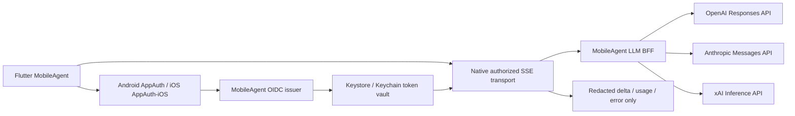

# implement_20260804_202612.md

작성 일시: `2026-08-04 20:26:12 KST`

문서 상태: **구현 진행 중 / local OIDC·양 플랫폼 debug build 검증 완료**

이 문서는 Flutter 기반 MobileAgent가 Android와 iOS에서 동일한 사용자 흐름으로 OAuth 로그인하고,
OpenAI·Anthropic·xAI의 외부 LLM을 실제 운영 API로 호출할 수 있는 제품 경로를 완성하기 위한 작업 문서다.
Mock, 복사한 CLI client ID 또는 로그인 화면 진입만으로 완료를 주장하지 않고, 앱 소유 인증 구성과
실계정·실기기 E2E가 모두 통과해야만 지원 완료로 판정한다.

## 2026-08-04 구현 스냅샷

| 영역 | 현재 상태 | 근거 |
|---|---|---|
| Flutter 제품 앱 | `IMPLEMENTED_LOCAL` | `apps/mobile_agent`, analyze/widget test PASS |
| Android OAuth | `IMPLEMENTED_LOCAL` | AppAuth + Keystore + native SSE/cancel, APK build PASS |
| iOS OAuth | `IMPLEMENTED_LOCAL` | AppAuth-iOS + Keychain + URLSession SSE/cancel, Simulator build PASS |
| 개발 OIDC | `PASS` | Keycloak 실제 login form→PKCE code→refresh rotation/replay 거부→revoke |
| BFF | `IMPLEMENTED_SINGLE_INSTANCE` | JWT 검증, 3 Provider adapter, upstream task cancel, 17 tests PASS |
| 외부 Provider 실계정 | `NOT_RUN` | Provider secret/account/billing 승인 미제공 |
| HTTPS staging OAuth | `BLOCKED_EXTERNAL` | 소유 domain/TLS/client registration/signing 정보 미제공 |
| Android/iPhone release E2E | `NOT_RUN` | staging 선행 조건 및 실제 iPhone signing 필요 |

이번 구현으로 **실 OAuth 페이지를 열 수 있는 native 코드와 local 실제 OIDC 흐름**은 확보했다.
다만 앱 제품 완료 판정은 소유 HTTPS staging issuer에서 Android/iPhone callback과 세 Provider 실제
stream까지 통과한 뒤에만 가능하다. Local HTTP Keycloak 결과를 production OAuth 완료로 집계하지 않는다.

## 개발 목적

- 하나의 Flutter 앱에서 Android와 iOS가 같은 계정·Provider·모델·채팅 UX를 사용한다.
- 모바일 사용자는 API key를 입력하지 않고 MobileAgent OAuth/OIDC Authorization Code + PKCE로 로그인한다.
- OpenAI, Anthropic, xAI credential은 모바일 바이너리에 넣지 않고 MobileAgent LLM BFF의 secret boundary에서 관리한다.
- Android Keystore와 iOS Keychain이 MobileAgent refresh credential을 소유하고, raw token은 Dart와 Linux Guest로 전달하지 않는다.
- OpenAI Responses, Anthropic Messages, xAI inference를 streaming·cancel·refresh·logout까지 실제 동작시킨다.
- Provider가 공식적으로 승인한 native public-client OAuth만 별도 direct connector로 허용하고, 타 앱/CLI 등록을 복사하거나 위장하지 않는다.

## 제품 인증 결정

### 기본 출시 경로: MobileAgent OAuth + LLM BFF



- 모바일 OAuth 대상은 MobileAgent가 소유·운영하는 OIDC issuer다.
- BFF는 issuer JWT를 `iss`·`aud`·`azp`·`exp`·서명·키 회전까지 검증한다.
- BFF의 Provider credential은 배포 secret manager에 저장하며 앱, 저장소, Flutter asset, Android resource, iOS plist에 포함하지 않는다.
- OpenAI는 공식 OpenAI API, Anthropic은 공식 Claude API, xAI는 공식 xAI API를 사용한다.
- 제품 UI의 `Codex`는 ChatGPT consumer 계정 OAuth가 아니라 공식 OpenAI API의 지원 coding model/profile을 의미해야 한다. 공식 승인이 없는 `chatgpt.com/backend-api` 사용은 출시 범위가 아니다.
- Claude consumer OAuth/Claude Code 식별 prompt·CLI fingerprint와 xAI/Grok CLI public client를 복제하는 경로는 출시 범위가 아니다.

| MobileAgent 표시명 | 실제 추론 경로 | 사용자 인증 | Provider 인증 |
|---|---|---|---|
| Codex | OpenAI Responses API의 승인된 coding model/profile | MobileAgent OIDC + PKCE | BFF의 OpenAI server credential |
| Claude | Anthropic Messages API | MobileAgent OIDC + PKCE | BFF의 Anthropic server credential |
| Grok | xAI 공식 inference API | MobileAgent OIDC + PKCE | BFF의 xAI server credential |

이 표의 OAuth는 **MobileAgent 사용자 로그인**이다. 사용자의 ChatGPT·Claude·Grok consumer 구독을
제3자 앱이 그대로 사용하는 로그인이 아니며, 그런 direct OAuth는 Provider의 MobileAgent 전용 등록 승인이 있을 때만 추가한다.

### 조건부 확장 경로: Provider 직접 OAuth

- Provider가 MobileAgent 명의 native client registration, redirect URI, scope와 inference 사용을 서면 또는 console 설정으로 승인한 경우에만 활성화한다.
- 승인 전에는 build-time feature flag와 release manifest에서 제거하고 사용자에게 표시하지 않는다.
- direct connector도 system browser, PKCE S256, state/nonce 검증, claimed HTTPS redirect, native secure storage를 동일하게 적용한다.
- 승인 근거와 실계정 E2E가 없으면 상태는 `UNSUPPORTED`이며 `EXPERIMENTAL` 또는 `완료`로 표시하지 않는다.

## 개발 범위

- `apps/mobile_agent/` Flutter 제품 앱 신규 구성과 Android/iOS host 생성
- Flutter 공통 계정·Provider·모델·채팅·오류·중단 UX
- Pigeon 기반 typed federated plugin 계약
- Android AppAuth/Custom Tabs/App Links 및 Keystore token vault
- iOS AppAuth-iOS(`ASWebAuthenticationSession` system external user-agent)/Universal Links 및 Keychain token vault
- native authorized HTTP/SSE transport, refresh single-flight와 즉시 cancel
- MobileAgent OIDC issuer 연동 및 LLM BFF의 JWT 검증·quota·audit·Provider routing
- OpenAI Responses, Anthropic Messages, xAI inference adapter와 공통 stream event 정규화
- 기존 Android Alpine HostBridge가 같은 authenticated session을 재사용하는 연결
- Android emulator/실기기, iOS Simulator/실제 iPhone, Provider 실계정 staging E2E
- security, privacy, OAuth redirect ownership, signing, TestFlight/Play Internal release gate

## 제외 범위

- 다른 앱, OpenMinis, Codex CLI, Claude Code, Grok CLI의 public client ID를 복사한 제품 로그인
- first-party CLI User-Agent, system prompt, header 또는 private endpoint를 MobileAgent가 공식 client인 것처럼 위장
- 모바일 APK/IPA에 OpenAI·Anthropic·xAI server API key 또는 confidential client secret 저장
- WebView/WKWebView 안에서 Provider 비밀번호를 입력받는 OAuth
- 실제 Provider E2E 없이 mock 성공만으로 Provider 지원 완료 처리
- 이번 계획에서 iOS Linux/iSH runtime, Android PRoot terminal 또는 전체 Agent 기능을 확장하는 작업
- 사용자 승인 없는 비용 발생, destructive Provider 장애 유발, production account 데이터 사용

## 참조 문서

- [기존 Android 통합 제품 전체 계획](implement_20260802_191629.md)
- [기존 Android OAuth Host 계획](implement_20260731_123949.md)
- [Provider OAuth adapter 현황](../docs/provider-oauth-adapters.md)
- [Provider 실계정 E2E 절차](../docs/provider-account-e2e-runbook.md)
- [프로젝트 README](../README.md)
- [Android OAuth 통합 문서](../android/README.md)
- [RFC 8252 OAuth 2.0 for Native Apps](https://datatracker.ietf.org/doc/html/rfc8252)
- [AppAuth for Android](https://github.com/openid/AppAuth-Android)
- [AppAuth for iOS](https://github.com/openid/AppAuth-iOS)
- [Apple ASWebAuthenticationSession](https://developer.apple.com/documentation/authenticationservices/aswebauthenticationsession)
- [Google native OAuth와 mobile loopback 제한](https://developers.google.com/identity/protocols/oauth2/native-app)
- [OpenAI API quickstart](https://developers.openai.com/api/docs/quickstart)
- [Anthropic API authentication](https://platform.claude.com/docs/en/manage-claude/authentication)
- [xAI inference API authentication](https://docs.x.ai/developers/rest-api-reference/inference)

## 문서 기반 제약 사항

- RFC 8252에 따라 native public client는 external user-agent와 PKCE를 사용하고 client secret을 신뢰하지 않는다.
- Android/iOS OAuth callback에 mobile loopback을 기본값으로 사용하지 않는다. 소유 도메인의 Android App Link와 iOS Universal Link를 우선한다.
- OpenAI 공식 개발 API의 기본 인증은 API key이므로 key는 BFF server-side secret으로만 사용한다.
- Anthropic 공식 API 인증은 API key 또는 workload identity federation이며, Claude consumer subscription OAuth와 동일한 계약으로 간주하지 않는다.
- xAI 공식 inference API는 API key Bearer 인증을 사용하므로 key는 BFF에만 둔다.
- Google direct OAuth를 후속 지원할 때 Android/iOS mobile loopback redirect는 사용하지 않고 공식 mobile SDK/redirect 정책을 적용한다.

## 실행 가능한 기준 구성

| 계층 | 기준 구현 | 필수 설정 |
|---|---|---|
| Flutter | stable SDK, Pigeon typed channels, Android/iOS 단일 UI | flavor별 issuer/BFF 공개 URL만 포함 |
| 개발 OIDC | pinned Keycloak container/realm export | public native client, PKCE S256, dev test user |
| Staging OIDC | MobileAgent 소유 HTTPS issuer | issuer, audience, App Link/Universal Link redirect 등록 |
| BFF | Python 3.11, FastAPI, uvicorn, async httpx | OIDC/JWKS, Redis, Provider secret reference |
| 상태/취소 | Redis | request owner, cancel channel, quota/revocation TTL |
| Android | AppAuth-Android, Custom Tabs, App Links, Keystore, OkHttp SSE | package, SHA-256 signing fingerprint, `assetlinks.json` |
| iOS | AppAuth-iOS, ASWebAuthenticationSession, Universal Links, Keychain, URLSession SSE | bundle/team ID, Associated Domains, AASA |
| Provider | OpenAI Responses, Anthropic Messages, xAI inference | BFF secret manager의 account/key와 비용 상한 |

- 로컬 server contract test는 `backend/dev-idp` Keycloak + Redis + BFF compose로 재현한다.
- 모바일 실제 OAuth E2E는 기기가 접근 가능한 **소유 HTTPS staging domain**에서 수행한다. 임시 loopback을 release 근거로 사용하지 않는다.
- 앱 build에는 `OIDC_ISSUER`, `OIDC_CLIENT_ID`, `BFF_BASE_URL` 같은 공개 설정만 포함하며 Provider key와 confidential secret은 0건이어야 한다.
- staging secret 이름은 `OPENAI_API_KEY`, `ANTHROPIC_API_KEY`, `XAI_API_KEY`로 표준화하되 값은 저장소·CI log·artifact에 기록하지 않는다.
- `make dev-up`, `make bff-test`, `flutter test`, Android/iOS integration test와 signed E2E report를 clean checkout 재현 명령으로 제공한다.

## 구현 시작 전 필수 외부 입력

| 입력 | 없을 때 상태 | 완료 증거 |
|---|---|---|
| MobileAgent 소유 staging domain/DNS/TLS | 모바일 OAuth E2E `BLOCKED` | issuer/BFF/link HTTPS health 및 association 파일 |
| Android package와 release signing SHA-256 | Android App Link release `BLOCKED` | Play signing 포함 `assetlinks.json` 검증 |
| Apple Team ID/bundle ID/signing 권한 | 실제 iPhone/TestFlight `BLOCKED` | AASA, archive, 설치본 callback PASS |
| OpenAI·Anthropic·xAI staging account/key/billing cap | 해당 Provider 실제 API `NOT_RUN` | secret owner 승인과 redacted stream report |
| OIDC/Backend 운영 owner와 secret manager | staging 배포 `BLOCKED` | rotation/rollback/incident owner 기록 |

## 공통 진행 규칙

- 각 Phase는 앞선 Phase의 자체 테스트와 완료 조건을 모두 만족한 뒤에만 시작한다.
- 구현 중 발생한 이슈는 해당 Phase의 `이슈 및 수정`에 기록하고 같은 Phase에서 해결한다.
- 체크박스는 실제 코드·자동 테스트·실기기 근거와 일치시킨다.
- mock, simulator와 실제 계정·실기기 결과를 분리해 기록한다.
- 로그인 화면이 열리거나 token exchange가 성공한 것만으로 LLM 동작 완료로 판정하지 않는다.
- 지원 Provider는 `login → model 조회/선택 → stream → cancel → refresh → app restart → logout/revoke` 전체가 실제 계정에서 통과해야 한다.
- OAuth access/refresh token과 Provider credential은 Dart, MethodChannel payload, Linux environment, log, crash report, analytics와 support bundle에 포함하지 않는다.
- Flutter에는 인증 상태 요약과 redacted 오류 코드만 전달하고 native vault가 token을 소유한다.
- Provider 요청 dispatch 후 다른 Provider/backend로 자동 재전송하지 않는다.
- Provider credential mode와 endpoint는 release allowlist로 고정하고 remote config가 임의 도메인으로 변경하지 못하게 한다.
- 새 의존성은 공식 SDK/표준 구현을 우선하고 lockfile·license·maintenance 상태를 검증한다.
- 실제 계정·등록·도메인·signing 조건이 없으면 `BLOCKED`/`NOT_RUN`을 유지하고 완료로 표시하지 않는다.

## 성공 정의

다음 조건을 모두 충족해야 **Android/iOS 외부 LLM OAuth 실제 작동 완료**로 판정한다.

- [ ] 동일 Flutter UI에서 Android와 iPhone 모두 MobileAgent OIDC 로그인 성공
- [ ] App Link/Universal Link callback이 서명된 앱으로만 복귀하고 state·PKCE·nonce 검증 성공
- [ ] 앱 강제 종료·재실행 후 native vault의 refresh로 session 복구
- [ ] OpenAI·Anthropic·xAI 각각 실제 staging credential로 첫 delta, 완료 usage와 정상 종료 수신
- [ ] Stop 후 1초 이내 mobile socket/task와 BFF upstream request가 취소되고 추가 delta·과금 요청이 재생성되지 않음
- [ ] 만료/401에서 provider별 single-flight refresh 또는 BFF session refresh가 한 번만 수행됨
- [ ] 로그아웃/계정 삭제 후 refresh token, local key material과 server session이 재사용되지 않음
- [ ] raw token·API key·prompt·Provider 원문 오류의 Flutter/Guest/log/artifact 노출 0건
- [ ] Android 실기기와 실제 iPhone의 signed redacted E2E report가 모두 `PASS`
- [ ] Play Internal과 TestFlight build가 clean checkout에서 재현되고 release blocker가 0건

## 목표 파일 구조

```text
apps/mobile_agent/
  lib/
    auth/
    providers/
    chat/
    settings/
  android/
  ios/
  integration_test/
packages/
  mobile_agent_auth/
  mobile_agent_auth_platform_interface/
  mobile_agent_auth_android/
  mobile_agent_auth_ios/
  mobile_agent_llm_transport/
  mobile_agent_llm_transport_android/
  mobile_agent_llm_transport_ios/
backend/mobile_agent_bff/
  pyproject.toml
  app/main.py
  auth/
  providers/openai/
  providers/anthropic/
  providers/xai/
  streaming/
  policy/
  tests/
backend/dev-idp/
  compose.yaml
  keycloak/mobileagent-realm.json
integration-fixtures/mobile-oauth-e2e/
```

- 기존 `android`, `alpine-*`, `integrated-app` 모듈은 Android reference/runtime 자산으로 유지한다.
- 최종 사용자 UI는 `apps/mobile_agent` Flutter 앱이 소유한다.
- 기존 Compose Provider UI는 migration 검증용이며 Flutter 제품 UI와 장기 중복 유지하지 않는다.

## Phase 상태 요약

| Phase | 상태 | 잔여 핵심 Gate |
|---|---|---|
| 0. 사실·지원 정책 | `PARTIAL` | provenance/legal owner 승인·release CI 연결 |
| 1. Flutter 인증 계약 | `PARTIAL` | Pigeon/federated 분리, delete/account state stream |
| 2. OIDC·BFF | `PARTIAL` | HTTPS staging, Redis multi-instance, secret manager |
| 3. Android OAuth | `PARTIAL` | App Link와 Android 실기기 OAuth E2E |
| 4. iOS OAuth | `PARTIAL` | Universal Link와 실제 iPhone OAuth E2E |
| 5. Provider API | `PARTIAL` | 세 Provider 실제 account/secret stream E2E |
| 6. Flutter GUI | `PARTIAL` | account deletion, lifecycle/accessibility 실기기 E2E |
| 7. 실계정·실기기 | `NOT_RUN` | 외부 입력 전체 |
| 8. 보안·배포 | `NOT_RUN` | signing, legal, Play Internal, TestFlight |

## QA 관점

- [ ] state mismatch, code replay, verifier 교체, redirect hijack와 중복 callback을 거부한다.
- [ ] 잘못된 issuer/audience/azp/signature/nonce, JWKS rotation과 clock skew를 검증한다.
- [ ] token endpoint timeout, offline, captive portal, VPN/Private DNS와 브라우저 취소를 검증한다.
- [ ] concurrent 401에서 refresh token rotation이 한 번만 일어나고 이전 refresh token을 재사용하지 않는다.
- [ ] Android process death와 iOS termination 뒤 partial transaction과 callback이 안전하게 폐기된다.
- [ ] screen capture, clipboard, accessibility semantics, notification, analytics와 crash report에 credential이 없다.
- [ ] SSE UTF-8 분할, 대용량 event, keepalive, malformed event, half-close와 cancel race를 검증한다.
- [ ] Provider 400/401/403/404/429/5xx를 안정된 redacted 오류로 매핑한다.
- [ ] 동일 request ID 중복, retry storm, Provider 자동 fallback과 이중 과금을 방지한다.
- [ ] text scale 200%, dark/light, TalkBack/VoiceOver, 한글 IME, 회전과 background/foreground를 검증한다.
- [ ] 로그아웃, 계정 삭제와 앱 삭제 후 local/server credential 잔존 여부를 확인한다.
- [ ] 다른 앱/CLI client ID, first-party fingerprint와 승인되지 않은 endpoint가 release artifact에 없는지 정적 검사한다.

## Phase 0. 현재 사실·지원 정책 고정

### 목표

- 현재 Android compatibility 구현과 제품 출시 가능한 OAuth 경로를 분리하고 거짓 완료를 막는다.

### 구현 태스크

- [x] 현재 저장소가 Android Kotlin 중심이며 Flutter/iOS 구현이 없음을 확인했다.
- [x] Android OAuth core, Provider adapter, token vault와 HostBridge 구현을 소스에서 확인했다.
- [x] OpenMinis와 같은 Codex·Claude·xAI client ID가 product profile default에 존재함을 확인했다.
- [x] Android unit test는 통과하지만 외부 Provider OAuth/API를 호출하지 않음을 확인했다.
- [x] MobileAgent OIDC + BFF를 기본 출시 경로로 결정하고 direct Provider OAuth를 공식 승인 조건부로 분리했다.
- [x] Codex·xAI·Claude compatibility client ID를 product profile default/UI에서 제거했다.
- [x] MobileAgent source와 압축 APK/AAB/IPA 내부까지 copied client ID, private endpoint, CLI fingerprint와 probable secret을 검사하는 fail-closed scanner를 추가했다.
- [ ] 위 scanner를 Android/iOS release CI와 signed archive gate에 연결한다.
- [x] 제품 UI에 Codex=`OpenAI Responses`, Claude=`Anthropic Messages`, Grok=`xAI Inference` 실제 경로를 함께 표시한다.
- [x] Flutter 제품은 기존 direct OAuth adapter를 의존하지 않고 별도 `apps/mobile_agent`·`packages/mobile_agent_*` 경로만 사용한다.
- [ ] `compliance/code-provenance.json`의 OAuth 관련 pending review를 완료하고 배포 분류를 갱신한다.

### 자체 테스트

- [x] MobileAgent source, debug APK와 Simulator `.app` scan에서 복사 client ID·private endpoint·first-party fingerprint가 0건이다.
- [ ] signed release AAB/IPA archive scan은 signing 구성 후 실행한다.
- [x] core contract가 빈/비정상 client ID, client secret 필드와 미등록 callback path를 fail-closed 처리한다.
- [x] README와 설정 UI가 MobileAgent OAuth와 Provider API 경계를 명시한다.

### 이슈 및 수정

- [x] 문서가 앱 소유 registration을 요구하지만 Android Provider UI는 복사 client ID를 기본값·읽기 전용으로 사용하는 불일치를 확인했다.
- [x] copied client default/UI 불일치는 제거했다. Provenance·license·staging E2E blocker는 별도로 유지한다.

### 완료 조건

- [ ] 구현 완료
- [ ] 자체 테스트 완료
- [ ] 출시 인증 정책 owner 승인
- [ ] Phase 1 진행 가능

## Phase 1. Flutter federated 인증 계약

### 목표

- Flutter UI가 플랫폼 세부 구현이나 raw credential을 알지 않고 Android/iOS 인증을 동일하게 사용하게 한다.

### 구현 태스크

- [x] `apps/mobile_agent` Flutter app과 monorepo package 구성을 추가했다.
- [x] `AuthSessionSummary`, `AuthSessionStatus`, `MobileAgentAuthException`, `MobileAgentAuthConfiguration` Dart 계약을 정의했다.
- [x] `AuthEvent`, `authStateStream`과 version negotiation 계약을 추가했다.
- [ ] 운영 IdP/BFF 삭제 주체를 확정한 뒤 `deleteAccount` 계약을 추가한다.
- [ ] Pigeon으로 `signIn`, `cancelSignIn`, `restoreSession`, `signOut`, `deleteAccount`, `authStateStream` typed channel을 생성한다.
- [x] 현재 typed Dart wrapper + MethodChannel 반환 타입에서 raw access/refresh/id token을 구조적으로 금지했다.
- [x] native transport용 `startStream`, `cancelRequest`와 redacted normalized event 계약을 정의했다.
- [x] `requestState`와 cancel server acknowledgment 계약을 추가했다.
- [x] Android Kotlin과 iOS Swift plugin 구현을 추가했다.
- [ ] 장기 유지용 federated package 분리와 version negotiation을 구현한다.
- [x] Provider-neutral request/delta/usage/failure 형식을 Dart 공통 모델로 이식했다.

### 자체 테스트

- [x] platform interface와 MethodChannel contract test가 통과한다.
- [x] Dart/native 공개 channel payload에 token/authorization/cookie/secret 필드가 없음을 코드·release scanner로 확인했다.
- [ ] Android/iOS fake plugin이 같은 Flutter widget/integration test를 통과한다.

### 이슈 및 수정

- [ ] 발견 이슈 없음

### 완료 조건

- [ ] 구현 완료
- [ ] 자체 테스트 완료
- [ ] Phase 2 진행 가능

## Phase 2. MobileAgent OIDC·LLM BFF

### 목표

- 앱 소유 OAuth session을 검증하고 외부 Provider credential을 안전하게 사용하는 실제 server boundary를 만든다.

### 구현 태스크

- [ ] staging/production OIDC issuer, audience, Android package/signing certificate, iOS bundle/team과 소유 callback domain을 확정한다.
- [x] 재현 가능한 pinned Keycloak OIDC fixture와 MobileAgent realm/native public client를 `backend/dev-idp`에 추가했다.
- [x] Authorization Code + PKCE S256 public native client를 등록하고 모바일 client secret을 사용하지 않는다.
- [x] BFF를 Python 3.11 + FastAPI/uvicorn + async `httpx`의 격리된 `pyproject.toml` 경계로 구현했다.
- [ ] backend dependency lockfile·SBOM과 container release artifact를 추가한다.
- [x] `backend/mobile_agent_bff`에 OIDC discovery/JWKS cache와 RS256 `iss`·`aud`·`azp`·`exp`·`iat`·`sub` 검증을 구현했다.
- [x] `/v1/session`, `/v1/providers`, `/v1/models`, `/v1/chat/stream`, `/v1/requests/{id}/cancel`, `/v1/session/revoke` 계약을 구현했다.
- [x] provider/model allowlist, request size, per-user concurrency, timeout와 duplicate request 차단을 적용했다.
- [ ] 분산 rate limit, 실제 cost budget과 tenant quota를 구현한다.
- [ ] Redis에 rate limit, request ownership, cancel signal과 짧은 수명의 revocation state를 두어 다중 BFF instance에서도 cancel이 upstream owner에 전달되게 한다.
- [ ] Provider key를 local `.env`가 아닌 staging/production secret manager에 주입하고 rotation runbook을 작성한다.
- [x] prompt/body와 Provider 원문 오류를 log/error에 기록하지 않는 기본 경계를 구현했다.
- [ ] redacted 운영 audit/metric schema와 trace correlation 저장소를 구현한다.
- [x] client disconnect와 cancel endpoint가 registry에 연결된 upstream provider task/httpx stream을 즉시 cancel하도록 구현했다.

### 자체 테스트

- [x] Keycloak fixture로 실제 login form→PKCE code exchange→BFF audience→refresh rotation/replay 거부→revoke를 검증했다.
- [x] 정상 JWT와 wrong issuer/audience/azp, JTI revoke를 crypto unit test로 검증했다.
- [x] 만료 JWT, crypto JWKS key rotation/cache invalidation과 30초 clock-skew 경계 test를 추가했다.
- [x] 인증 없는 요청, duplicate request, concurrency와 과대 prompt 계약을 구현·검증했다.
- [x] cancel endpoint가 blocking fake upstream task를 0.5초 timeout 안에 취소하고 active request가 0으로 수렴함을 검증했다.
- [ ] server log, metric, trace와 error response에 credential/prompt/provider body가 없다.

### 이슈 및 수정

- [x] local OIDC fixture의 offline_access role/basic subject scope 누락과 Colima bind mount 문제를 수정했다.
- [ ] HTTPS OIDC issuer·callback 소유 domain·secret manager 운영 주체 미확정

### 완료 조건

- [ ] 구현 완료
- [ ] 자체 테스트 완료
- [ ] staging issuer/BFF 배포 및 health 확인
- [ ] Phase 3 진행 가능

## Phase 3. Android OAuth 제품 구현

### 목표

- Android에서 RFC 8252에 맞는 browser OAuth와 native credential vault를 Flutter plugin으로 제공한다.

### 구현 태스크

- [x] AppAuth-Android 기반 Authorization Code + PKCE S256 flow를 구현했다.
- [ ] 소유 HTTPS callback domain, Digital Asset Links와 `android:autoVerify=true` App Link를 구성한다.
- [x] WebView 없이 AppAuth system Custom Tab/default browser를 사용한다.
- [ ] Samsung Internet을 포함한 실제 browser 호환성을 실기기에서 검증한다.
- [x] AppAuth state/PKCE/issuer validation과 exact registered custom callback을 사용하고 중복 sign-in을 차단한다.
- [x] refresh credential이 포함된 AuthState를 Keystore AES/GCM non-exportable key로 암호화한다.
- [x] native transport가 하나의 shared AuthState를 사용해 concurrent refresh를 AppAuth single-flight 경로로 합친다.
- [ ] invalid_grant, Keystore invalidation과 process-death refresh rotation 실기기 test를 추가한다.
- [x] native HTTPS/SSE transport가 token을 주입하고 Flutter에는 normalized event만 전달한다.
- [x] Flutter Stop을 `HttpsURLConnection.disconnect`/Future cancel과 BFF cancel endpoint에 연결했다.
- [ ] 기존 Android Alpine HostBridge가 동일 session broker를 사용하되 MobileAgent token을 Guest로 전달하지 않게 연결한다.

### 자체 테스트

- [x] Kotlin unit에서 issuer/client secret/exact callback configuration contract가 통과한다.
- [ ] Robolectric/instrumentation에서 PKCE/state/nonce/refresh rotation/cancel contract를 추가 검증한다.
- [ ] emulator에서 App Link callback, browser 취소, process recreation과 logout이 통과한다.
- [ ] Samsung 실기기에서 Chrome/Samsung Internet, 한글 계정 UI, VPN/Private DNS와 앱 복귀를 검증한다.
- [ ] `adb logcat`, backup, preferences, files와 Flutter channel에 token 원문이 없다.

### 이슈 및 수정

- [x] signOut 중 active sign-in Future가 미완료로 남는 문제를 stable cancel error 완료로 수정했다.
- [ ] Flutter 3.44.8의 AGP 9 Built-in Kotlin compatibility warning은 Flutter 3.47+ 전환 시 해소한다.

### 완료 조건

- [ ] 구현 완료
- [ ] 자동 테스트 완료
- [ ] Android 실기기 OAuth session E2E 완료
- [ ] Phase 4 진행 가능

## Phase 4. iOS OAuth 제품 구현

### 목표

- iOS에서 Android와 같은 계약으로 browser OAuth, secure storage와 native streaming을 제공한다.

### 구현 태스크

- [x] AppAuth-iOS를 사용하고 system external user-agent(`ASWebAuthenticationSession`) Authorization Code + PKCE flow를 구현했다.
- [ ] 소유 HTTPS callback domain, Associated Domains와 `apple-app-site-association` Universal Link를 구성한다.
- [x] foreground presenter, 사용자 취소와 중복 sign-in lifecycle을 구현했다.
- [ ] scene background/termination 중 callback transaction 복구 test를 추가한다.
- [x] AppAuth state/PKCE/issuer validation과 exact registered custom callback을 사용한다.
- [x] AuthState를 Keychain `WhenUnlockedThisDeviceOnly`로 저장하고 raw token은 Dart에 반환하지 않는다.
- [x] transport가 shared `OIDAuthState`를 사용하고 Keychain store를 동기화해 concurrent refresh를 단일 AppAuth state에서 처리한다.
- [ ] `errSecInteractionNotAllowed`, reinstall과 server account deletion을 실제 기기에서 처리·검증한다.
- [x] `URLSessionDataDelegate` SSE parser와 `URLSessionTask.cancel`을 공통 stream/cancel 계약에 연결했다.
- [x] Flutter/Swift channel에서 raw token, Provider 원문 body와 `localizedDescription`을 전달하지 않는다.

### 자체 테스트

- [ ] XCTest에서 PKCE/state/nonce/Keychain/refresh/cancel contract를 추가한다.
- [x] Xcode Simulator compile로 AppAuth-iOS·Keychain·URLSession plugin integration을 검증했다.
- [ ] iOS Simulator에서 Universal Link, browser 취소, scene 재생성과 logout이 통과한다.
- [ ] 실제 iPhone에서 Face ID/passcode 상태, 앱 kill/restart, network 전환과 streaming cancel을 검증한다.
- [ ] sysdiagnose 대상 로그, UserDefaults, app container와 Flutter channel에 token 원문이 없다.

### 이슈 및 수정

- [x] signOut 중 active sign-in Future가 미완료로 남는 문제와 Keychain concurrent access를 수정했다.
- [ ] Apple Team ID, production bundle ID, Associated Domain과 실제 iPhone signing 조건 미확정

### 완료 조건

- [ ] 구현 완료
- [ ] 자동 테스트 완료
- [ ] 실제 iPhone OAuth session E2E 완료
- [ ] Phase 5 진행 가능

## Phase 5. 외부 Provider 실제 API 통합

### 목표

- BFF가 세 Provider의 공식 운영 API를 공통 계약으로 호출하고 실제 stream/cancel/error를 정규화한다.

### 구현 태스크

- [x] OpenAI Responses adapter에 input, streaming text/usage와 upstream task cancel을 구현했다.
- [ ] OpenAI tool call/result normalization과 실제 승인 coding model E2E를 추가한다.
- [x] Anthropic Messages adapter에 system/messages, SSE text/usage와 cancel을 구현했다.
- [ ] Anthropic tools normalization과 실제 model E2E를 추가한다.
- [x] xAI 공식 chat completions endpoint에 model allowlist, stream/usage/error 처리를 구현했다.
- [x] Provider model catalog를 BFF environment allowlist로 관리하고 앱에는 build-time 선택 기본값만 둔다.
- [x] 각 Provider의 HTTP status/timeout/malformed stream을 공통 redacted 오류로 변환하고 자동 retry를 금지했다.
- [ ] staging 비용 상한, 일별 quota, kill switch와 Provider별 credential rotation을 연결한다.
- [ ] actual provider request/response body를 저장하지 않는 운영 metric을 구현한다.

### 자체 테스트

- [x] secret-free `httpx.MockTransport`와 blocking fake upstream으로 세 Provider SSE normalization과 cancel을 검증했다.
- [ ] OpenAI·Anthropic·xAI staging에서 실제 계정으로 최소 1개 승인 모델의 stream이 완료된다.
- [ ] 각 Provider cancel 후 추가 delta가 없고 BFF active request가 0으로 수렴한다.
- [ ] 실제 401/403/429는 강제 장애 대신 승인된 낮은 비용 test tenant 또는 provider-supplied fixture로 검증한다.

### 이슈 및 수정

- [ ] 세 Provider staging account, billing limit와 secret owner 미확정이므로 실제 API 호출은 `NOT_RUN`

### 완료 조건

- [ ] 세 Provider 구현 완료
- [ ] mock/contract test 완료
- [ ] 세 Provider 실제 staging E2E 완료
- [ ] Phase 6 진행 가능

## Phase 6. Flutter GUI·세션·취소 통합

### 목표

- Android/iOS 사용자가 동일한 화면에서 로그인부터 외부 LLM 채팅, 중단과 계정 삭제까지 완료하게 한다.

### 구현 태스크

- [x] restoring, signed-out, authorizing, authenticated와 stable failure 상태 화면을 구현했다.
- [x] reauthentication-required 전용 상태와 auth state stream을 추가했다.
- [ ] token refresh 진행 중 전용 UI 상태를 추가한다.
- [x] Codex/OpenAI, Claude/Anthropic, Grok/xAI picker와 API key server boundary 고지를 구현했다.
- [x] streaming Run Card, delta, usage, Stop과 redacted 오류 UX를 구현했다.
- [x] native encrypted local conversation persistence, 복구·검색·개별/전체 삭제와 local-only 범위 고지를 추가했다.
- [ ] retry와 Provider 비용/데이터 전송 상세 고지를 추가한다.
- [x] Stop 버튼을 Android/iOS native socket/task cancel과 BFF cancel endpoint 요청에 연결했다.
- [x] BFF cancel acknowledgment를 native→Dart `accepted/notActive/unavailable` 상태로 별도 추적한다.
- [ ] app lifecycle·network 변화에서 자동 재전송 없이 session과 진행 상태를 복원한다.
- [x] local conversation 삭제와 BFF/Provider/IdP data deletion의 범위를 사용자에게 구분해 표시한다.
- [ ] account deletion과 server retention deletion의 실제 제품 흐름을 추가한다.
- [ ] Android Alpine 모드와 빠른 채팅이 같은 Flutter account/provider selection을 사용하게 한다.
- [x] 주요 workspace 200% text scale smoke와 local conversation semantics를 추가했다.
- [ ] TalkBack/VoiceOver, keyboard/viewInsets, light/dark golden과 실제 device responsive layout을 완료한다.

### 자체 테스트

- [x] Flutter auth 14건, transport 7건, app widget/controller/store 16건과 200% text scale smoke가 통과한다.
- [x] Flutter app conversation store/controller/widget 포함 16건과 Android APK/iOS Simulator build가 통과한다.
- [ ] stream/error 전체 widget·golden과 200% text scale test를 추가한다.
- [ ] integration test에서 로그인→Provider 선택→stream→Stop→restart→refresh→logout 흐름이 통과한다.
- [ ] Android/iOS fake platform 결과가 같은 UI state와 error message를 만든다.
- [ ] Stop/Retry 연타, 화면 이동, background/foreground와 account 전환에서 중복 요청이 없다.

### 이슈 및 수정

- [x] OAuth와 BFF build setting이 없을 때 버튼/Run Card를 비활성화하고 필요한 설정을 화면에 표시한다.

### 완료 조건

- [ ] 구현 완료
- [ ] Flutter 자동 테스트 완료
- [ ] 접근성 자동 검사 완료
- [ ] Phase 7 진행 가능

## Phase 7. 실계정·실기기 E2E

### 목표

- 지원 선언을 실제 Android/iPhone과 실제 Provider staging 근거로 확정한다.

### 구현 태스크

- [ ] Provider·플랫폼별 test account, 비용 한도, 실행자와 승인 창을 확정한다.
- [ ] Android physical device와 실제 iPhone에서 MobileAgent OAuth 전체 flow를 실행한다.
- [ ] OpenAI·Anthropic·xAI 각각 login 후 model/stream/cancel/refresh/restart/logout을 실행한다.
- [ ] Wi-Fi↔cellular, offline 복귀, VPN/Private DNS와 token 만료 중 network 전환을 검증한다.
- [ ] 앱 kill/restart, OS 메모리 종료, callback 중 앱 종료와 refresh rotation을 검증한다.
- [ ] account deletion/revocation 뒤 mobile 및 server token 재사용이 거부되는지 확인한다.
- [ ] platform/provider matrix별 signed redacted report와 build/version/commit SHA를 기록한다.

### 자체 테스트

- [ ] Android × 3 Provider report가 모두 `PASS`다.
- [ ] iOS × 3 Provider report가 모두 `PASS`다.
- [ ] token/prompt/raw response가 report, log, screenshot과 artifact에 없다.
- [ ] 실패 항목은 지원 UI에서 숨기거나 `지원 안 함`으로 표시되고 성공으로 집계되지 않는다.

### 이슈 및 수정

- [ ] 실제 iPhone, Provider account와 비용 승인 외부 조건 대기

### 완료 조건

- [ ] Android 실제 작동 승인
- [ ] iOS 실제 작동 승인
- [ ] 세 Provider 실제 작동 승인
- [ ] Phase 8 진행 가능

## Phase 8. 보안·배포 Gate

### 목표

- OAuth와 외부 LLM 경로를 공개 테스트 배포할 수 있는 Release Candidate로 고정한다.

### 구현 태스크

- [ ] OAuth threat model, redirect takeover, token theft, replay, malicious browser와 compromised device를 검토한다.
- [ ] dependency/SBOM/license, provenance와 copied-client-ID scanner를 release CI에 연결한다.
- [ ] Android signing certificate·assetlinks와 iOS Team/bundle/AASA 연결을 production domain에서 검증한다.
- [ ] privacy manifest/policy, Provider 데이터 전송·retention·삭제와 incident response 문서를 작성한다.
- [ ] staging/production issuer·BFF·Provider secret 분리, rotation, rollback과 kill switch를 검증한다.
- [ ] Play Internal과 TestFlight에서 install/update/reinstall/login/stream/logout 회귀를 수행한다.
- [ ] clean checkout에서 Flutter analyze/test, Android release, iOS archive와 backend test/build를 재현한다.

### 자체 테스트

- [ ] secret scan, binary strings scan, SAST와 dependency audit에 release blocker가 없다.
- [ ] App Link/Universal Link production association과 callback ownership test가 통과한다.
- [ ] Play Internal/TestFlight 설치본의 platform/provider E2E가 signed report와 일치한다.
- [ ] rollback 후 이전 app/server version이 credential 또는 protocol을 잘못 재사용하지 않는다.

### 이슈 및 수정

- [ ] 현재 프로젝트 전체 LICENSE와 OAuth reference provenance 외부 배포 blocker가 남아 있다.

### 완료 조건

- [ ] 구현 완료
- [ ] 보안·개인정보·컴플라이언스 검토 완료
- [ ] Play Internal·TestFlight Release Candidate 승인
- [ ] 최종 결과와 잔여 리스크 기록 완료

## 예상 변경 파일 / 영향 범위

- `apps/mobile_agent/**`: Flutter 제품 앱과 Android/iOS host
- `packages/mobile_agent_auth*/**`: federated OAuth/token vault plugin
- `packages/mobile_agent_llm_transport*/**`: native authorized SSE/cancel plugin
- `backend/mobile_agent_bff/**`: OIDC 검증과 Provider server adapter
- `android/**`: 기존 compatibility OAuth의 release 격리와 Android reusable core 정리
- `alpine-chat-provider-android/**`: copied client default 제거, reference-only UI 분리
- `alpine-llm-bridge/**`: MobileAgent session broker 연결과 Guest credential 비노출 유지
- `integration-fixtures/mobile-oauth-e2e/**`: cross-platform/provider report schema와 validator
- `.github/workflows/**`: Flutter·Android·iOS·backend·secret/provenance release gate
- `docs/**`, `README.md`, `distribution/**`: 실제 지원 상태, 운영·배포·개인정보 문서

## 잔여 리스크 / 후속 과제

- MobileAgent OIDC issuer, callback 소유 domain, backend hosting과 secret manager 운영 주체를 확정해야 한다.
- 실제 iOS archive/TestFlight는 Apple Developer Team과 signing 권한이 필요하다.
- OpenAI·Anthropic·xAI 실제 API는 별도 계정·billing·rate limit·데이터 정책을 가진다.
- consumer subscription OAuth를 요구하면 각 Provider의 공식 third-party native registration 승인이 별도 선행 조건이다.
- 공식 registration 승인 없이 기존 OpenMinis 호환 client ID를 사용하는 방식은 제품 경로로 승격할 수 없다.
- Provider API와 OAuth 정책은 변경 가능하므로 release마다 공식 문서와 실제 E2E를 다시 검증한다.
